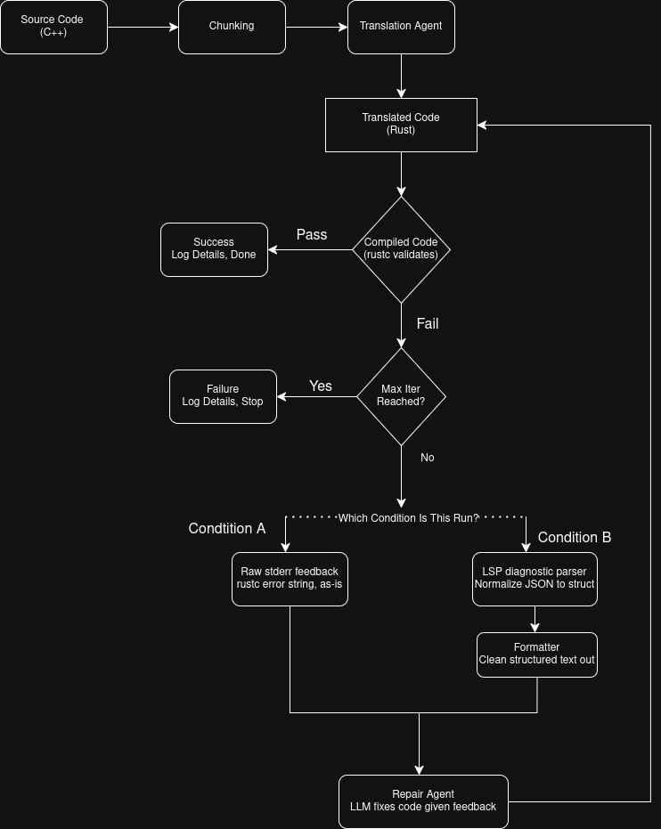

# Code Translation Engine

Thesis pipeline for comparing two feedback signals in agentic **C++ → Rust** translation:

- **Condition A** — repair agent sees raw `rustc` stderr.
- **Condition B** — repair agent sees structured **LSP diagnostics** from rust-analyzer (severity, error code, line:col, message).

Everything else (model, prompts, iteration cap, input code) is held constant. The primary endpoint is **strict compile success** after a fixed number of repair iterations; secondary endpoints are **iterations used** and the **profile of errors resolved** (recorded as `feedback_history` per run).

## How it works



For each C++ translation unit × condition × repetition: the translation agent emits a Rust file, then `rustc` compiles it in a tempdir. If compilation fails, the repair agent is invoked with the broken code plus condition-specific feedback (A = raw stderr, B = LSP diagnostics) and emits a new file. Loop until it compiles or `max_iterations` is reached.

## Layout

| Path | What it does |
|---|---|
| `src/main.py` | Entry point. Builds an `ExperimentConfig` and calls `run_experiment`. |
| `src/config.py` | `ExperimentConfig` dataclass (projects dir, conditions, repetitions, max_iterations, models) and LSP workspace paths. |
| `src/experiment.py` | Top-level loop over units × conditions × repetitions. Persists results and a config snapshot. |
| `src/pipeline.py` | Per-unit translate-then-repair loop. The one branch on condition is the feedback signal. |
| `src/agent.py` | Thin wrapper around `agno.Agent` over `OpenAIChat`. |
| `src/compile_rust.py` | Compiles a Rust string with `rustc` in a tempdir, returns `(ok, stderr)`. |
| `src/lsp_tool.py` | Writes Rust to the workspace and pulls structured diagnostics from rust-analyzer via a minimal stdio LSP client (`pygls`/`lsprotocol`). |
| `src/prompts.py` | System prompts for the translator and repairer (identical across A/B). |
| `src/dataset.py` | Loads `.cpp/.hpp/.h/.cc` files from a projects directory into `TranslationUnit`s. |
| `src/results.py` | `RunResult` dataclass + append-only JSONL writer. |
| `src/io_utils.py` | Small file read/write helpers. |
| `src/metrics.py` | Aggregate compile rate + iteration stats. (Not wired into the main loop yet.) |
| `inputs/projects/<project>/` | C++ source trees to translate. Each immediate subdirectory of `projects_dir` is treated as one project. |
| `outputs/rust_workspace/` | Cargo project where Condition B writes `src/output.rs` for rust-analyzer to diagnose. |
| `outputs/runs/<run-id>/` | Per-run artefacts: `results.jsonl`, `config.json`, `translations/<project>/...rs`. |
| `tests/` | Developer scratch: `compile_rust_test.py`, `test_pipeline.py`, sample C++ inputs. |

## Setup

```bash
git clone git@github.com:youni20/code-translation-engine.git
cd code-translation-engine
uv venv --python 3.12
uv sync                            # installs everything from pyproject.toml
source .venv/bin/activate          # fish: source .venv/bin/activate.fish
```

You also need:
- `rustc` and `cargo` (install via [rustup](https://rustup.rs))
- `rust-analyzer` on `PATH`
- An `OPENAI_API_KEY` in `.env` (the agent uses `OpenAIChat`)

## Run

Edit the knobs in `src/main.py`:

```python
config = ExperimentConfig(
    projects_dir=Path("./inputs/projects/project_a"),
    conditions=("A", "B"),
    repetitions=3,
    max_iterations=5,
    translator_model="gpt-4o-mini",
    repair_model="gpt-4o-mini",
)
run_experiment(config)
```

Then:

```bash
uv run src/main.py
```

Each invocation writes to `outputs/runs/<timestamp>/`:
- `results.jsonl` — one `RunResult` per (unit, condition, repetition)
- `config.json` — snapshot of the `ExperimentConfig` used
- `translations/<project>/<file>.cond_<A|B>.rep_<N>.rs` — final Rust output per run

## How A and B differ

| | Condition A | Condition B |
|---|---|---|
| Feedback to repair agent | `rustc` stderr (raw text) | LSP diagnostics (severity, code, line:col, message) |
| Compiler invoked? | Yes (`rustc` in tempdir) | Yes (`rustc` in tempdir), plus rust-analyzer via a minimal stdio LSP client for diagnostics |
| Model / prompts / iteration cap / input code | identical | identical |

---

**Note on LSP client choice.** Condition B uses a minimal stdio LSP client built on `pygls`/`lsprotocol` rather than `multilspy`, because `multilspy 0.0.15` does not expose diagnostic notifications through its public API and its pull-mode workaround hangs indefinitely.