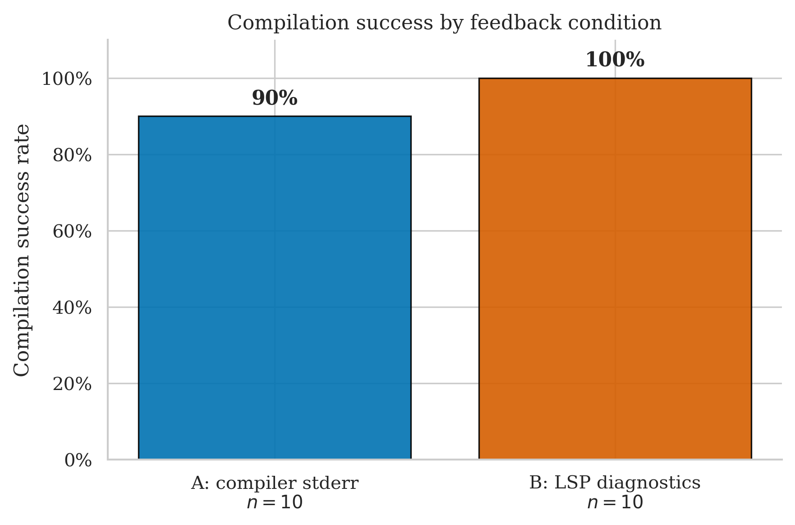
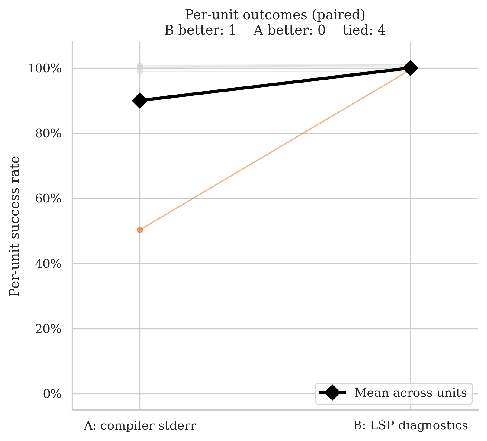
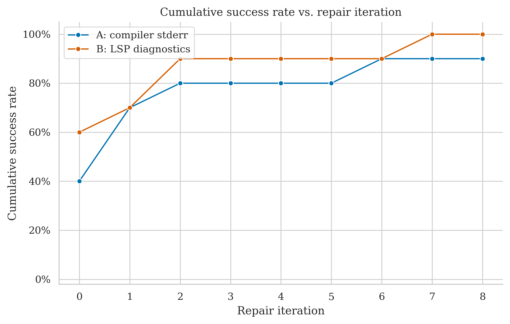
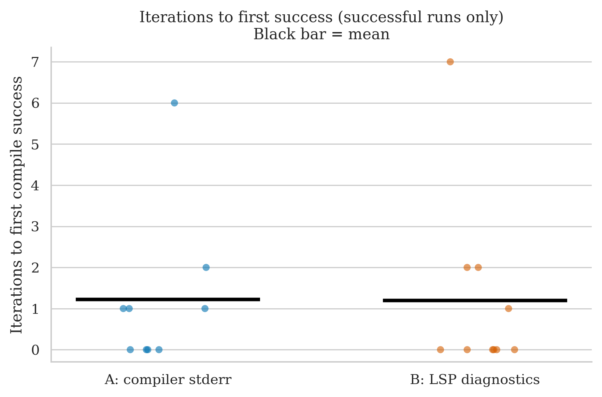
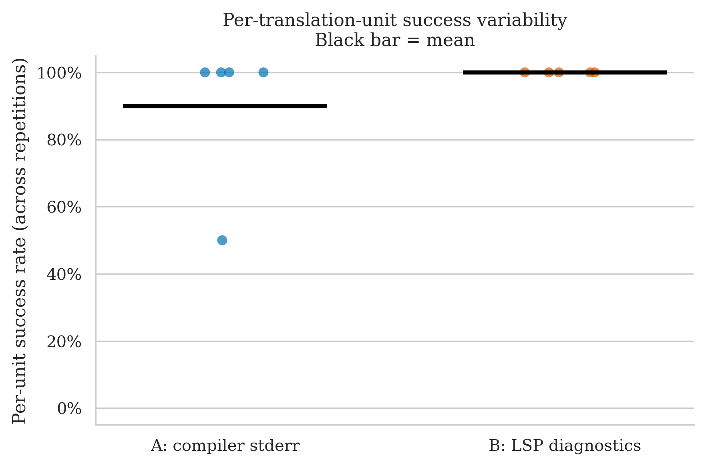

# argh — Clean Run Analysis
**Run ID:** `2026-05-14_22-35-32`
**Date:** 2026-05-14
**Project:** argh (single-header C++ command-line argument parsing library)
**Model:** gpt-4o-2024-08-06 (translator + repair)
**Setup:** 5 files × 2 conditions × 2 repetitions × max 8 repair iterations

> **First project where B (LSP) beats A (stderr) at the run level.** A succeeded on 9/10 runs; B succeeded on 10/10. The headline gap is small (1 run) and McNemar still returns p = 1.0 under the ≥50% majority rule, but the *direction* is the opposite of every other clean run.

---

## The Two Conditions

| Label | What the repair agent receives after a failed compile |
|-------|------------------------------------------------------|
| **A: compiler stderr** | Raw `rustc` error output |
| **B: LSP diagnostics** | Structured output from rust-analyzer: error codes, line/col numbers, severity |

---

## Files Tested

| File | Lines of Code | Description |
|------|-------------|-------------|
| `argh.h` | 485 | The argh library itself — argument parser, flags, positionals |
| `argh_tests.cpp` | 885 | Test suite using doctest |
| `doctest.h` | 6 580 | Bundled doctest single-header testing framework |
| `example.cpp` | 32 | Tiny usage example |
| `test_package/test_package.cpp` | 14 | Conan packaging smoke test |

`doctest.h` is by far the largest single translation unit attempted across any project so far (over 4× the previous largest, `immediate2d.h` at 1 485 LOC).

---

## Overall Success Rates

| Condition | Successes / Runs | Success Rate | 95% Wilson CI |
|-----------|-----------------|-------------|--------------|
| A: compiler stderr | 9 / 10 | **90%** | 60% – 98% |
| B: LSP diagnostics | 10 / 10 | **100%** | 72% – 100% |

B compiled every run. A failed once — on `argh.h` rep 0, where it exhausted the 8-iteration budget. The Wilson intervals overlap heavily, so this gap is well within noise at n = 10.

| Metric | A | B |
|--------|---|---|
| Mean iterations to success | 1.9 | 1.2 |
| Median iterations | 1 | 0 |
| Mean wall time | 49.3s | 65.7s |
| Median wall time | 18.8s | 5.6s |

B used fewer iterations on average. Wall time tells a more nuanced story: B's *median* run was much faster (5.6s vs 18.8s) because half its runs compiled first-try on small files, but B's *mean* is higher because of the one slow `doctest.h` run at 476s.

---

## Per-File Breakdown

### argh.h (485 LOC) — the only file with any disagreement

| | Rep 0 | Rep 1 |
|-|-------|-------|
| **A** | ❌ FAIL (8 iters, 153.4s) | ✅ PASS (2 iters, 50.8s) |
| **B** | ✅ PASS (2 iters, 82.5s) | ✅ PASS (2 iters, 43.0s) |

This is the file that drives the entire condition difference. A exhausted the iteration budget on rep 0 and recovered on rep 1; B converged in 2 iterations both times. Per-unit success rates: A = 50%, B = 100%.

### argh_tests.cpp (885 LOC)

| | Rep 0 | Rep 1 |
|-|-------|-------|
| **A** | ✅ PASS (1 iter, 17.1s) | ✅ PASS (0 iters, 20.5s) |
| **B** | ✅ PASS (0 iters, 4.0s) | ✅ PASS (0 iters, 7.2s) |

Both passed everywhere. B compiled first-try on both reps; A needed one repair on rep 0. Despite 885 LOC, this is a test file (mostly `TEST_CASE` blocks with assertions) — likely easy to mechanically translate because the structure is repetitive.

### doctest.h (6 580 LOC) — the biggest file in the entire experiment

| | Rep 0 | Rep 1 |
|-|-------|-------|
| **A** | ✅ PASS (1 iter, 66.1s) | ✅ PASS (6 iters, 166.4s) |
| **B** | ✅ PASS (7 iters, 475.7s) | ✅ PASS (1 iter, 33.3s) |

Both conditions succeeded both times on a 6 580-line testing framework header. That's surprising — the previous largest file (`immediate2d.h`, 1 485 LOC) also compiled easily, suggesting that LOC alone is a poor predictor of difficulty. The variance is huge: B took 476s on rep 0 (7 repair rounds) but 33s on rep 1 (1 repair round); A took 66s on rep 0 (1 round) but 166s on rep 1 (6 rounds).

### example.cpp (32 LOC) and test_package.cpp (14 LOC)

Both trivial. Both conditions, both reps, all succeeded in 0–1 iterations. No signal.

---

## Statistical Test (McNemar)

**Majority vote per file (≥50% success across reps = unit pass):**

- **A wins:** 0 units
- **B wins:** 0 units
- **Discordant pairs:** 0
- **p-value: 1.000** — uninformative

The ≥50% rule masks the per-run difference. On `argh.h`, A passes 1/2 = 50% which counts as "pass" under the rule, so A and B tie on every file. The paired slope chart shows five flat lines at 100% — the test cannot distinguish "A failed once, B never failed" from "perfect agreement."

This is a recurring limitation of the per-file majority-vote McNemar: when reps are small (n=2) and per-file success is close to ceiling, you need a near-total wipeout to register as discordant.

---

## Cumulative Success Over Repair Iterations

B's curve jumps to ~60% at iteration 0 (six of ten runs compiled first-try) and reaches 100% by iteration 7. A's curve climbs more gradually, plateauing at 90% because of the `argh.h` rep 0 failure.

---

## Iterations to Success (Successful Runs Only)

Among runs that succeeded:

| Condition | Iterations used | Median |
|-----------|----------------|--------|
| A | 1, 0, 1, 6, 1, 0, 0, 0, 2 | 1 |
| B | 2, 2, 0, 0, 7, 1, 0, 0, 0, 0 | 0 |

B's distribution is bimodal: a tight cluster at 0 iterations (the trivial files) and one outlier at 7 (`doctest.h` rep 0). A's distribution is similar but shifted right.

---

## Per-Unit Success Variability

A has one unit at 50% (`argh.h`) and four units at 100%. B has all five units at 100%.

---

## Key Takeaways

1. **First B > A result.** Across Swarmz, MicroPather, immediate2d, A was equal-or-better. Here it flips. The flip is small (one run, on one file) but it's worth noting honestly — the direction is not uniform across projects.

2. **The signal is on `argh.h` only.** Four of five files in this dataset are either trivial (example, test_package, ~25 LOC each) or structurally easy (the test suite, the doctest framework). Only `argh.h` itself produced any condition difference, and on that file B converged twice while A failed once.

3. **LOC is a bad difficulty proxy (again).** `doctest.h` at 6 580 LOC compiled under both conditions in all four runs. `immediate2d.h` at 1 485 LOC was also easy. Yet 305-LOC `dungeon.cpp` (MicroPather) was never solved by A. Idiomatic complexity matters far more than line count.

4. **The McNemar still p = 1.0.** With n=5 units and most files at ceiling success, the per-file majority test has no power to detect a 1-run difference. The aggregate success rates (90% vs 100%) hint at a B-favourable signal, but Wilson intervals overlap fully.

5. **Cross-project pattern is now less clean than before.**

   | Project | A success | B success | Direction |
   |---------|----------|----------|----------|
   | Swarmz | 100% | 50% | A ≫ B |
   | MicroPather | 50% | 50% | tie |
   | immediate2d | 100% | 85% | A > B |
   | argh | 90% | 100% | B > A |

   Three projects favour A (or tie); one favours B. No project gives McNemar significance individually. The pooled story is no longer a clean "A ≥ B" but rather "results vary by project, with no condition reliably ahead."

---

## What This Means for the Thesis

- The pooled cross-project picture has become more honest: condition effects are dataset-dependent and small. This is actually a more defensible scientific finding than "A wins."
- `argh.h` is the new candidate for qualitative analysis: it's the *one* file in any clean run where A specifically failed but B succeeded. Understanding why is symmetric to the work on Swarmz's `swarmz.h` (where A succeeded but B failed). Together those two files give the thesis a balanced pair of failure modes to examine.
- The trivial files in this run (example.cpp, test_package.cpp) and the easy ones (argh_tests.cpp, doctest.h) contribute almost nothing to the comparison. Future runs should bias the dataset toward difficult files if power is the goal.
- Pooled aggregate across all four clean runs: A = 42/46 ≈ 91%, B = 37/46 ≈ 80%. Still slightly favours A overall, but argh shifts the pooled numbers closer together than they were before this run.
