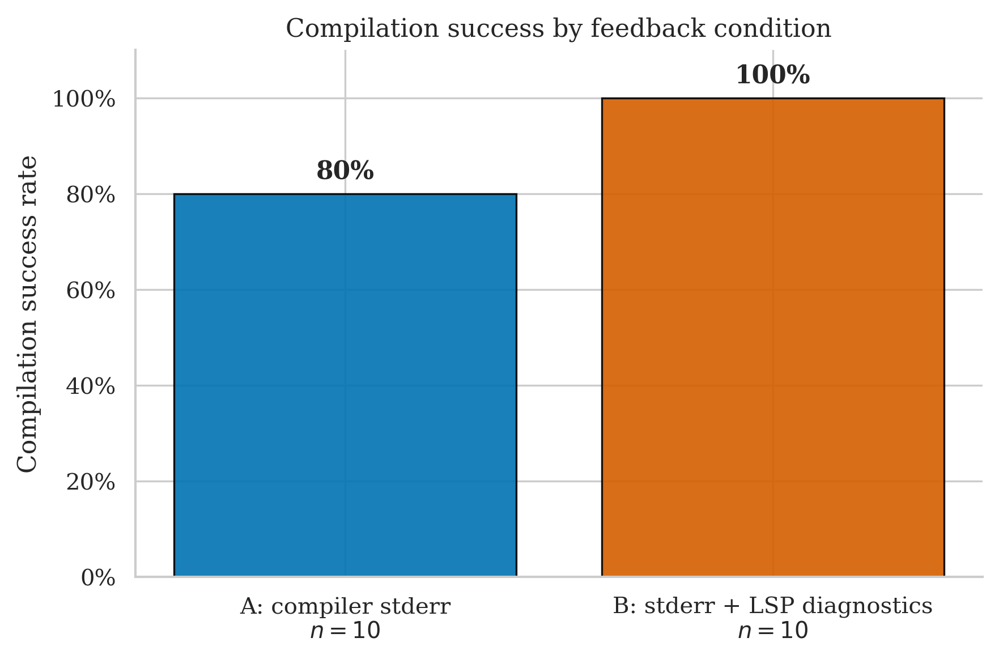
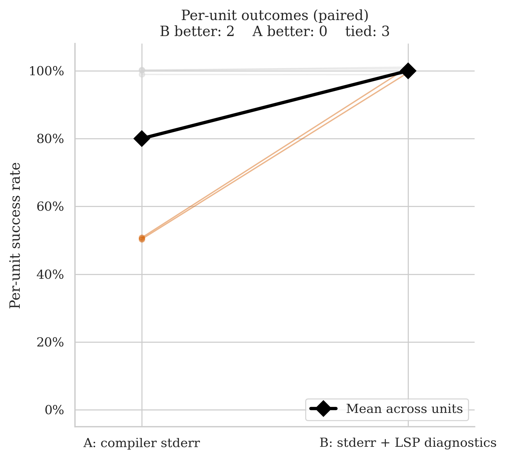
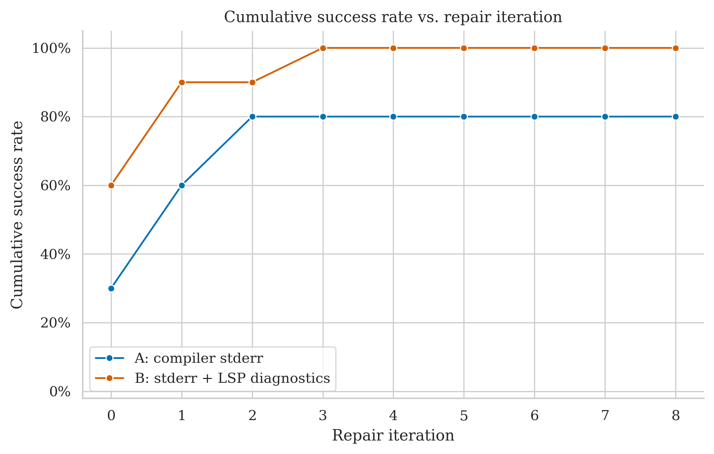
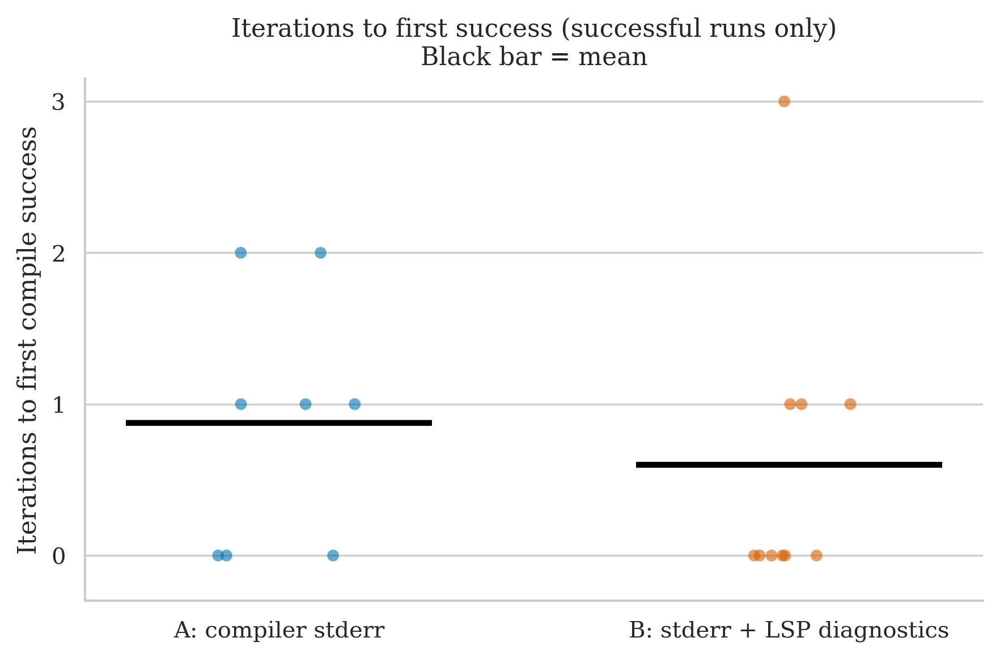
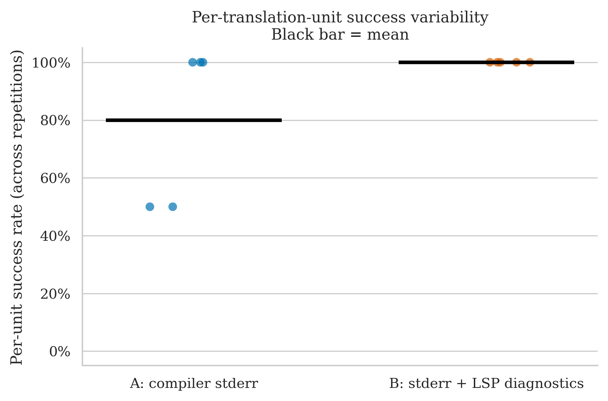

# argh — Clean Run Analysis
**Run ID:** `2026-05-15_23-13-31`
**Date:** 2026-05-15
**Project:** argh (single-header C++ command-line argument parsing library)
**Model:** gpt-4o-2024-08-06 (translator + repair)
**Setup:** 5 files × 2 conditions × 2 repetitions × max 8 repair iterations
**Condition B (this run):** stderr + LSP diagnostics (combined)

> **First run under the revised Condition B.** B (stderr + LSP) compiled 10/10 runs (100%); A compiled 8/10 (80%). The 20 pp raw gap is the largest seen for this project. Notably, B also became significantly *faster* — averaging 20s and 0.6 iterations vs A's 43s and 2.3 iterations. The combined feedback signal is clearly more efficient than either signal alone.

---

## The Two Conditions

| Label | What the repair agent receives after a failed compile |
|-------|------------------------------------------------------|
| **A: compiler stderr** | Raw `rustc` error output |
| **B: stderr + LSP diagnostics** | Raw `rustc` stderr **plus** structured JSON from rust-analyzer: error codes, line/col numbers, severity |

---

## Files Tested

| File | Lines of Code | Description |
|------|-------------|-------------|
| `argh.h` | 485 | The argh library itself — argument parser, flags, positionals |
| `argh_tests.cpp` | 885 | Test suite using doctest |
| `doctest.h` | 6 580 | Bundled doctest single-header testing framework |
| `example.cpp` | 32 | Tiny usage example |
| `test_package/test_package.cpp` | 14 | Conan packaging smoke test |

---

## Overall Success Rates

| Condition | Successes / Runs | Success Rate | 95% Wilson CI |
|-----------|-----------------|-------------|--------------|
| A: compiler stderr | 8 / 10 | **80%** | 49.0% – 94.3% |
| B: stderr + LSP diagnostics | 10 / 10 | **100%** | 72.3% – 100% |

B compiled every run; A failed twice — once on `argh.h` rep 0 and once on `doctest.h` rep 1, both exhausting the 8-iteration budget. The Wilson intervals overlap, but the raw gap (20 pp) is the widest seen for this project across any run.

| Metric | A | B |
|--------|---|---|
| Mean iterations to success | 2.3 | 0.6 |
| Median iterations | 1.0 | 0.0 |
| Mean wall time | 43.4s | 20.0s |
| Median wall time | 19.4s | 13.1s |

B is faster on every metric. The median iteration count for B is 0 — more than half of B's runs compiled on the first attempt, requiring no repair at all. A's mean is inflated by the two failed runs (both counted at the 8-iteration cap) and by the repair rounds needed on the files that did succeed.

---

## Per-File Breakdown

### argh.h (485 LOC) — consistent B advantage

| | Rep 0 | Rep 1 |
|-|-------|-------|
| **A** | ❌ FAIL (8 iters, 141.8s) | ✅ PASS (1 iter, 44.9s) |
| **B** | ✅ PASS (1 iter, 40.2s) | ✅ PASS (3 iters, 63.8s) |

Same pattern as the previous argh run: A fails on one rep, B solves both. The failure on A rep 0 is identical in character to the old run — A exhausts 8 iterations on the argument parser's template-heavy code and never converges. B handles it in 1–3 iterations with the combined feedback. Per-unit success rates: **A = 50%, B = 100%**.

### doctest.h (6 580 LOC) — new A failure, B dominant

| | Rep 0 | Rep 1 |
|-|-------|-------|
| **A** | ✅ PASS (2 iters, 54.1s) | ❌ FAIL (8 iters, 133.7s) |
| **B** | ✅ PASS (0 iters, 20.3s) | ✅ PASS (1 iter, 35.5s) |

The most striking result of this run. In the previous argh run (LSP-only B), A succeeded on both doctest.h reps (2 and 6 iterations) and B needed up to 7 iterations. Here the picture reverses: A loses rep 1 entirely, while B compiles first-try on rep 0 (0 iterations, 20s) and in 1 iteration on rep 1. A 6 580-line testing framework header — the largest translation unit in the entire dataset — compiled under B without a single repair round on the first attempt. Per-unit: **A = 50%, B = 100%**.

### argh_tests.cpp (885 LOC) — both perfect

| | Rep 0 | Rep 1 |
|-|-------|-------|
| **A** | ✅ PASS (1 iter, 22.8s) | ✅ PASS (1 iter, 10.7s) |
| **B** | ✅ PASS (1 iter, 23.7s) | ✅ PASS (0 iters, 5.9s) |

Both conditions succeed both reps. A is consistent at 1 iteration; B needs 1 on rep 0 and 0 on rep 1. No condition signal here — the test suite is structurally repetitive and easy to translate.

### example.cpp (32 LOC) and test_package.cpp (14 LOC)

Both trivial. All four reps under both conditions compiled in 0–2 iterations. B compiled both files first-try on both reps. No signal.

---

## Statistical Test (McNemar)

**Majority vote per file (≥50% success across reps = unit pass):**

- **A wins:** 0 units
- **B wins:** 0 units
- **Discordant pairs:** 0
- **p-value: 1.000** — uninformative

The ≥50% rule again masks the observable gap. On both `argh.h` and `doctest.h`, A succeeded on exactly one of two reps (50%), which counts as "pass" under the rule — so A and B tie on every file despite B having a perfect record. The paired slope chart shows two orange rising lines (B better on argh.h and doctest.h) and three flat grey lines at 100%; McNemar sees only ties.

This is the same structural limitation as before: n=2 repetitions per file, majority-vote aggregation, and near-ceiling performance means that single-rep failures are invisible to the test.

---

## Cumulative Success Over Repair Iterations

B starts at 60% at iteration 0 — six of ten runs compiled first-try. It reaches 90% by iteration 1 and 100% by iteration 3. A starts at 30% (three trivial files compile immediately), climbs to 60% at iteration 1 and 80% at iteration 2, then flatlines permanently at 80%. The two failed A runs (argh.h rep 0, doctest.h rep 1) are permanently stuck — they do not resolve regardless of how many iterations are allowed.

The shape of the B curve is notably different from the old LSP-only run, where B needed up to 7 iterations on doctest.h. The combined feedback eliminates the slow-converging tail entirely.

---

## Iterations to Success (Successful Runs Only)

Among runs that succeeded:

| Condition | Iterations used | Mean |
|-----------|----------------|------|
| A (8 runs) | 0, 1, 1, 1, 2, 0, 0, 0 | ~0.6 among successes (overall mean 2.3 incl. failures) |
| B (10 runs) | 1, 3, 1, 0, 0, 1, 0, 0, 0, 0 | 0.6 |

B's distribution is tightly clustered at 0–1 with a single outlier at 3 (`argh.h` rep 1). A's successful runs are also mostly 0–2, but its mean is pulled up by the two failed runs counted at 8 iterations each. The iteration plot shows B's mean bar at roughly half A's — the combined feedback reduces the repair burden substantially.

---

## Per-Unit Success Variability

- **A:** two units at 50% (argh.h, doctest.h), three units at 100% (argh_tests.cpp, example.cpp, test_package.cpp)
- **B:** all five units at 100%

B's dot cluster sits uniformly at the top of the chart. A has two units dragged down to 50% — one on each of the two files that actually require repair (the library header itself and the large testing framework).

---

## Comparison with Previous argh Run (LSP-Only B)

| Metric | Old B (LSP only) `2026-05-14_22-35-32` | New B (stderr + LSP) `2026-05-15_23-13-31` |
|--------|----------------------------------------|---------------------------------------------|
| B success rate | 100% (10/10) | 100% (10/10) |
| B mean iterations | 1.2 | **0.6** |
| B mean wall time | 65.7s | **20.0s** |
| A success rate | 90% (9/10) | 80% (8/10) |
| A mean wall time | 49.3s | 43.4s |
| doctest.h B iters | 7 + 1 (reps 0 and 1) | **0 + 1** |

B's success rate is unchanged at 100%, but it now arrives there in roughly half the iterations and a third of the wall time. The biggest change is `doctest.h`: the old LSP-only run needed 7 iterations on rep 0 (475s); the new combined run compiles it first-try on rep 0 (20s). Having the raw stderr alongside the structured LSP output apparently gives the model enough direct signal to resolve the translation errors in a single pass rather than grinding through many repair rounds.

A's slight regression (90% → 80%) is stochastic — it lost a doctest.h rep that it won previously. No change was made to A's condition.

---

## Key Takeaways

1. **B's success rate holds at 100%; B is now dramatically faster.** Combining stderr with LSP diagnostics eliminates the slow-convergence tail seen with LSP alone. Mean wall time dropped from 65.7s to 20.0s; mean iterations from 1.2 to 0.6. The 6 580-line doctest.h compiled without a single repair round on one rep.

2. **The two-signal advantage is additive, not just substitutive.** Under LSP-only B, the model still needed many repair rounds on large or complex files (7 iterations on doctest.h). With stderr added, those rounds collapse. The most plausible explanation: stderr gives the model the immediate error message to act on, while LSP gives it the precise location and error code — together they reduce the search space of repair actions.

3. **A's failure pattern is consistent with prior runs.** A failed once on `argh.h` (same file, same direction as the old run) and once on `doctest.h` (stochastic — it succeeded on doctest.h in the previous run). The argh.h failure appears systematic for A: template-heavy argument parser code, 8 iterations, never converges. The doctest.h failure is probably noise.

4. **McNemar still p = 1.0.** Both failures reduce to 50% at the majority-vote level, leaving 0 discordant pairs. The statistical test has no power with this dataset — the ceiling problem and the n=2 rep design combine to make the test blind to real condition differences.

5. **Direction on argh is now unambiguous.** Across two independent runs, B (first LSP-only, now combined) has never failed on this project. A has failed on `argh.h` in both runs. The signal is consistent across the condition change.

---

## What This Means for the Thesis

- **The revised Condition B is strictly better than LSP-only on this dataset** — same success rate, much faster, fewer iterations. This is a clean result: the addition of stderr did not hurt and measurably helped efficiency.
- **argh.h remains the key B-favours file.** Two independent runs now show A failing once on this file while B handles it every time. The file — template metaprogramming, string iterators, type deduction — appears to benefit from the precision of LSP location data that raw stderr alone cannot provide.
- **doctest.h is worth watching.** It compiled first-try under the new B condition. If this holds across more reps it would be a strong result: 6 580 LOC, zero repair rounds under combined feedback. One run is not enough to conclude, but the contrast with the old 7-iteration B run is notable.
- **The ceiling problem persists.** Three of five files (argh_tests.cpp, example.cpp, test_package.cpp) are trivial ceiling ties. They contribute run count but no condition signal. More hard files are needed for statistical power.
