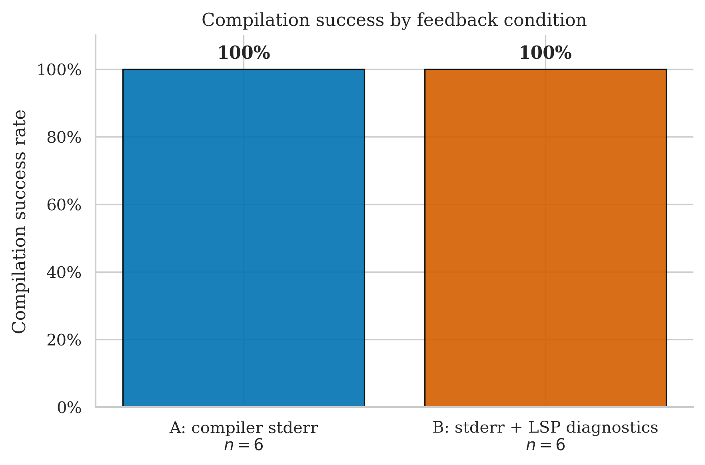
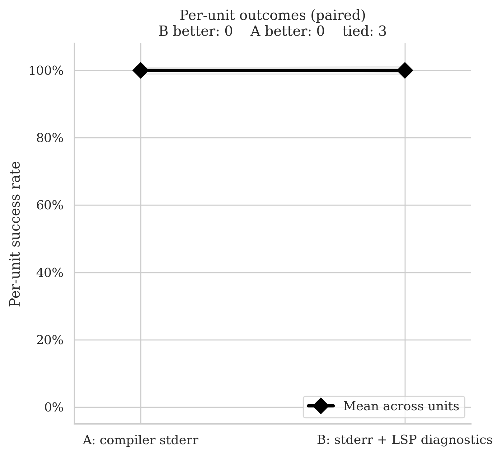
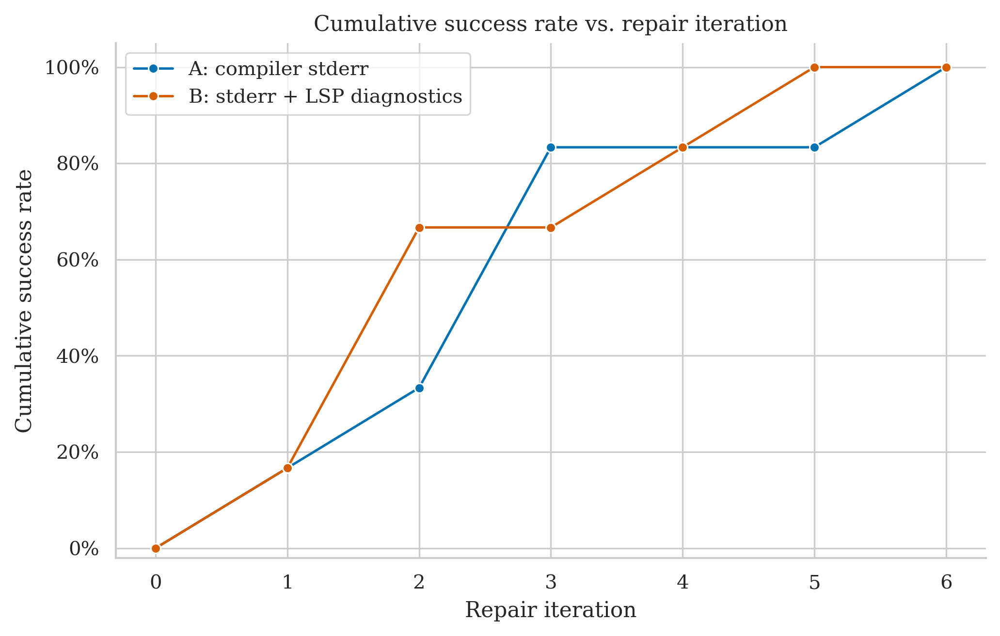
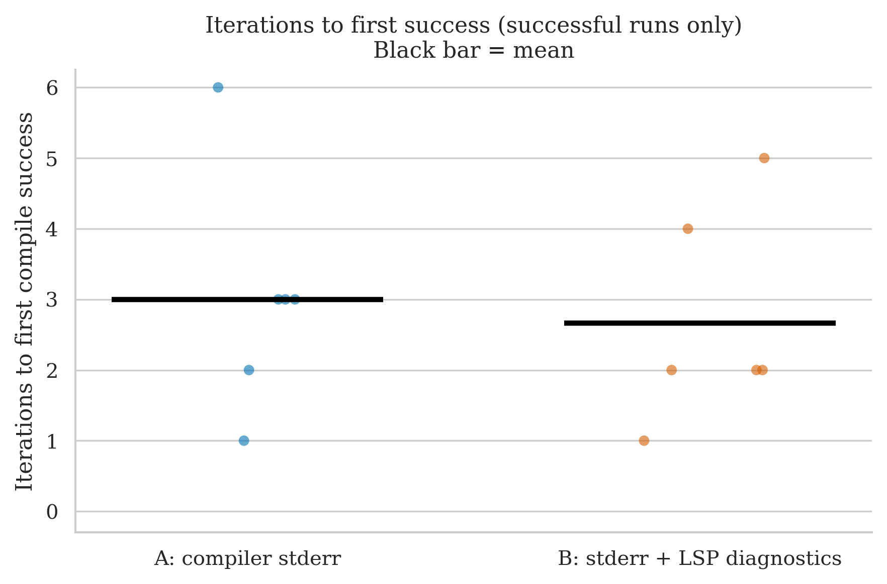
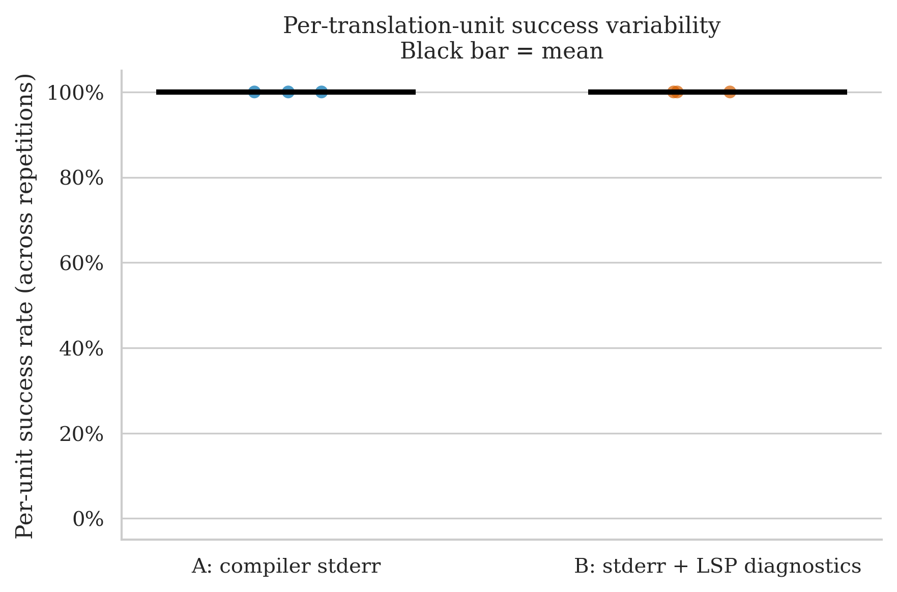

# debug_assert — Clean Run Analysis
**Run ID:** `2026-05-15_23-29-52`
**Date:** 2026-05-15
**Project:** debug_assert (assertion/debugging macro library)
**Model:** gpt-4o-2024-08-06 (translator + repair)
**Setup:** 3 files × 2 conditions × 2 repetitions × max 8 repair iterations
**Condition B (this run):** stderr + LSP diagnostics (combined)

> **Perfect tie — both conditions 100%.** A and B each compiled all 6 runs. No condition signal whatsoever: every file succeeded under both conditions on both repetitions. This matches the previous debug_assert run under LSP-only B. The project is simply too easy to distinguish the two feedback signals.

---

## The Two Conditions

| Label | What the repair agent receives after a failed compile |
|-------|------------------------------------------------------|
| **A: compiler stderr** | Raw `rustc` error output |
| **B: stderr + LSP diagnostics** | Raw `rustc` stderr **plus** structured JSON from rust-analyzer: error codes, line/col numbers, severity |

---

## Files Tested

| File | Lines of Code | Description |
|------|-------------|-------------|
| `debug_assert.hpp` | 370 | Core library — assertion macros, handler dispatch, level filtering |
| `example.cpp` | 55 | Usage example demonstrating the assertion API |
| `test_package/example.cpp` | 68 | Conan packaging smoke test with example usage |

All three files are compact and structurally straightforward — macro-heavy header with two small example programs. There are no complex C++ idioms (templates, pointer arithmetic, bitwise ops) that are known to cause translation difficulty.

---

## Overall Success Rates

| Condition | Successes / Runs | Success Rate | 95% Wilson CI |
|-----------|-----------------|-------------|--------------|
| A: compiler stderr | 6 / 6 | **100%** | 61.0% – 100% |
| B: stderr + LSP diagnostics | 6 / 6 | **100%** | 61.0% – 100% |

Both conditions compiled every run. The bar chart shows two equal bars at 100% — there is nothing to distinguish the conditions at the success-rate level.

| Metric | A | B |
|--------|---|---|
| Mean iterations | 3.0 | 2.7 |
| Median iterations | 3.0 | 2.0 |
| Mean wall time | 28.0s | 33.7s |
| Median wall time | 27.4s | 27.0s |

A is marginally faster in mean wall time (28.0s vs 33.7s), driven by the per-round LSP query overhead in B adding ~5–10s per iteration. B uses fractionally fewer iterations on average (2.7 vs 3.0), but neither difference is meaningful given the small sample. High within-condition variance dominates: `example.cpp` took A 6 iterations on rep 0 and only 1 on rep 1 — a 6× swing on the same file.

---

## Per-File Breakdown

### debug_assert.hpp (370 LOC)

| | Rep 0 | Rep 1 |
|-|-------|-------|
| **A** | ✅ PASS (3 iters, 36.3s) | ✅ PASS (3 iters, 45.6s) |
| **B** | ✅ PASS (4 iters, 54.0s) | ✅ PASS (1 iter, 21.1s) |

Both conditions succeed both reps. A is consistent at 3 iterations each time. B has high variance (4 vs 1 iterations), suggesting the repair path is stochastic rather than signal-driven. Per-unit: **A = 100%, B = 100%**.

### example.cpp (55 LOC)

| | Rep 0 | Rep 1 |
|-|-------|-------|
| **A** | ✅ PASS (6 iters, 45.9s) | ✅ PASS (1 iter, 8.9s) |
| **B** | ✅ PASS (5 iters, 49.7s) | ✅ PASS (2 iters, 25.1s) |

The most iteration-heavy file in the run despite being only 55 LOC. Both conditions required 5–6 repair rounds on rep 0 but converged in 1–2 on rep 1 — strong stochastic variation driven by the initial translation quality rather than the repair feedback. Per-unit: **A = 100%, B = 100%**.

### test_package/example.cpp (68 LOC)

| | Rep 0 | Rep 1 |
|-|-------|-------|
| **A** | ✅ PASS (3 iters, 18.6s) | ✅ PASS (2 iters, 13.0s) |
| **B** | ✅ PASS (2 iters, 23.8s) | ✅ PASS (2 iters, 28.8s) |

Both conditions succeed both reps with low iteration counts. B is consistent at 2 iterations both reps; A varies slightly (3 and 2). No condition signal. Per-unit: **A = 100%, B = 100%**.

---

## Statistical Test (McNemar)

**Majority vote per file (≥50% success across reps = unit pass):**

- **A wins:** 0 units
- **B wins:** 0 units
- **Discordant pairs:** 0
- **p-value: 1.000** — uninformative

Three units, all tied at 100%/100%. The paired slope chart is a single flat horizontal line from A to B — no movement at all. McNemar has nothing to work with.

---

## Cumulative Success Over Repair Iterations

Neither condition compiles anything at iteration 0 — no file translates cleanly on the first attempt. The curves interleave as they climb: B reaches ~67% by iteration 2, A reaches ~83% by iteration 3, B reaches 100% by iteration 5, A finishes at iteration 6. The curves cross briefly in the middle before converging to the same endpoint. The shape reflects within-run stochastic variation in repair convergence speed, not a systematic condition difference.

---

## Iterations to Success

| Condition | Iterations used | Mean |
|-----------|----------------|------|
| A (6 runs) | 3, 3, 6, 1, 3, 2 | 3.0 |
| B (6 runs) | 4, 1, 5, 2, 2, 2 | 2.7 |

Both distributions span roughly 1–6, with no systematic separation. A's outlier is 6 (`example.cpp` rep 0); B's outlier is 5 (also `example.cpp` rep 0). The mean bar in the plot shows A at 3.0 and B slightly below at ~2.7 — a difference too small to interpret given n=6.

---

## Per-Unit Success Variability

All dots for both conditions sit at 100%. Both mean bars are flat at the top of the chart. There is no spread to observe.

---

## Comparison with Previous debug_assert Run (LSP-Only B)

| Metric | Old B (LSP only) | New B (stderr + LSP) |
|--------|-----------------|----------------------|
| B success rate | 100% (6/6) | 100% (6/6) |
| A success rate | 100% (6/6) | 100% (6/6) |
| Result | Tie | Tie |

The result is identical to the previous run. debug_assert produces a perfect tie regardless of which B condition is used, confirming that the project is too straightforward to serve as a discriminating test. The files do not stress either feedback signal.

---

## Key Takeaways

1. **Complete tie, as expected.** debug_assert has been a 100%/100% tie in every run across both the old and new B conditions. The project is a known ceiling dataset — it adds run count but contributes zero condition signal.

2. **High within-condition variance despite small files.** `example.cpp` at 55 LOC needed 6 iterations on one rep and 1 on another. This level of stochastic variance within a condition is a reminder that iteration count is driven partly by the luck of the initial translation, not just feedback quality.

3. **B's wall-time overhead is visible here.** Even though B uses marginally fewer iterations on average (2.7 vs 3.0), its mean wall time is 5.7s higher than A's (33.7s vs 28.0s). The per-round LSP query cost adds up even when iteration counts are similar. On harder projects where B uses noticeably fewer rounds, this overhead is more than offset; on a ceiling project like this it just shows as pure overhead.

4. **McNemar: 0 discordant pairs, p = 1.0.** No information gained. All three units are perfect ties.

---

## What This Means for the Thesis

- debug_assert should not be weighted heavily in any condition comparison — it will always be a tie, under any feedback condition, because the files are too simple to fail consistently.
- The project is useful for one thing: confirming the *floor* of the system — that even under non-ideal repair feedback, trivial C++ can always be translated to compilable Rust within 8 iterations.
- The within-condition iteration variance (1 to 6 on a 55-LOC file) is worth noting as a reminder that the repair outcome has a stochastic component independent of the feedback signal.
