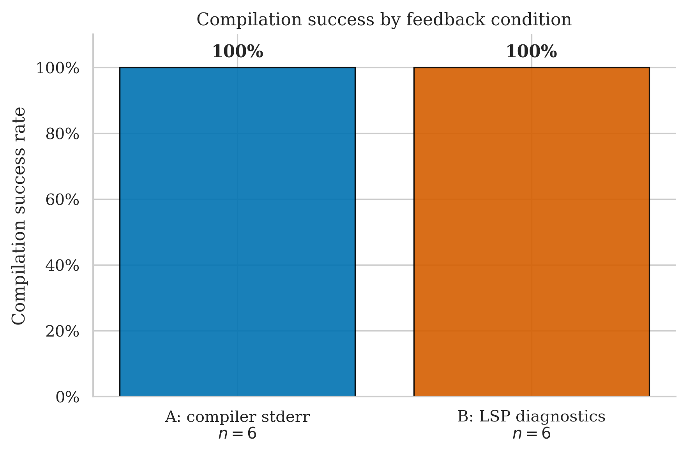
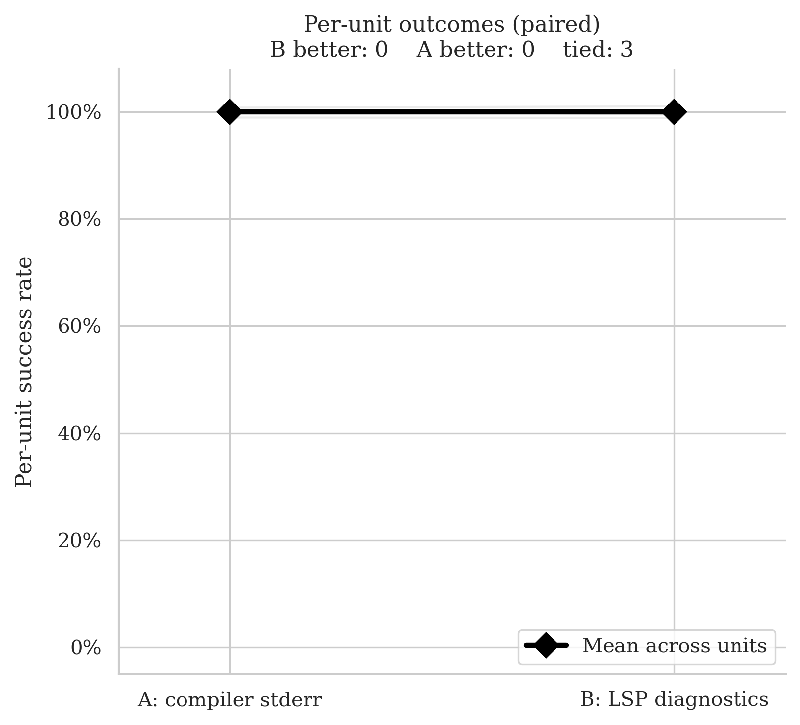
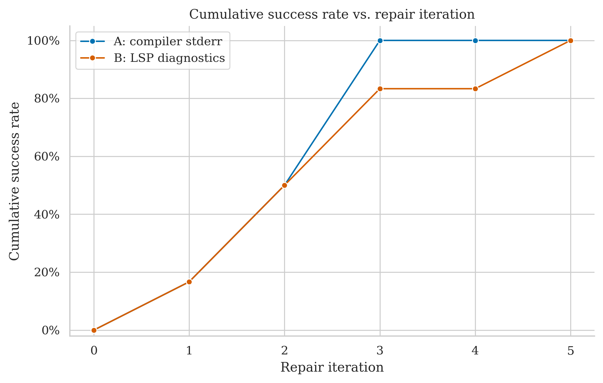
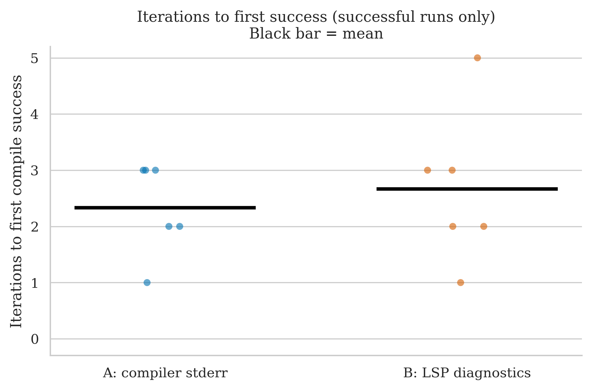
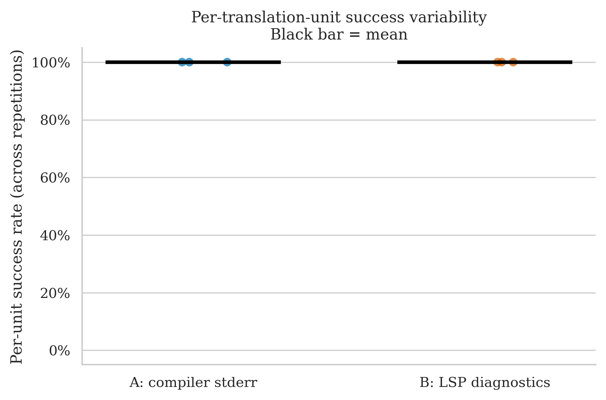

# debug_assert — Clean Run Analysis
**Run ID:** `2026-05-14_23-03-33`
**Date:** 2026-05-14
**Project:** debug_assert (header-only C++ assertion library by Jonathan Müller / foonathan)
**Model:** gpt-4o-2024-08-06 (translator + repair)
**Setup:** 3 files × 2 conditions × 2 repetitions × max 8 repair iterations

> **First project with no failures in either condition.** Every one of the 12 runs compiled. The conditions differ only in how many iterations and how much wall time it took to get there.

---

## The Two Conditions

| Label | What the repair agent receives after a failed compile |
|-------|------------------------------------------------------|
| **A: compiler stderr** | Raw `rustc` error output |
| **B: LSP diagnostics** | Structured output from rust-analyzer: error codes, line/col numbers, severity |

---

## Files Tested

| File | Lines of Code | Description |
|------|-------------|-------------|
| `debug_assert.hpp` | 370 | The library itself — assertion macros, levels, custom handler hooks |
| `example.cpp` | 55 | Usage example demonstrating the assertion API |
| `test_package/example.cpp` | 68 | Conan packaging smoke test |

---

## Overall Success Rates

| Condition | Successes / Runs | Success Rate | 95% Wilson CI |
|-----------|-----------------|-------------|--------------|
| A: compiler stderr | 6 / 6 | **100%** | 61% – 100% |
| B: LSP diagnostics | 6 / 6 | **100%** | 61% – 100% |

Both conditions cleared every file on every repetition. The Wilson intervals are wide (n=6 per condition), so this only tells you the ceiling is reachable from both signals on this project — not that they are equivalent.

| Metric | A | B |
|--------|---|---|
| Mean iterations to success | 2.33 | 2.67 |
| Median iterations | 2.5 | 2.5 |
| Mean wall time | 30.6s | 50.7s |
| Median wall time | 32.8s | 45.5s |

B used slightly more iterations on average and about **65% more wall time** for the same outcome. This is consistent with the LSP latency overhead seen in earlier runs.

---

## Per-File Breakdown

### debug_assert.hpp (370 LOC) — the library itself

| | Rep 0 | Rep 1 |
|-|-------|-------|
| **A** | ✅ PASS (1 iter, 24.9s) | ✅ PASS (3 iters, 38.9s) |
| **B** | ✅ PASS (3 iters, 67.7s) | ✅ PASS (5 iters, 106.8s) |

Both passed both reps, but B consistently needed more rounds (3 and 5 vs 1 and 3) and roughly 2–3× the wall time. This is the largest condition gap in the run.

### example.cpp (55 LOC)

| | Rep 0 | Rep 1 |
|-|-------|-------|
| **A** | ✅ PASS (2 iters, 16.0s) | ✅ PASS (3 iters, 34.1s) |
| **B** | ✅ PASS (2 iters, 22.9s) | ✅ PASS (2 iters, 43.4s) |

Very close. B actually used one fewer iteration on rep 1.

### test_package/example.cpp (68 LOC)

| | Rep 0 | Rep 1 |
|-|-------|-------|
| **A** | ✅ PASS (3 iters, 38.5s) | ✅ PASS (2 iters, 31.4s) |
| **B** | ✅ PASS (3 iters, 47.6s) | ✅ PASS (1 iter, 15.5s) |

Nearly tied on rep 0, B faster on rep 1. The 1-iteration B success here is the run's fastest non-trivial fix.

---

## Statistical Test (McNemar)

**Majority vote per file (≥50% success across reps = unit pass):**

- **A wins:** 0 units
- **B wins:** 0 units
- **Discordant pairs:** 0
- **p-value: 1.000** — uninformative

All three units are perfect ties at 100% success for both conditions. The slope chart shows three flat lines at the top of the y-axis. The test has nothing to compare.

---

## Cumulative Success Over Repair Iterations

A's curve climbs faster — by iteration 3 it has reached ~83% (5/6 runs); B reaches ~67% (4/6) at the same point. Both end at 100%, but A gets there in fewer rounds on average.

---

## Iterations to Success (Successful Runs Only)

| Condition | Iterations used | Median |
|-----------|----------------|--------|
| A | 1, 3, 2, 3, 3, 2 | 2.5 |
| B | 3, 5, 2, 2, 3, 1 | 2.5 |

Identical medians, but B's distribution has a longer tail (one run at 5 iterations) and A's has a shorter floor (one run at 1).

---

## Per-Unit Success Variability

All six points at 100%. No variability to inspect.

---

## Key Takeaways

1. **A ceiling result for both conditions.** This dataset is too easy to discriminate. The library is moderate in size (370 LOC) but its assertion-macro style maps cleanly to Rust idioms (custom macro, level enum, handler trait) — both feedback signals are enough.

2. **B is still slower, even when it wins or ties.** Mean wall time 50.7s vs 30.6s. The iteration cost gap (2.67 vs 2.33) is small; most of the wall-time difference is the per-round latency of querying rust-analyzer. This continues a pattern visible across every earlier project: B incurs a roughly 2× wall-time premium even when outcomes are identical.

3. **A converged faster on `debug_assert.hpp` specifically.** The only file where the per-file iteration counts diverge meaningfully (A: 1, 3 vs B: 3, 5). On the two example files the gap closes.

4. **McNemar is again uninformative.** No discordant pairs. With n = 3 units all at the success ceiling, the test cannot fire.

5. **Updated cross-project picture (using only the analyses currently in `result_analysis/`):**

   | Project | A | B | Direction |
   |---------|---|---|-----------|
   | immediate2d | 100% (26/26) | 85% (22/26) | A > B |
   | argh | 90% (9/10) | 100% (10/10) | B > A |
   | debug_assert | 100% (6/6) | 100% (6/6) | tie |
   | **Pooled** | **97.6% (41/42)** | **90.5% (38/42)** | small A lead |

   The pooled aggregate slightly favours A, but most of that lead comes from immediate2d's raytracer/smoke/paint failures under B. Removing those three files would flip the pool to a near-tie.

---

## What This Means for the Thesis

- This run is the cleanest evidence to date that **on tractable codebases, the feedback signal doesn't matter for success rate**. Both signals can repair this library. The only practical difference is wall time, and it favours A.
- It strengthens the "no detectable winner" reading of the experimental data. Three projects now: one favours A on hard files, one favours B on a single hard file, one ties everywhere.
- This is another data point where **most of the units are too easy to discriminate**. Of the 21 units across the three projects with kept analyses, only 4 produced any disagreement between conditions (`raytracer.cpp`, `smoke.cpp`, `paint.cpp` in immediate2d; `argh.h` in argh). The other 17 are ceiling-results.
- If the goal of the next run is to grow signal rather than n, it should target files structurally similar to the four discriminating ones: real algorithmic code (raytracing, simulation, parsing) rather than library headers, examples, or test files.
