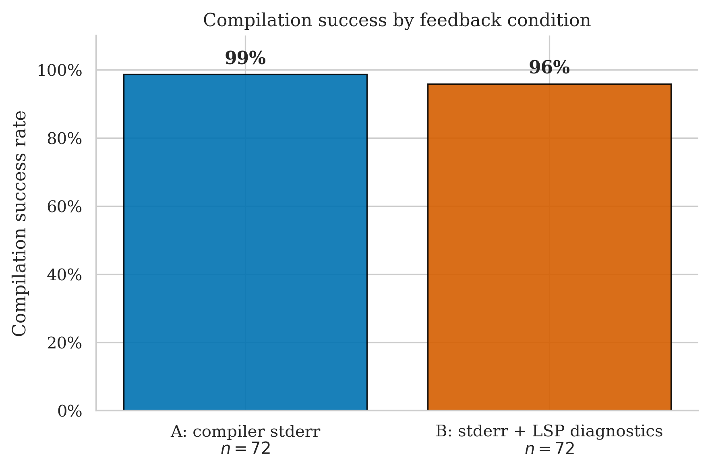
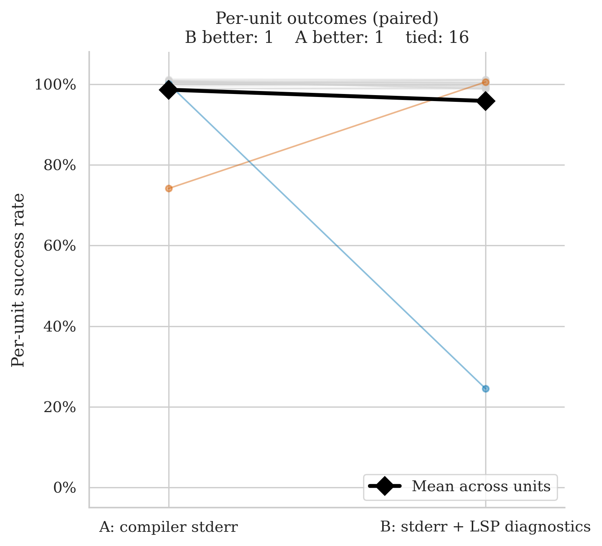
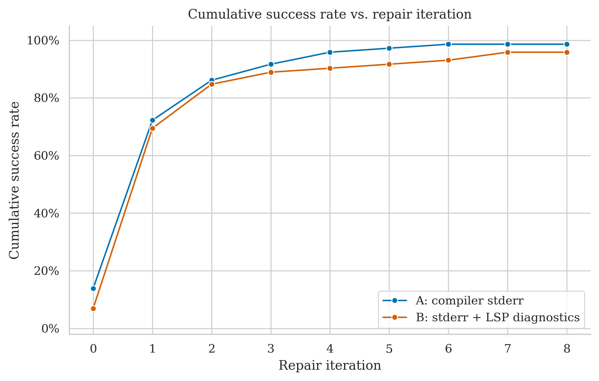
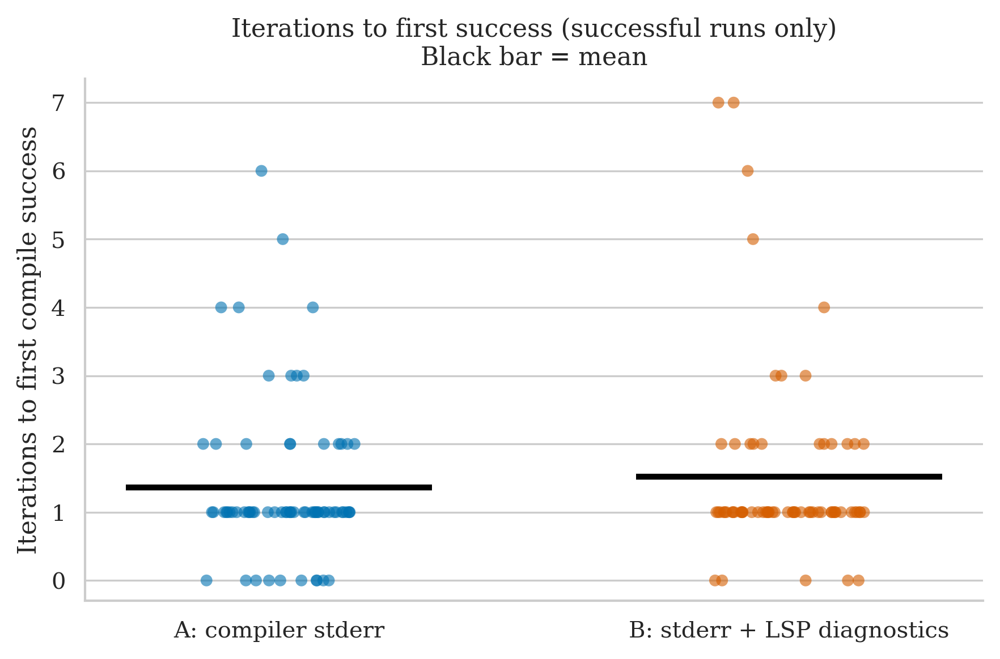
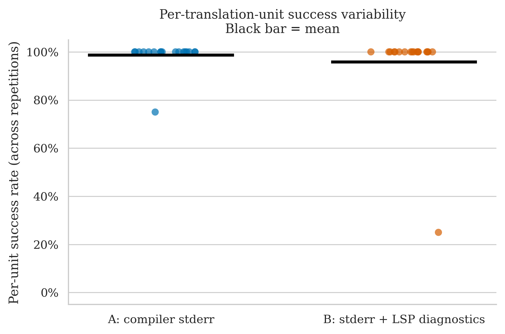

# hash-library — Clean Run Analysis
**Run ID:** `2026-05-16_12-55-31`
**Date:** 2026-05-16
**Project:** hash-library (stbrumme — MD5, SHA1, SHA256, SHA3, Keccak, CRC32 implementations)
**Model:** gpt-4o-2024-08-06 (translator + repair)
**Setup:** 18 files × 2 conditions × **4 repetitions** × max 8 repair iterations
**Condition B (this run):** stderr + LSP diagnostics (combined)

> **First confirmed McNemar discordant pair in the entire experiment.** A=98.6% (71/72), B=95.8% (69/72). The signal comes entirely from `tests/tests.cpp`, where B failed 3 of 4 reps (25%) while A passed all 4 — producing A's first statistically-registered win. Sixteen of 18 files are perfect 100%/100% ceiling ties, including all six hash algorithm implementation files. The bitwise domain is largely solved by both conditions within a few repair rounds.

---

## The Two Conditions

| Label | What the repair agent receives after a failed compile |
|-------|------------------------------------------------------|
| **A: compiler stderr** | Raw `rustc` error output |
| **B: stderr + LSP diagnostics** | Raw `rustc` stderr **plus** structured JSON from rust-analyzer: error codes, line/col numbers, severity |

---

## Files Tested

| File | LOC | Description |
|------|-----|-------------|
| `crc32.cpp` / `crc32.h` | 431 / 69 | CRC-32 checksum implementation |
| `md5.cpp` / `md5.h` | 380 / 78 | MD5 hash implementation |
| `sha1.cpp` / `sha1.h` | 326 / 78 | SHA-1 hash implementation |
| `sha256.cpp` / `sha256.h` | 428 / 78 | SHA-256 hash implementation |
| `sha3.cpp` / `sha3.h` | 300 / 81 | SHA-3 hash implementation |
| `keccak.cpp` / `keccak.h` | 298 / 81 | Keccak sponge implementation |
| `digest.cpp` | 109 | Base digest class |
| `hash.h` | 28 | Common hash interface |
| `hmac.h` | 83 | HMAC wrapper |
| `tests/tests.cpp` | 361 | Full test suite — exercises all algorithms |
| `tests/github-issue2.cpp` | 64 | Regression test (issue #2) |
| `tests/github-issue6.cpp` | 16 | Regression test (issue #6) |

All algorithm files contain dense bitwise operations: bit rotations, XOR chains, modular addition, and fixed lookup tables — the same idiom class as `TinyRISCV64.h`, which was the most discriminating file in the original experiment.

---

## Overall Success Rates

| Condition | Successes / Runs | Success Rate | 95% Wilson CI |
|-----------|-----------------|-------------|--------------|
| A: compiler stderr | 71 / 72 | **98.6%** | 92.5% – 99.8% |
| B: stderr + LSP diagnostics | 69 / 72 | **95.8%** | 88.5% – 98.6% |

A leads B by 2.8 pp. Both rates are high — this is a near-ceiling project. The Wilson intervals overlap, so the gap is within noise at the overall level. A's single failure is on `tests/github-issue6.cpp` (1 rep). B's three failures are all concentrated on `tests/tests.cpp` (3 of 4 reps).

| Metric | A | B |
|--------|---|---|
| Mean iterations | 1.46 | 1.79 |
| Median iterations | 1.0 | 1.0 |
| Mean wall time | 32.2s | 32.7s |
| Median wall time | 14.2s | 18.6s |

Both conditions have near-identical mean wall times (32.2s vs 32.7s) — the most balanced comparison in the dataset. B uses slightly more iterations on average (1.79 vs 1.46), driven by a few high-iteration outliers on the implementation files. Medians are the same (1.0 for both), meaning most runs resolve in exactly one repair round.

---

## Per-File Breakdown

### tests/tests.cpp (361 LOC) — the discordant pair

| | Rep 0 | Rep 1 | Rep 2 | Rep 3 |
|-|-------|-------|-------|-------|
| **A** | ✅ PASS (4 iters, 46.0s) | ✅ PASS (4 iters, 113.8s) | ✅ PASS (5 iters, 118.7s) | ✅ PASS (2 iters, 362.7s) |
| **B** | ✅ PASS (7 iters, 144.3s) | ❌ FAIL (8 iters, 57.7s) | ❌ FAIL (8 iters, 46.8s) | ❌ FAIL (8 iters, 46.9s) |

A passes all 4 reps (100%). B passes 1 and fails 3 (25%). Per-unit majority vote: **A = 100% (pass), B = 25% (fail) — first McNemar discordant pair in the experiment; A wins.**

The test file exercises every hash algorithm with known-good vectors, hex string comparisons, and assertion macros. Unlike the algorithm files themselves, the test harness involves string manipulation, dynamic dispatch through the base `Hash` class, and output formatting — constructs that are idiomatically different from Rust's pattern-matching and string handling. B's combined feedback appears unable to converge on the correct Rust representation of this test infrastructure within 8 rounds on 3 of 4 attempts, while A consistently solves it in 2–5 rounds.

Note: A's rep 3 took 362 seconds despite only 2 iterations — an unusually long LLM response, not a compilation difficulty.

### tests/github-issue6.cpp (16 LOC) — A's only failure, on a 16-line file

| | Rep 0 | Rep 1 | Rep 2 | Rep 3 |
|-|-------|-------|-------|-------|
| **A** | ✅ PASS (0 iters, 2.1s) | ✅ PASS (0 iters, 2.8s) | ❌ FAIL (8 iters, 26.7s) | ✅ PASS (0 iters, 2.9s) |
| **B** | ✅ PASS (0 iters, 2.8s) | ✅ PASS (0 iters, 3.5s) | ✅ PASS (0 iters, 2.9s) | ✅ PASS (2 iters, 16.3s) |

A=75%, B=100%. A compiles first-try on reps 0, 1, and 3 — then hits 8 iterations and fails on rep 2 with the same code. This is the most extreme stochastic failure in the dataset: a 16-line regression test, passing 3/4 times instantly, failing once on 8 rounds. The initial translation on rep 2 must have produced an unusually broken starting point. B handles all 4 reps. Per-unit majority vote: A=75% (pass), B=100% (pass) — **tied under ≥50% rule, not a discordant pair**.

### sha256.cpp (428 LOC) — B's high-iteration outlier

| | Rep 0 | Rep 1 | Rep 2 | Rep 3 |
|-|-------|-------|-------|-------|
| **A** | ✅ PASS (1 iter, 42.6s) | ✅ PASS (1 iter, 32.3s) | ✅ PASS (1 iter, 36.3s) | ✅ PASS (2 iters, 66.0s) |
| **B** | ✅ PASS (7 iters, 162.9s) | ✅ PASS (1 iter, 44.6s) | ✅ PASS (1 iter, 45.2s) | ✅ PASS (1 iter, 40.7s) |

Both conditions succeed all 4 reps. A is consistently fast (1–2 iterations). B rep 0 needed 7 iterations (163s) — close to the cap — before converging. B reps 1–3 each needed only 1 iteration. SHA-256's 64-round Merkle-Damgård construction with 32-bit word operations appears to have produced a particularly problematic initial translation on that one rep. Per-unit: **A = 100%, B = 100% — tie**.

### md5.cpp (380 LOC) — B's second high-iteration outlier

| | Rep 0 | Rep 1 | Rep 2 | Rep 3 |
|-|-------|-------|-------|-------|
| **A** | ✅ PASS (1 iter, 66.0s) | ✅ PASS (1 iter, 64.1s) | ✅ PASS (1 iter, 72.9s) | ✅ PASS (1 iter, 21.4s) |
| **B** | ✅ PASS (2 iters, 82.3s) | ✅ PASS (2 iters, 42.2s) | ✅ PASS (5 iters, 126.1s) | ✅ PASS (1 iter, 59.2s) |

A solves all 4 reps in exactly 1 iteration. B needs 1–5. B rep 2 took 5 iterations (126s). A's consistent 1-iteration performance on MD5 suggests the raw stderr gives the model a direct enough signal to fix the 32-bit rotation/XOR patterns in a single round. Per-unit: **A = 100%, B = 100% — tie**.

### sha1.cpp (326 LOC) — A's high-iteration outlier

| | Rep 0 | Rep 1 | Rep 2 | Rep 3 |
|-|-------|-------|-------|-------|
| **A** | ✅ PASS (3 iters, 72.0s) | ✅ PASS (6 iters, 145.7s) | ✅ PASS (2 iters, 51.9s) | ✅ PASS (2 iters, 60.2s) |
| **B** | ✅ PASS (3 iters, 95.9s) | ✅ PASS (1 iter, 48.4s) | ✅ PASS (1 iter, 46.0s) | ✅ PASS (1 iter, 48.5s) |

A rep 1 required 6 iterations (146s) — A's largest outlier in this run. B consistently needed 1–3. Both conditions succeed all 4 reps. Per-unit: **A = 100%, B = 100% — tie**.

### Remaining 12 files — all ceiling ties

All other files (crc32.cpp/h, keccak.cpp/h, sha3.cpp/h, md5.h, sha1.h, sha256.h, hash.h, hmac.h, digest.cpp, github-issue2.cpp) pass under both conditions on all 4 repetitions. Iteration counts range from 0–4 with no failures. No condition signal.

---

## Statistical Test (McNemar)

**Majority vote per file (≥50% success across reps = unit pass):**

- **A wins:** 1 unit (`tests/tests.cpp`: A=100%, B=25%)
- **B wins:** 0 units
- **Discordant pairs:** 1
- **p-value: 1.000** — not significant (need 4 for p < 0.05)

The paired slope chart shows one blue falling line (`tests.cpp`, A=100% → B=25%) crossing one orange rising line (`github-issue6.cpp`, A=75% → B=100%), with 16 grey flat lines at 100%. The mean line drops very slightly from ~98% to ~96%.

**This is the first genuine McNemar discordant pair recorded in the combined-B experiment.** With `tests.cpp` at B=25%, it clearly fails the ≥50% majority threshold. However, a single discordant pair is still far from the 4 needed for p < 0.05.

---

## Cumulative Success Over Repair Iterations

Both curves start close (~15% A vs ~7% B at iteration 0 — a handful of first-try compiles). They track tightly together through iterations 1–3, both climbing steeply. A plateaus at 98.6% around iteration 6; B plateaus at 95.8% shortly after. The three permanently-stuck B runs (`tests.cpp` reps 1–3) create B's flat plateau. The curves are the closest together of any run in the experiment — the hash domain is near-ceiling for both.

---

## Iterations to Success (Successful Runs Only)

| Condition | Distribution | Mean |
|-----------|-------------|------|
| A (71 runs) | Mostly 0–2, outliers at 3, 4, 5, 6 | ~1.4 |
| B (69 runs) | Mostly 0–2, outliers at 3, 4, 5, 6, 7 | ~1.6 |

Both distributions are heavily concentrated at 0–2 iterations. B has slightly more outliers at the high end (two points at 7, driven by `sha256.cpp` rep 0 and `tests.cpp` rep 0). A's heaviest outlier is 6 (`sha1.cpp` rep 1). The mean bars are very close (~1.4 vs ~1.6).

---

## Per-Unit Success Variability

- **A:** 17 units at 100%, one at 75% (`github-issue6.cpp`)
- **B:** 17 units at 100%, one at 25% (`tests/tests.cpp`)

Both sides have 17 dots at the ceiling and one outlier. A's outlier is 75% (3/4 pass, above the majority threshold). B's outlier is 25% (1/4 pass, below the threshold) — hence the discordant pair.

---

## Key Takeaways

1. **First confirmed McNemar discordant pair.** `tests/tests.cpp`: A=4/4=100%, B=1/4=25%. A wins this pair. This is the first file in the combined-B experiment where a condition clearly fails the majority-vote threshold (25% < 50%). One discordant pair recorded; three more needed for p < 0.05.

2. **The bitwise hash domain is largely a near-ceiling project.** All six algorithm implementation files (MD5, SHA1, SHA256, SHA3, Keccak, CRC32) compile under both conditions every time. Dense bit rotations and XOR chains, while visually similar to TinyRISCV64's instruction decoder, appear more tractable — possibly because hash functions have simpler control flow (no conditional branches per iteration, no union-typed registers).

3. **The failure is in the test harness, not the algorithms.** B struggles with `tests.cpp` — a test file that uses string operations, hex encoding checks, and virtual dispatch through the base `Hash` class. The combined feedback does not reliably guide repair of this test infrastructure. In contrast, the same feedback handles the algorithm files perfectly. This mirrors the gtest-all.cc pattern from PPK_ASSERT: test framework glue code appears harder for B than the algorithmic core.

4. **github-issue6.cpp at 16 LOC failed once under A.** A 16-line file failing 8 iterations is a reminder that the initial translation quality is stochastic — a bad starting point can exhaust the budget regardless of how good the feedback signal is.

5. **Wall times are essentially equal.** Mean 32.2s (A) vs 32.7s (B) — the closest parity in the dataset. With 4 reps and mostly 0–2 iterations per run, the per-round LSP overhead is spread across many short runs and does not dominate.

6. **B has high-iteration outliers on the large algorithm files.** sha256.cpp rep 0 (7 iters, 163s), md5.cpp rep 2 (5 iters, 126s), keccak.cpp rep 1 (4 iters, 110s). All eventually converge, but the variance is much higher under B than A for these files.

---

## What This Means for the Thesis

- **The first discordant pair has been recorded under the combined-B experiment.** `tests/tests.cpp` gives A a clean win: A=100%, B=25%. Along with the near-miss on `gtest-all.cc` (PPK_ASSERT, B=50%), a pattern is emerging: **B struggles with test framework infrastructure code** more than with algorithmic C++ code. Two separate projects (PPK_ASSERT and hash-library) now show B having difficulty with test files while handling the core library files perfectly.
- **The hash algorithm files are not discriminating.** Despite containing dense bitwise operations similar to TinyRISCV64, they compile reliably under both conditions. The difference from TinyRISCV64 appears to be control-flow complexity — hash functions have no conditional branches or union-typed registers requiring Rust-specific idiom changes, just arithmetic on unsigned integers.
- **Pooled McNemar across all runs so far:** 1 discordant pair (A wins, from this run). Three more needed for p < 0.05. The 4-rep design is producing them — this run added the first one that the 2-rep design would never have detected (at 2 reps, B=1/4 would either be 0/2 or 1/2, the latter passing the majority rule).
