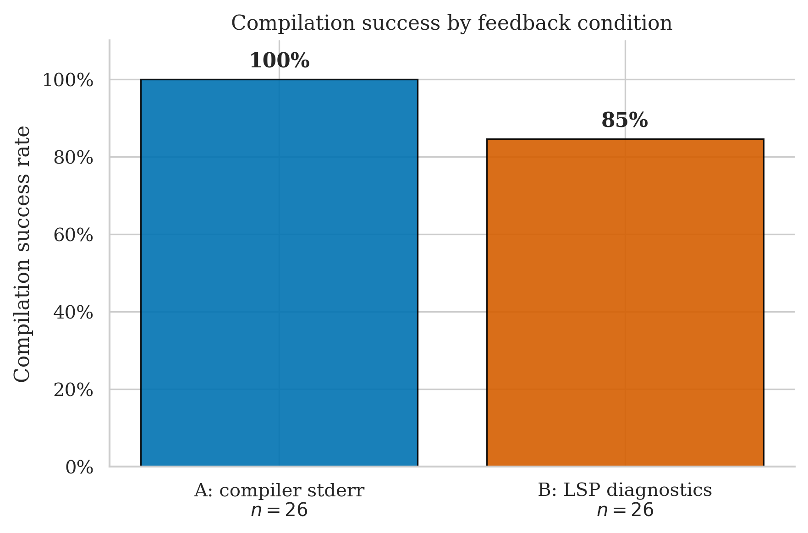
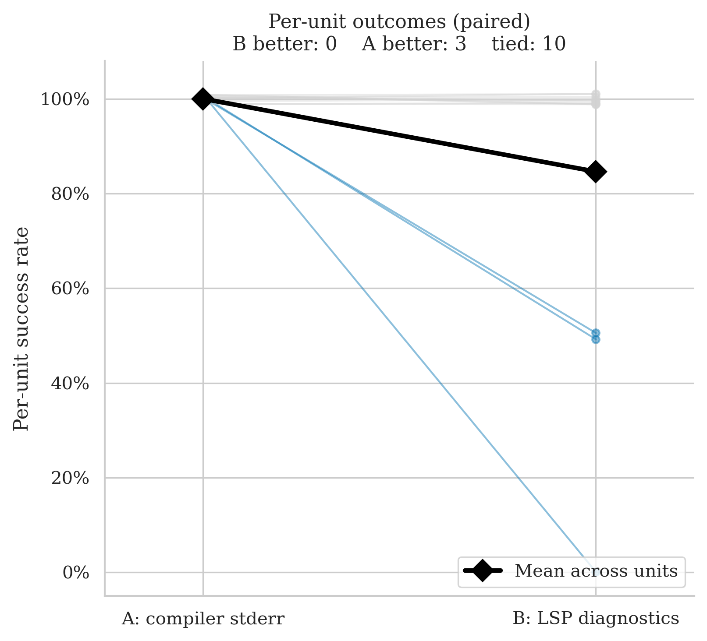
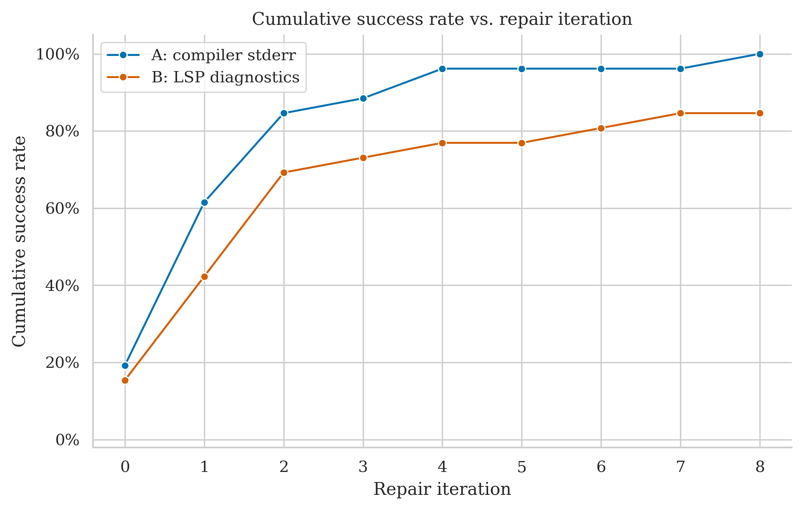
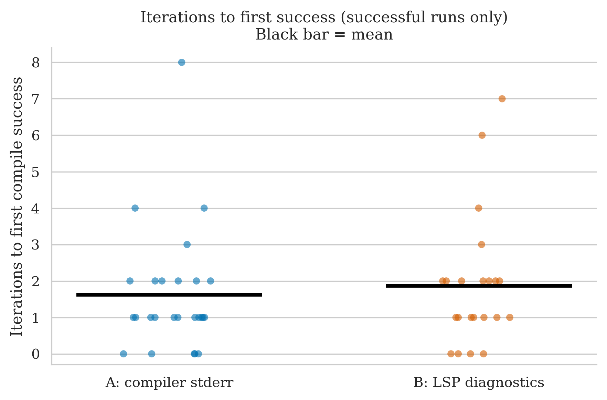
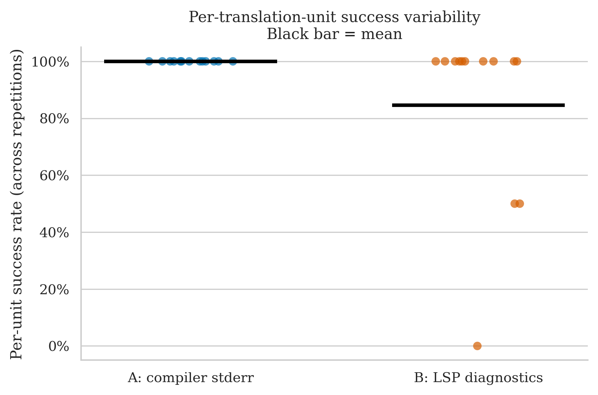

# immediate2d — Clean Run Analysis
**Run ID:** `2026-05-14_21-27-33`
**Date:** 2026-05-14
**Project:** immediate2d (C++ header-only graphics/input toy library + example programs)
**Model:** gpt-4o-2024-08-06 (translator + repair)
**Setup:** 13 files × 2 conditions × 2 repetitions × max 8 repair iterations

> By far the largest run to date: 52 total invocations across 13 translation units ranging from 19 LOC up to 1 485 LOC.

---

## The Two Conditions

| Label | What the repair agent receives after a failed compile |
|-------|------------------------------------------------------|
| **A: compiler stderr** | Raw `rustc` error output |
| **B: LSP diagnostics** | Structured output from rust-analyzer: error codes, line/col numbers, severity |

---

## Files Tested

| File | Lines of Code | Description |
|------|-------------|-------------|
| `example1_helloWorld.cpp` | 19 | Tiny "draw text" demo |
| `example2_blink.cpp` | 34 | Pixel blink loop |
| `example3_button.cpp` | 63 | Mouse-click button demo |
| `example4_paint.cpp` | 117 | Mouse-drag paint program |
| `example5_graphing.cpp` | 57 | Live function-graph plotter |
| `example6_text.cpp` | 131 | Text rendering / wrapping demo |
| `example7_nibbles.cpp` | 503 | Full "snake" clone with sound |
| `example8_smoke.cpp` | 306 | Particle-based smoke simulation |
| `example9_raytracer.cpp` | 255 | Small ray tracer |
| `exampleA_snow.cpp` | 198 | Falling-snow simulation |
| `exampleB_game.cpp` | 689 | Largest example — a small platformer |
| `exampleData/littleGame/levels.h` | 167 | Level data for `exampleB_game` |
| `immediate2d.h` | 1 485 | The library itself (header-only) |

---

## Overall Success Rates

| Condition | Successes / Runs | Success Rate | 95% Wilson CI |
|-----------|-----------------|-------------|--------------|
| A: compiler stderr | 26 / 26 | **100%** | 87% – 100% |
| B: LSP diagnostics | 22 / 26 | **84.6%** | 66% – 94% |

Condition A compiled every single run on every single file. Condition B failed 4 runs out of 26, and those failures clustered on 3 specific files (paint, smoke, raytracer).

A is also faster and uses fewer iterations on average:

| Metric | A | B |
|--------|---|---|
| Mean iterations to success | 1.62 | 2.81 |
| Median iterations | 1 | 2 |
| Mean wall time | 45.1s | 82.7s |
| Median wall time | 24.2s | 33.2s |

---

## Per-File Breakdown

### Files where both conditions passed every rep (10 / 13)

| File (LOC) | A iters (rep 0 / rep 1) | B iters (rep 0 / rep 1) |
|------------|-------------------------|-------------------------|
| `example1_helloWorld.cpp` (19) | 0 / 1 | 1 / 0 |
| `example2_blink.cpp` (34) | 0 / 0 | 1 / 0 |
| `example3_button.cpp` (63) | 1 / 2 | 0 / 1 |
| `example5_graphing.cpp` (57) | 0 / 0 | 1 / 0 |
| `example6_text.cpp` (131) | 1 / 1 | 1 / 2 |
| `example7_nibbles.cpp` (503) | 2 / 3 | **7** / 3 |
| `exampleA_snow.cpp` (198) | 4 / 2 | 2 / 6 |
| `exampleB_game.cpp` (689) | 1 / 2 | 2 / 2 |
| `exampleData/littleGame/levels.h` (167) | 2 / 1 | 1 / 2 |
| `immediate2d.h` (1 485) | 1 / 2 | 1 / 4 |

`example7_nibbles` is the most noticeable: B needed 7 repair iterations on rep 0 (still succeeded). The largest file in the project — `immediate2d.h` at 1 485 LOC — was surprisingly easy under both conditions (1–4 iterations).

### Files where B failed at least once (3 / 13)

#### `example4_paint.cpp` (117 LOC)

| | Rep 0 | Rep 1 |
|-|-------|-------|
| **A** | ✅ PASS (1 iter, 14.1s) | ✅ PASS (1 iter, 13.3s) |
| **B** | ✅ PASS (2 iters, 30.2s) | ❌ FAIL (8 iters, 83.3s) |

A compiled this in 1 iteration both reps. B compiled rep 0 in 2 iterations but exhausted the 8-iteration budget on rep 1.

#### `example8_smoke.cpp` (306 LOC)

| | Rep 0 | Rep 1 2026-05-14_23-15-26|
|-|-------|-------|
| **A** | ✅ PASS (1 iter, 53.8s) | ✅ PASS (1 iter, 65.7s) |
| **B** | ❌ FAIL (8 iters, 310.1s) | ✅ PASS (2 iters, 100.1s) |

Same pattern — A trivial under both reps, B succeeds once and fails once.

#### `example9_raytracer.cpp` (255 LOC) — B's worst file

| | Rep 0 | Rep 1 |
|-|-------|-------|
| **A** | ✅ PASS (8 iters, 224.9s) | ✅ PASS (4 iters, 159.3s) |
| **B** | ❌ FAIL (8 iters, 313.4s) | ❌ FAIL (8 iters, 235.2s) |

The only file where condition B never compiled. A also struggled (8 iterations on rep 0 — exactly at the limit) but ultimately succeeded both times. Ray tracer code is dense with floating-point arithmetic, vector math, and tight loops; B's LSP feedback was apparently not enough to converge in 8 iterations either time.

---

## Statistical Test (McNemar)

**Majority vote per file (≥50% success across reps = unit pass):**

- **A wins:** 1 unit (raytracer — A passes 2/2, B passes 0/2)
- **B wins:** 0 units
- **Discordant pairs:** 1
- **p-value: 1.000** — inconclusive

With only 1 discordant unit out of 13, McNemar has no power even at this larger n. The other two B-failure files (paint, smoke) each succeeded once for B, so under the ≥50% rule they count as ties.

The paired slope chart visualises this directly: 10 horizontal lines at 100% (ties), 2 lines dropping from 100% to 50% (paint, smoke), and 1 line dropping from 100% to 0% (raytracer). No line goes the other direction.

---

## Cumulative Success Over Repair Iterations

A's curve climbs faster and higher: most A runs succeed at iteration 0 or 1, and the curve reaches 100% within 8 iterations. B's curve is shallower throughout — more runs need late iterations to succeed, and the curve plateaus at ~85% because of the 4 unrecovered failures.

---

## Iterations to Success (Successful Runs Only)

Among runs that succeeded:

| Condition | Distribution of iterations used | Median |
|-----------|-------------------------------|--------|
| A | mostly 0–2, a few at 3–4, one at 8 (raytracer rep 0) | 1 |
| B | spread from 0 to 7, more mass in 1–3 range | 2 |

A succeeds earlier in the repair loop. B that does succeed often needs a few more rounds, and a meaningful tail at 6–7 iterations.

---

## Per-Unit Success Variability

A's points are all at 100% (every unit, every rep succeeded). B's points cluster at 100% for 10 units, 50% for 2 units (paint, smoke), and 0% for 1 unit (raytracer).

---

## Key Takeaways

1. **A wins cleanly on this dataset.** 100% vs 84.6% is the largest gap seen in any clean run so far, on the largest sample (52 runs). The win is concentrated on 3 specific files; the other 10 are ties.

2. **A is also faster and needs fewer iterations on average** (45s vs 83s mean wall time; 1.6 vs 2.8 mean iterations). Even when both conditions succeed, A converges sooner.

3. **B's failures are correlated with code difficulty, not size.** The 1 485-LOC `immediate2d.h` compiled fine under B. The 255-LOC raytracer never did. The structural complexity of the code matters more than line count.

4. **The McNemar result is still p = 1.0 despite n = 13 units.** Most files are easy enough that both conditions pass, which makes them ties under the ≥50% rule and removes them from the discordant count. The single discordant unit (raytracer) is consistent with the Swarmz-style pattern: when the code is hard, A converges and B does not.

5. **Combined direction across projects is now consistent.** Swarmz: A=100%, B=50%. MicroPather: A=50%, B=50%. immediate2d: A=100%, B=85%. All three projects point in the same direction (A ≥ B at the aggregate level), but no individual McNemar test reaches significance.

---

## What This Means for the Thesis

- This is the strongest single result for condition A so far, on the largest sample.
- The directional pattern across all three clean runs is consistent: raw stderr feedback never underperforms structured LSP diagnostics at the aggregate level, and on hard files it can outperform decisively.
- A pooled analysis across Swarmz + MicroPather + immediate2d (total 21 units, 84 runs) is now feasible and would have meaningfully more statistical power than any individual project's McNemar.
- The 4 B-failures (paint rep 1, smoke rep 0, raytracer reps 0 and 1) are the natural target for a follow-up qualitative inspection: where did the LSP-guided repair get stuck, and what would the model have needed to escape?
