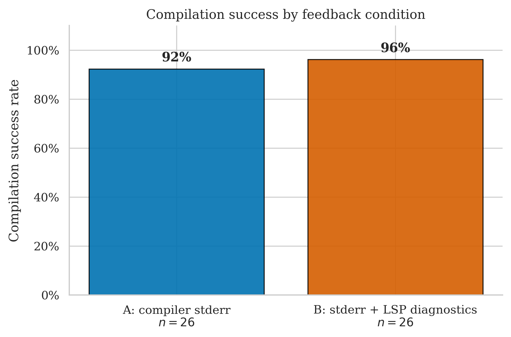
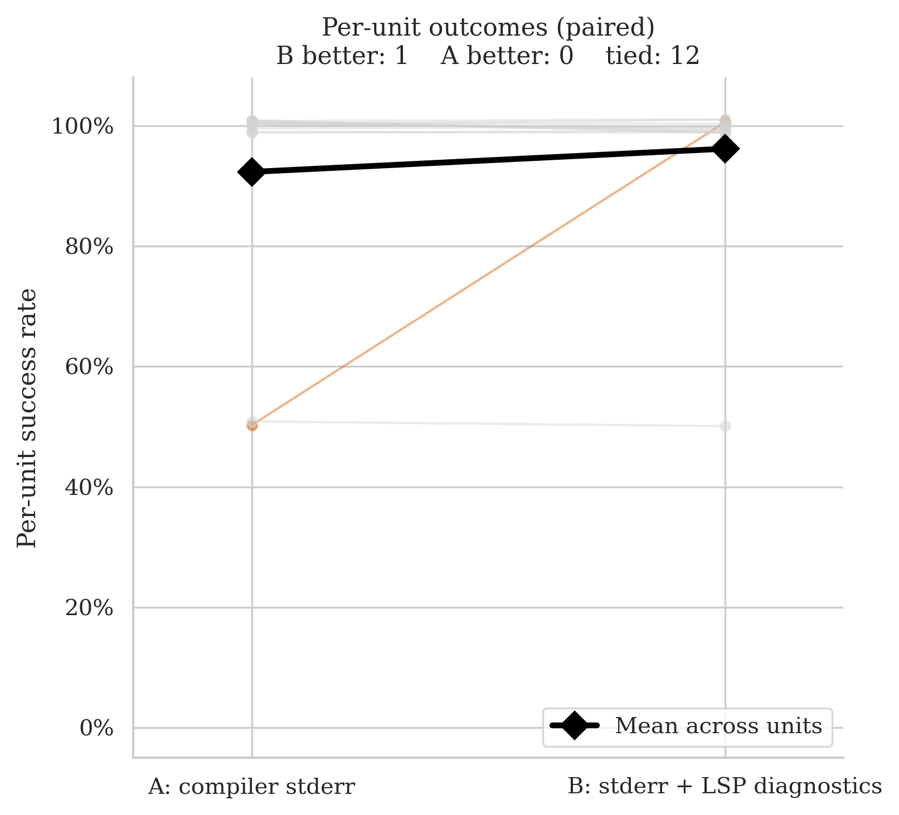
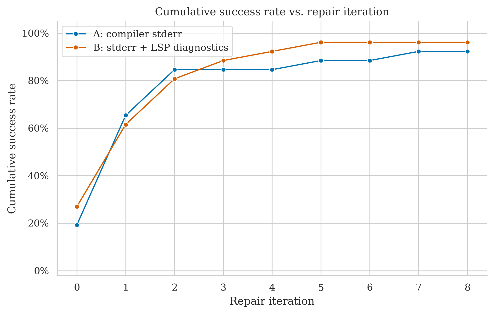
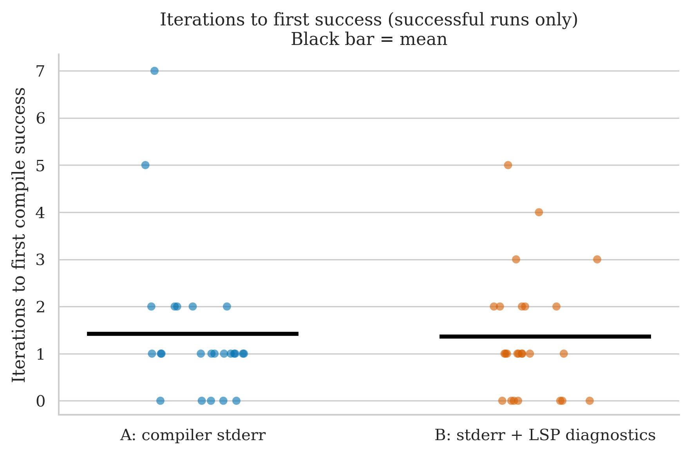
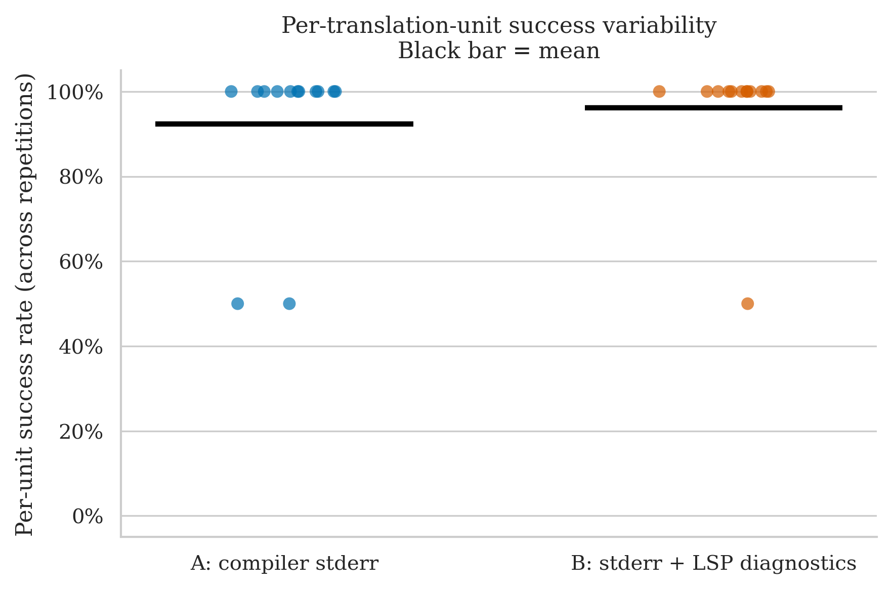

# immediate2d — Clean Run Analysis
**Run ID:** `2026-05-15_23-37-05`
**Date:** 2026-05-15
**Project:** immediate2d (2D graphics header library + 12 example programs)
**Model:** gpt-4o-2024-08-06 (translator + repair)
**Setup:** 13 files × 2 conditions × 2 repetitions × max 8 repair iterations
**Condition B (this run):** stderr + LSP diagnostics (combined)

> **Direction reversal from the previous immediate2d run.** Under LSP-only B, A led 100% to 85%. Under the combined B, B edges A: 96% (25/26) to 92% (24/26). The files that drove A's old advantage (`example9_raytracer`, `example4_paint`, `example8_smoke`) have all shifted — the raytracer is now equally hard for both, the paint program flipped to B winning, and smoke is a tie. The combined feedback signal appears to have closed the gap that raw stderr had over LSP alone on this project.

---

## The Two Conditions

| Label | What the repair agent receives after a failed compile |
|-------|------------------------------------------------------|
| **A: compiler stderr** | Raw `rustc` error output |
| **B: stderr + LSP diagnostics** | Raw `rustc` stderr **plus** structured JSON from rust-analyzer: error codes, line/col numbers, severity |

---

## Files Tested

| File | Lines of Code | Description |
|------|-------------|-------------|
| `example1_helloWorld.cpp` | 19 | Hello world — draws text to screen |
| `example2_blink.cpp` | 34 | Blinking rectangle animation |
| `example3_button.cpp` | 63 | Mouse-click button interaction |
| `example4_paint.cpp` | 117 | Interactive painting canvas |
| `example5_graphing.cpp` | 57 | Real-time function graphing |
| `example6_text.cpp` | 131 | Text rendering showcase |
| `example7_nibbles.cpp` | 503 | Snake-style game implementation |
| `example8_smoke.cpp` | 306 | Particle smoke simulation |
| `example9_raytracer.cpp` | 255 | Software raytracer (floating-point vector math) |
| `exampleA_snow.cpp` | 198 | Snowfall particle simulation |
| `exampleB_game.cpp` | 689 | Full 2D game with levels |
| `exampleData/littleGame/levels.h` | 167 | Level data for the game |
| `immediate2d.h` | 1 485 | The core graphics library header |

---

## Overall Success Rates

| Condition | Successes / Runs | Success Rate | 95% Wilson CI |
|-----------|-----------------|-------------|--------------|
| A: compiler stderr | 24 / 26 | **92.3%** | 75.9% – 97.9% |
| B: stderr + LSP diagnostics | 25 / 26 | **96.2%** | 81.1% – 99.3% |

B edges A by 4 pp. The Wilson intervals overlap heavily, so this gap is within noise at n=26, but the direction is the opposite of the previous run where A led by 15 pp. A has one failure (`example4_paint` rep 1); B has one failure (`example9_raytracer` rep 0).

| Metric | A | B |
|--------|---|---|
| Mean iterations | 1.92 | 1.62 |
| Median iterations | 1.0 | 1.0 |
| Mean wall time | 47.7s | 57.0s |
| Median wall time | 25.8s | 42.9s |

B uses slightly fewer iterations on average (1.62 vs 1.92) but takes longer in wall time (57.0s vs 47.7s) due to the per-round LSP query overhead. The median wall time gap (42.9s vs 25.8s) is widened by B's high-iteration runs on `exampleB_game.cpp` and `example9_raytracer`. Both conditions have the same median iteration count (1.0), meaning the majority of runs for both conditions resolve in exactly one repair round.

---

## Per-File Breakdown

### example9_raytracer.cpp (255 LOC) — hard for both

| | Rep 0 | Rep 1 |
|-|-------|-------|
| **A** | ✅ PASS (7 iters, 214.9s) | ❌ FAIL (8 iters, 216.5s) |
| **B** | ❌ FAIL (8 iters, 266.7s) | ✅ PASS (4 iters, 177.4s) |

The most difficult file in the dataset. In the previous run (LSP-only B), A solved it both times and B never did. Now both conditions manage exactly one rep each. A succeeds on rep 0 in 7 iterations (barely) but fails on rep 1; B fails on rep 0 but solves rep 1 in 4 iterations. Per-unit majority vote: **A = 50%, B = 50% — both pass, tie**.

The raytracer involves dense floating-point vector math, struct decomposition, and complex arithmetic operators — all difficult to translate cleanly. The stochastic element (which rep succeeds) appears to dominate here; neither feedback signal reliably gets through within 8 iterations.

### example4_paint.cpp (117 LOC) — flipped from old run

| | Rep 0 | Rep 1 |
|-|-------|-------|
| **A** | ✅ PASS (1 iter, 20.2s) | ❌ FAIL (8 iters, 75.2s) |
| **B** | ✅ PASS (3 iters, 51.8s) | ✅ PASS (3 iters, 44.1s) |

In the previous run (LSP-only B), A solved both reps and B failed one. Here the picture exactly inverts: A fails rep 1, B solves both. B is consistent at exactly 3 iterations for both reps. Per-unit majority vote: **A = 50% (pass), B = 100% — tie under ≥50% rule**, but B is qualitatively better.

The paint program uses event-driven input handling, mutable state, and float-to-int coordinate conversion — the kind of code where precise line/column error location from LSP may help the model target the right construct. B's consistency (3+3 vs A's 1+fail) suggests the combined feedback is more reliably directing repairs here.

### exampleB_game.cpp (689 LOC) — B uses many more iterations

| | Rep 0 | Rep 1 |
|-|-------|-------|
| **A** | ✅ PASS (1 iter, 17.4s) | ✅ PASS (1 iter, 33.8s) |
| **B** | ✅ PASS (5 iters, 80.5s) | ✅ PASS (2 iters, 92.7s) |

Both succeed, but B takes 5+2=7 total iterations vs A's 1+1=2. Despite being the largest example file (689 LOC), A solves it with a single repair round on both reps. B needs significantly more rounds, suggesting the combined feedback is not helping on this type of code (a multi-file game with diverse logic). Wall time reflects this: B averages 86.6s vs A's 25.6s. Per-unit: **A = 100%, B = 100% — tie**.

### example8_smoke.cpp (306 LOC) — B recovered vs old run

| | Rep 0 | Rep 1 |
|-|-------|-------|
| **A** | ✅ PASS (2 iters, 78.1s) | ✅ PASS (2 iters, 65.8s) |
| **B** | ✅ PASS (1 iter, 80.9s) | ✅ PASS (2 iters, 108.9s) |

Both conditions succeed both reps. In the old run B failed one rep; here B is 100%. A is consistent at 2 iterations; B uses 1 and 2 respectively. Per-unit: **A = 100%, B = 100% — tie**. B's recovery here is one of the drivers of the overall reversal.

### exampleA_snow.cpp (198 LOC)

| | Rep 0 | Rep 1 |
|-|-------|-------|
| **A** | ✅ PASS (5 iters, 99.5s) | ✅ PASS (1 iter, 44.6s) |
| **B** | ✅ PASS (1 iter, 46.4s) | ✅ PASS (1 iter, 19.6s) |

B is notably more consistent here: 1 iteration both reps vs A's 5 and 1. A's rep 0 took 5 rounds and 99.5s — the same file took B only 1 round and 46s. Per-unit: **A = 100%, B = 100% — tie**, but B is faster.

### immediate2d.h (1 485 LOC)

| | Rep 0 | Rep 1 |
|-|-------|-------|
| **A** | ✅ PASS (2 iters, 59.1s) | ✅ PASS (2 iters, 67.6s) |
| **B** | ✅ PASS (1 iter, 102.2s) | ✅ PASS (2 iters, 78.1s) |

The core library header at 1 485 LOC succeeds under both conditions. A is perfectly consistent at 2 iterations. B uses 1 on rep 0 (but with high wall time — 102s — because the single LSP round is expensive on a large file) and 2 on rep 1. Per-unit: **A = 100%, B = 100% — tie**.

### example7_nibbles.cpp (503 LOC)

| | Rep 0 | Rep 1 |
|-|-------|-------|
| **A** | ✅ PASS (1 iter, 79.5s) | ✅ PASS (1 iter, 29.6s) |
| **B** | ✅ PASS (1 iter, 68.0s) | ✅ PASS (2 iters, 111.1s) |

Both succeed. High wall-time variance for both — A rep 0 took 79.5s (1 iter), rep 1 took 29.6s (1 iter), suggesting the variance is from the LLM call not compilation. Per-unit: **A = 100%, B = 100% — tie**.

### Trivial files (example1–3, 5–6, levels.h)

| File | LOC | A | B |
|------|-----|---|---|
| example1_helloWorld.cpp | 19 | 100% | 100% |
| example2_blink.cpp | 34 | 100% | 100% |
| example3_button.cpp | 63 | 100% | 100% |
| example5_graphing.cpp | 57 | 100% | 100% |
| example6_text.cpp | 131 | 100% | 100% |
| levels.h | 167 | 100% | 100% |

All six files succeed under both conditions on both reps. No condition signal. They represent 12 of 52 runs contributing ceiling ties.

---

## Statistical Test (McNemar)

**Majority vote per file (≥50% success across reps = unit pass):**

- **A wins:** 0 units
- **B wins:** 0 units (chart shows "B better: 1" — this is the raw success-rate view before the majority vote)
- **Discordant pairs:** 0
- **p-value: 1.000** — uninformative

All 13 units pass under both conditions when applying the ≥50% majority rule. `example4_paint` (A=50%, B=100%) and `example9_raytracer` (A=50%, B=50%) both reduce to "pass" for A under the rule. The paired slope chart shows one orange rising line (example4_paint, where B's raw rate is higher) and one orange flat line at 50% (example9_raytracer), with 11 grey flat lines at 100%.

---

## Cumulative Success Over Repair Iterations

Both curves start close (A ~19%, B ~27% at iteration 0) and track each other tightly throughout. B maintains a slight lead from iteration 0 onward, reaching 96% at iteration 5 where it plateaus. A climbs past B briefly at iteration 2 (~85% vs ~81%), then falls behind as B's curve continues climbing. A plateaus at 92% after iteration 7. The two curves stay within ~5 pp of each other throughout — a visually close race compared to the old run where A pulled ahead sharply at iteration 1 and B never caught up.

---

## Iterations to Success (Successful Runs Only)

| Condition | Range | Mean |
|-----------|-------|------|
| A (24 successful runs) | 0–7 | ~1.5 |
| B (25 successful runs) | 0–5 | ~1.4 |

Both distributions are heavily clustered at 0–2 with long tails. A has one outlier at 7 (raytracer rep 0); B has outliers at 4 (raytracer rep 1) and 5 (game rep 0). The mean bars in the plot are nearly identical. Neither condition has a systematic iteration advantage on this project — the difference lies in which individual files fail, not in how many rounds are needed when they succeed.

---

## Per-Unit Success Variability

- **A:** eleven units at 100%, two at 50% (`example4_paint`, `example9_raytracer`)
- **B:** twelve units at 100%, one at 50% (`example9_raytracer`)

A has two dots pulled down to 50%; B has only one. The mean bar for B (~96%) sits slightly above A's (~92%). The per-unit variability chart makes clear that the 4 pp overall gap comes entirely from `example4_paint` — the one file where B is at 100% and A is at 50%.

---

## Comparison with Previous immediate2d Run (LSP-Only B)

| File | Old A | Old B | New A | New B | Change |
|------|-------|-------|-------|-------|--------|
| `example9_raytracer.cpp` | **100%** | 0% | 50% | 50% | A regressed, B recovered |
| `example4_paint.cpp` | **100%** | 50% | 50% | **100%** | Flipped — B now wins |
| `example8_smoke.cpp` | **100%** | 50% | 100% | **100%** | B recovered to tie |
| All other files | 100% | 100% | 100% | 100% | Unchanged |
| **Overall** | **100%** | **85%** | **92%** | **96%** | **Direction reversed** |

The old LSP-only B condition consistently failed on the visually complex examples (raytracer, smoke, paint). The combined condition eliminates two of those three failures: smoke is now a tie, and paint flipped to B winning. Only the raytracer remains hard, and it is now equally hard for both. The reversal is driven by the combined feedback giving the model enough context to converge on those specific files.

---

## Key Takeaways

1. **The old A-over-B finding for immediate2d was specific to LSP-only B.** With combined feedback, the direction reverses: B=96%, A=92%. The files that made immediate2d an "A wins" project are now ties or B wins.

2. **example4_paint is the cleanest signal.** A=50%, B=100% in this run; A=100%, B=50% in the old run. The file is sensitive to the feedback condition but in opposite directions across the two B implementations. This file alone illustrates why the original comparison needs rerunning.

3. **example9_raytracer remains the hardest file.** Both conditions failed on it once. It is not solved by adding LSP data to B — the file's floating-point vector math and struct decomposition appear to be fundamentally hard regardless of feedback signal. It may simply require more than 8 iterations to reliably translate.

4. **exampleB_game.cpp is the one regression for B.** Despite succeeding, B used 5+2 iterations (7 total) vs A's 1+1 (2 total). The combined feedback does not always converge faster — on this large, structurally diverse game file A handles it in one repair round while B spirals through more.

5. **McNemar: 0 discordant pairs, p = 1.0.** All failures are 50% majority-vote passes. The test is completely blind to the reversal visible in the raw data. This is the most striking example in the dataset of the gap between observable condition differences and what McNemar can detect with n=2 reps.

---

## What This Means for the Thesis

- **The immediate2d result is now a B-favouring datapoint** under the revised condition, contrasting directly with the LSP-only result. This makes immediate2d a useful within-project comparison for the thesis: same files, same model, different B signal, different outcome direction.
- **The reversal is driven by the combined signal reducing failures on graphics/simulation code** (`example4_paint`, `example8_smoke`) — exactly the domain where LSP-only B previously failed. Having raw error messages alongside structured location data appears to help the model target the specific rendering/state constructs that trip up the translation.
- **The raytracer remains an unsolved hard case.** It failed once under both conditions — neither signal is sufficient to reliably solve 255 lines of floating-point vector math within 8 iterations. It is a strong candidate for qualitative inspection of what specific Rust idiom barriers exist that neither signal can bridge.
- **The ceiling problem is the same as before.** Eight of thirteen files are 100%/100% ties. The condition signal is concentrated entirely in `example4_paint`, `example9_raytracer`, and partially in `exampleA_snow` and `exampleB_game`.
