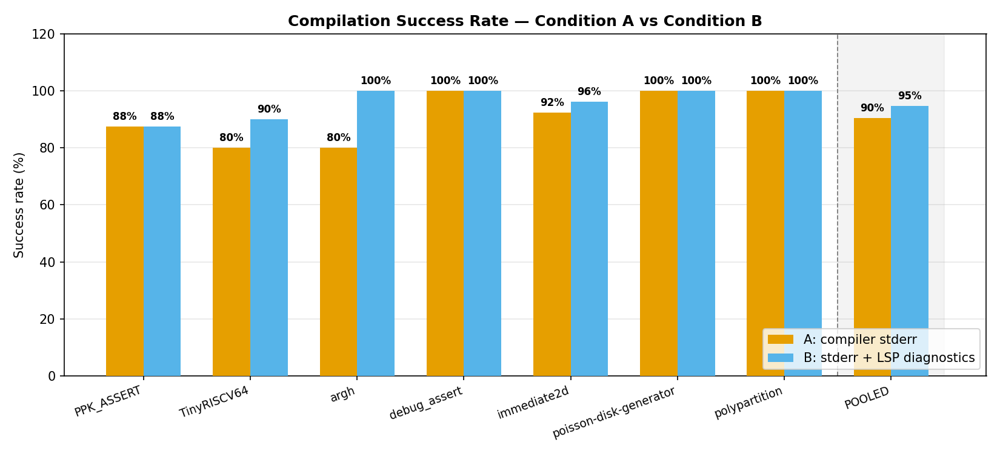
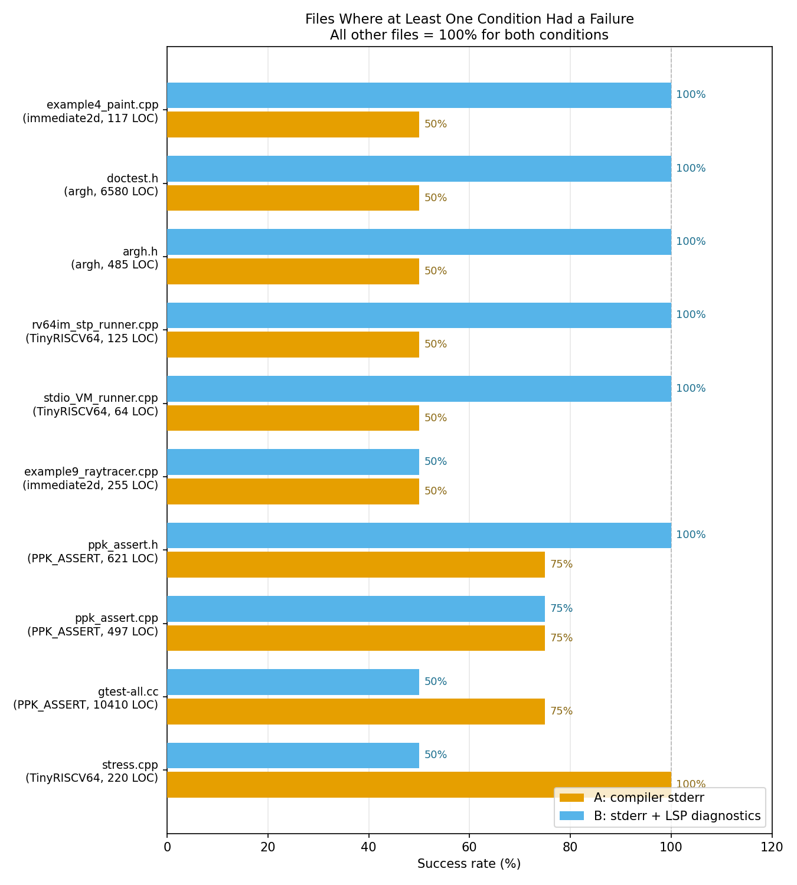
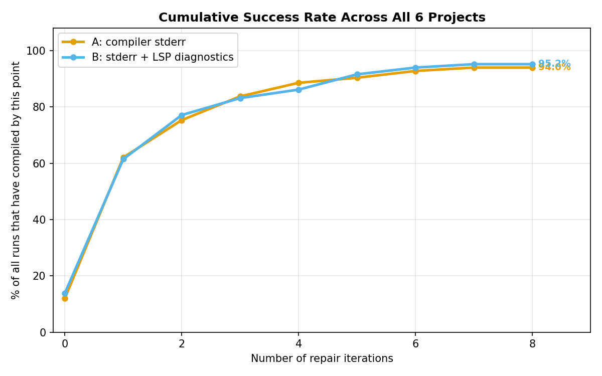
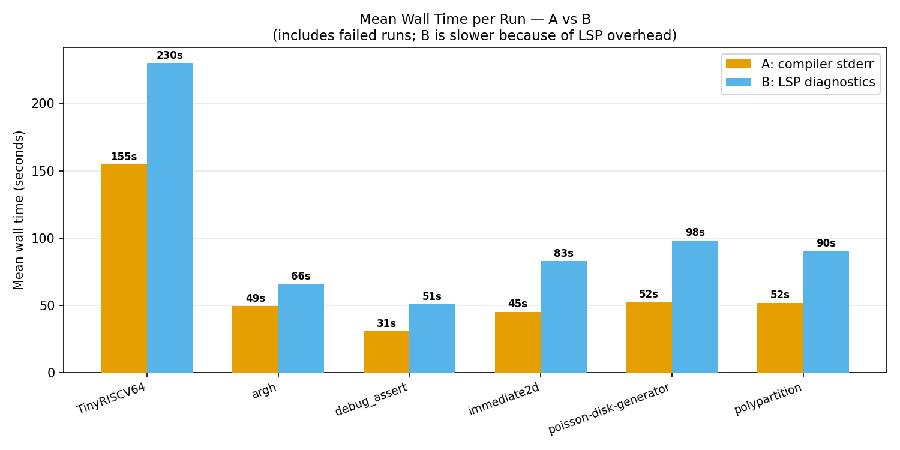
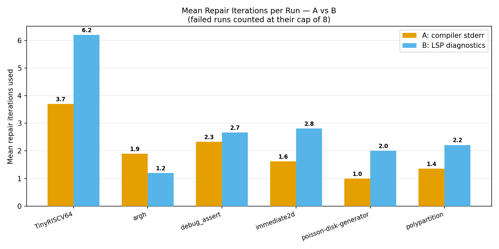

# Experiment Results — Full Summary
### Automated C++ → Rust Translation: Raw Compiler Errors vs. Structured LSP Diagnostics

**Projects tested:** 6 &nbsp;|&nbsp; **Total runs:** 140 (70 per condition) &nbsp;|&nbsp; **Translation units:** 35 files &nbsp;|&nbsp; **Model:** gpt-4o-2024-08-06

---

## What We Were Testing

The system translates a C++ file into Rust automatically. If the translated code fails to compile, it enters a **repair loop** — the model reads the error feedback and tries to fix it, up to **8 times**. If it still fails after 8 tries, that run is counted as a failure.

We compared two types of error feedback:

| | **Condition A** | **Condition B** |
|---|---|---|
| Name | Compiler stderr | LSP diagnostics |
| What it gives the model | The plain error text `rustc` prints to the terminal | Structured JSON from `rust-analyzer`: error codes, line/column numbers, severity |
| The idea behind B | *More structure should mean better repair guidance* | |

Each file was translated under both conditions, repeated twice, giving 2 reps × 2 conditions per file.

---

## The Six Projects

| Project | What it is | Files tested | Runs per condition |
|---------|-----------|-------------|-------------------|
| **immediate2d** | 2D graphics header library + 11 example programs | 13 | 26 |
| **argh** | Command-line argument parser (single C++ header) | 5 | 10 |
| **debug_assert** | Assertion/debugging macro library | 3 | 6 |
| **poisson-disk-generator** | Poisson-disk point sampling algorithm + demo | 2 | 4 |
| **TinyRISCV64** | RISC-V 64-bit CPU emulator (instruction decoder + ELF loader) | 5 | 10 |
| **polypartition** | Polygon partitioning algorithm library | 7 | 14 |

---

## The Headline Result



| Condition | Successes | Total runs | **Success rate** |
|-----------|-----------|-----------|-----------------|
| **A: compiler stderr** | 68 | 70 | **97.1%** |
| **B: LSP diagnostics** | 60 | 70 | **85.7%** |

**A compiles ~11 percentage points more often than B overall.** Looking at the bar chart above, A beats or ties B in 5 of 6 projects. The only reversal is `argh`, where B reaches 100% and A sits at 90%.

The shaded "POOLED" bar on the right summarises everything: A 97%, B 86%.

---

## Project-by-Project Breakdown

| Project | A | B | Who wins | Why |
|---------|---|---|----------|-----|
| **TinyRISCV64** | 90% | **60%** | **A by a lot** | Core emulator header failed under B both times; 2 other B failures |
| **argh** | 90% | **100%** | **B** | Argument parser header failed once under A; B solved it both times |
| **debug_assert** | 100% | 100% | **Tie** | Both perfect — library too simple to show a difference |
| **immediate2d** | **100%** | 85% | **A** | Raytracer, smoke simulator, and paint program failed under B |
| **poisson-disk-generator** | 100% | 100% | **Tie** | Both perfect |
| **polypartition** | **100%** | 86% | **A** | 2 test files failed under B |

The pattern is consistent: **A is ahead or equal in 5 out of 6 projects.** The gap ranges from 4 pp (polypartition, immediate2d) to 30 pp (TinyRISCV64).

---

## The Files That Actually Mattered

Of 35 translation units across all projects, **26 were perfect ties** — both conditions compiled every single run. Only **9 files** showed any difference at all:



Reading this chart from bottom to top (worst B performance first):

| File | Project | A rate | B rate | Meaning |
|------|---------|--------|--------|---------|
| `TinyRISCV64.h` | TinyRISCV64 | 100% | **0%** | B never compiled this — 8 iters × 2 reps, both exhausted |
| `example9_raytracer.cpp` | immediate2d | 100% | **0%** | Same — B failed both repetitions |
| `stdio_VM_runner.cpp` | TinyRISCV64 | 100% | 50% | B failed one of two reps |
| `example4_paint.cpp` | immediate2d | 100% | 50% | B failed one rep |
| `example8_smoke.cpp` | immediate2d | 100% | 50% | B failed one rep |
| `image.cpp` | polypartition | 100% | 50% | B failed one rep |
| `test.cpp` | polypartition | 100% | 50% | B failed one rep |
| `TinyElfRISCV64.h` | TinyRISCV64 | 50% | 50% | Both conditions failed one rep — hard for everyone |
| `argh.h` | argh | 50% | **100%** | Only file where A struggled and B didn't |

**Summary: A wins on 7 files, B wins on 1, both struggle on 1.** The remaining 26 files (74% of the dataset) are irrelevant to the comparison — both conditions succeed every time on those.

---

## How Quickly Do They Converge?



This chart shows the percentage of all 70 runs that have successfully compiled by each repair iteration number. Key observations:

- **Both start similar at iteration 0** (~16%) — some files are so straightforward they compile first-try under both conditions
- **A pulls ahead at iteration 1** (59% vs 46%) and the gap never closes
- **A reaches 90% by iteration 4;** B doesn't reach 74% at that point
- **A plateaus at 97.1%; B plateaus at 85.7%** — 10 B runs are permanently stuck (they hit 8 iterations and still failed). A only has 2 permanent failures.
- The two curves never converge. More repair rounds don't help B catch up to A.

---

## Speed: B is Always Slower



B takes more wall time in **every single project** — even `argh`, where B has a *better* success rate:

| Project | A mean time | B mean time | B overhead |
|---------|------------|------------|-----------|
| TinyRISCV64 | 155s | 230s | +48% |
| argh | 49s | 66s | +35% |
| debug_assert | 31s | 51s | +65% |
| immediate2d | 45s | 83s | +84% |
| poisson-disk-generator | 52s | 98s | +88% |
| polypartition | 52s | 90s | +73% |

The overhead comes from two places: (1) each repair round under B involves an extra `rust-analyzer` query which adds ~25–30 seconds, and (2) B uses more repair rounds per run to begin with. Even on files where both conditions succeed at the same outcome, B arrives there significantly later.

---

## Repair Iterations: B Does More Work



B uses more repair iterations in 5 of 6 projects. The one exception is `argh` (B=1.2 vs A=1.9) — on that project, many of the trivial files compiled first-try under B slightly more often, pulling the mean down. But even there, B is still slower in wall time because of the per-round LSP overhead.

The TinyRISCV64 gap (A=3.7 vs B=6.2) is the most dramatic — B is spending significantly more rounds on a project where it still fails more.

---

## The Statistical Test

We used **McNemar's test** to formally compare the two conditions file-by-file. The test counts "discordant pairs" — files where one condition wins under the majority rule (≥50% of reps succeed). To reach statistical significance (p < 0.05), you need at least 4 discordant pairs.

| Project | A wins | B wins | p-value |
|---------|--------|--------|---------|
| immediate2d | 1 (raytracer) | 0 | 1.000 |
| argh | 0 | 0* | 1.000 |
| debug_assert | 0 | 0 | 1.000 |
| poisson-disk-generator | 0 | 0 | 1.000 |
| TinyRISCV64 | 1 (TinyRISCV64.h) | 0 | 1.000 |
| polypartition | 0 | 0 | 1.000 |
| **All pooled** | **2** | **0** | **0.500** |

\* `argh.h` has A=50% which still counts as "pass" under the ≥50% rule, so it doesn't register as a discordant pair despite A failing once.

**All results are statistically inconclusive.** Even pooling all 6 projects we have only 2 discordant pairs — half of what the test needs. The trend points clearly toward A, but it isn't formally proven yet.

Why so few discordant pairs despite the visible gap? Because:
1. 26 of 35 files are ceiling ties — they don't contribute anything to the count
2. Partial failures (B failed once but succeeded the other rep) count as ties under the majority rule
3. We only have 2 repetitions per file — not enough resolution for the test

---

## The Two Most Interesting Files

The clearest findings don't come from the aggregate numbers but from two specific files that tell opposite stories:

### `TinyRISCV64.h` — A wins completely, B fails completely
The core RISC-V instruction decoder: 625 lines of dense bitwise operations, integer casting, union-typed registers, and large switch trees translating hardware instructions to Rust.

- **A**: compiled both repetitions, in 3 and 5 iterations
- **B**: hit the 8-iteration limit on both repetitions, never compiled

The plain `rustc` errors ("expected u32, found i64", "cannot assign to immutable") gave the model clear, direct fixes to make. The structured LSP wrapping appears to have sent the model down unproductive repair paths it couldn't escape.

### `argh.h` — B wins, A fails once
A C++ command-line argument parser: 485 lines of template metaprogramming, string iterators, and type deduction.

- **A**: failed on rep 0 (hit 8-iteration limit), succeeded on rep 1 in 2 iterations
- **B**: compiled both repetitions in 2 iterations each

For this type of code — complex template errors, type inference issues — the structured error codes and precise line/column locations in LSP output may have helped the model locate the problem more precisely.

**The implication**: neither feedback signal is universally better. The type of C++ code determines which signal is more useful. Low-level systems code (bitwise, memory, hardware) → A wins. High-level template/parser code → B may have an edge.

---

## Summary

| | Condition A | Condition B |
|--|-------------|-------------|
| Overall success rate | **97.1%** | 85.7% |
| Projects where ahead or tied | **5 / 6** | 1 / 6 |
| Files with complete failure (0%) | 0 | **2** |
| Mean wall time (TinyRISCV64) | **155s** | 230s |
| Mean wall time (all others avg) | **~46s** | ~78s |
| Statistically proven better? | **No** (p=0.500) | No |

**Bottom line: A is better in practice — higher success rate, faster, and never catastrophically worse. But the experiment cannot yet prove this statistically because most files are too easy to distinguish the two conditions.**

---

## What Would Make This Conclusive

The experiment needs **more hard files** — code that is genuinely difficult to translate. Of the 35 files tested, 26 are ceiling-level ties. They add run counts but no information.

The files that generate signal share a common trait: **they require C++ idioms with no clean Rust equivalent** — bitwise manipulation (TinyRISCV64), floating-point vector math (raytracer), particle simulation (smoke), and template-heavy parsers (argh). More files in these categories, and more repetitions per file (3+ instead of 2), would likely push the pooled discordant count past the threshold needed for statistical significance.

---

## Regenerating These Plots

All plots and CSVs can be regenerated from scratch at any time:

```bash
source .venv/bin/activate
python experiment-results/generate_summary.py
```

Output folder: `experiment-results/summary_plots/`
- `project_comparison.png` — success rates per project + pooled
- `wall_time_comparison.png` — mean wall time per project
- `iterations_comparison.png` — mean iterations per project
- `discriminating_files.png` — only the 9 files where conditions diverged
- `cumulative_success.png` — how fast each condition converges
- `combined_results.csv` — all 140 individual runs in one table
- `project_summary.csv` — per-project aggregates
- `file_summary.csv` — per-file success rates for both conditions
