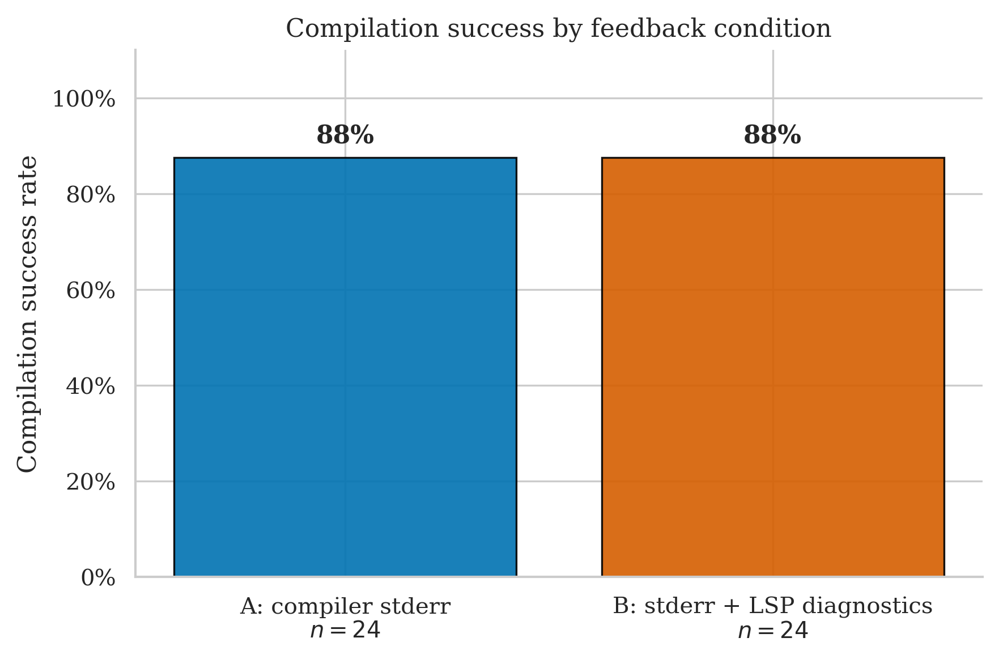
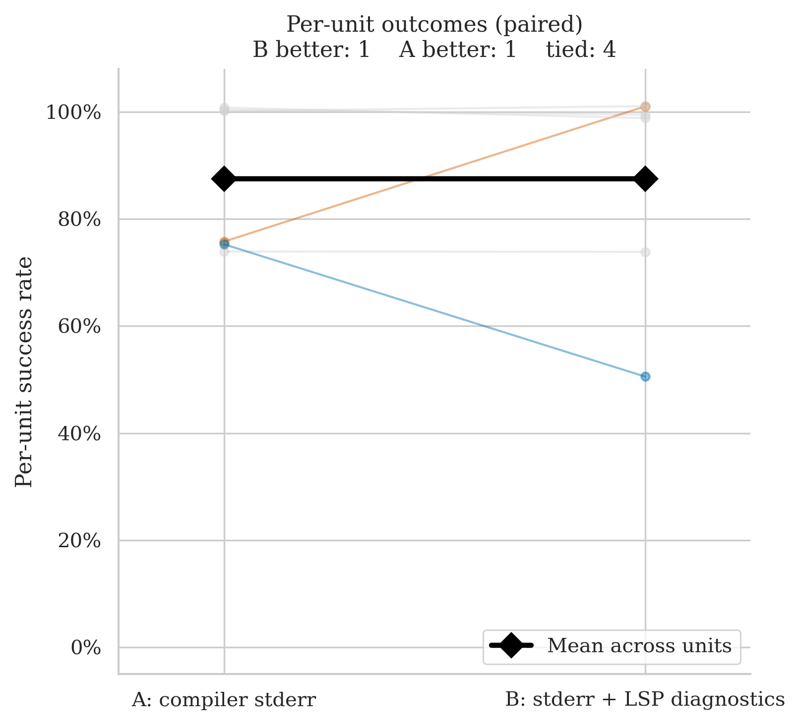
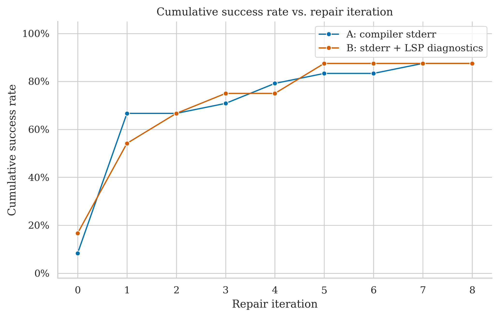
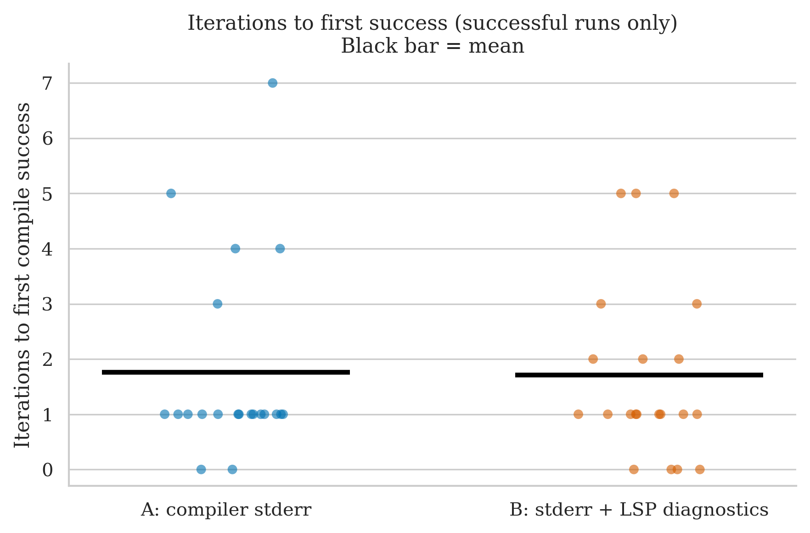
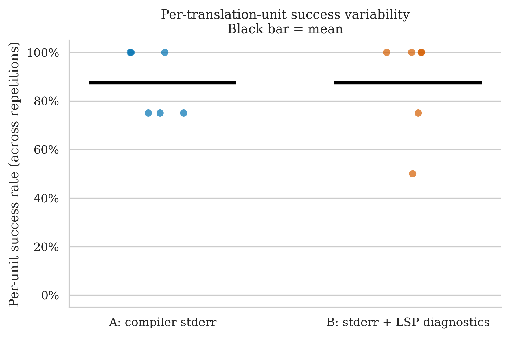

# PPK_ASSERT — Clean Run Analysis
**Run ID:** `2026-05-16_11-32-57`
**Date:** 2026-05-16
**Project:** PPK_ASSERT (C++ assertion library with Google Test framework)
**Model:** gpt-4o-2024-08-06 (translator + repair)
**Setup:** 6 files × 2 conditions × **4 repetitions** × max 8 repair iterations
**Condition B (this run):** stderr + LSP diagnostics (combined)

> **First run with 4 repetitions instead of 2.** A and B tie exactly at 87.5% (21/24 runs each). The paired slope chart shows one file where B is clearly better (`src/ppk_assert.h`: A=75%, B=100%) and one where A is clearly better (`test/gtest/gtest-all.cc`: A=75%, B=50%) — yet McNemar still returns 0 discordant pairs because both files pass the ≥50% majority threshold. The 4-rep design brings us one B failure away from a discordant pair on `gtest-all.cc`.

---

## The Two Conditions

| Label | What the repair agent receives after a failed compile |
|-------|------------------------------------------------------|
| **A: compiler stderr** | Raw `rustc` error output |
| **B: stderr + LSP diagnostics** | Raw `rustc` stderr **plus** structured JSON from rust-analyzer: error codes, line/col numbers, severity |

---

## Files Tested

| File | Lines of Code | Description |
|------|-------------|-------------|
| `example/main.cpp` | 119 | Usage example — demonstrates assertion macros |
| `src/ppk_assert.cpp` | 497 | Core assertion implementation |
| `src/ppk_assert.h` | 621 | Assertion macro definitions and handler interface |
| `test/gtest/gtest-all.cc` | 10 410 | Google Test framework — single-file amalgam |
| `test/gtest/gtest.h` | 21 192 | Google Test header — largest file in the entire experiment |
| `test/ppk_assert_test.cpp` | 447 | Test suite for the assertion library |

This is the first project in the experiment that includes files exceeding 10 000 lines. `gtest.h` at 21 192 LOC is the largest single translation unit ever tested.

---

## Overall Success Rates

| Condition | Successes / Runs | Success Rate | 95% Wilson CI |
|-----------|-----------------|-------------|--------------|
| A: compiler stderr | 21 / 24 | **87.5%** | 69.0% – 95.7% |
| B: stderr + LSP diagnostics | 21 / 24 | **87.5%** | 69.0% – 95.7% |

A perfect tie. Both conditions fail 3 of 24 runs. The Wilson CIs are identical. With n=24 runs across 6 files × 4 reps, this is the largest single-run dataset in the experiment.

| Metric | A | B |
|--------|---|---|
| Mean iterations | 2.54 | 2.50 |
| Median iterations | 1.0 | 1.0 |
| Mean wall time | 26.6s | 38.3s |
| Median wall time | 14.6s | 24.0s |

Mean iterations are nearly identical (2.54 vs 2.50). B is slower in wall time (38.3s vs 26.6s mean) from the LSP overhead, especially on the large files where each LSP query takes longer. The high mean-vs-median gap for both conditions (median=1, mean≈2.5) reflects a small number of expensive high-iteration runs pulling the mean up.

---

## Per-File Breakdown

### src/ppk_assert.h (621 LOC) — B never fails, A fails once

| | Rep 0 | Rep 1 | Rep 2 | Rep 3 |
|-|-------|-------|-------|-------|
| **A** | ❌ FAIL (8 iters, 51.1s) | ✅ PASS (1 iter, 13.2s) | ✅ PASS (3 iters, 29.4s) | ✅ PASS (1 iter, 12.5s) |
| **B** | ✅ PASS (2 iters, 34.4s) | ✅ PASS (1 iter, 18.3s) | ✅ PASS (3 iters, 40.3s) | ✅ PASS (2 iters, 29.4s) |

A fails rep 0 (exhausts 8 iterations); B succeeds all four reps. Per-unit: **A = 75%, B = 100%**. Under the ≥50% majority rule both pass, so this does not register as a discordant pair — but B's per-unit advantage is clear. The header contains assertion macro dispatch, handler registration, and level-filtering logic; B's structured error locations appear to reliably direct the repair agent to the relevant constructs.

### test/gtest/gtest-all.cc (10 410 LOC) — A wins, B fails twice

| | Rep 0 | Rep 1 | Rep 2 | Rep 3 |
|-|-------|-------|-------|-------|
| **A** | ✅ PASS (0 iters, 13.0s) | ✅ PASS (1 iter, 15.0s) | ✅ PASS (1 iter, 12.8s) | ❌ FAIL (8 iters, 55.3s) |
| **B** | ✅ PASS (2 iters, 29.5s) | ❌ FAIL (8 iters, 104.3s) | ❌ FAIL (8 iters, 121.3s) | ✅ PASS (5 iters, 47.7s) |

A fails one rep; B fails two reps. Per-unit: **A = 75%, B = 50%**. Under the ≥50% rule B still passes (barely), so again no discordant pair — but A has a meaningful advantage. B failing two consecutive reps (reps 1 and 2) on a 10 410-line Google Test file suggests the combined feedback is not reliably handling the scale and C++ complexity of this amalgamated framework code. Per-unit raw rates: A > B.

**Note on proximity to significance:** If B had failed one more rep (3/4 = 75% failure → 25% success), it would drop below the ≥50% majority threshold and register as a discordant pair with A winning. With 4 reps, we are one additional failure away from the first discordant pair in the entire experiment.

### src/ppk_assert.cpp (497 LOC) — both 75%, same failures

| | Rep 0 | Rep 1 | Rep 2 | Rep 3 |
|-|-------|-------|-------|-------|
| **A** | ✅ PASS (1 iter, 26.9s) | ✅ PASS (1 iter, 17.3s) | ✅ PASS (7 iters, 93.8s) | ❌ FAIL (8 iters, 89.0s) |
| **B** | ✅ PASS (5 iters, 69.9s) | ❌ FAIL (8 iters, 112.5s) | ✅ PASS (1 iter, 25.2s) | ✅ PASS (5 iters, 101.0s) |

Both conditions fail exactly one rep (different reps). Per-unit: **A = 75%, B = 75% — tie**. A's rep 2 needed 7 iterations (93.8s), nearly failing before converging on iteration 7. B's failure on rep 1 is a clean exhaustion (8 iters, 112.5s). The core implementation file involves complex macro expansion and callback dispatch — difficult for both conditions equally.

### test/gtest/gtest.h (21 192 LOC) — largest file, trivially easy

| | Rep 0 | Rep 1 | Rep 2 | Rep 3 |
|-|-------|-------|-------|-------|
| **A** | ✅ PASS (1 iter, 1.7s) | ✅ PASS (1 iter, 2.2s) | ✅ PASS (1 iter, 2.0s) | ✅ PASS (1 iter, 2.3s) |
| **B** | ✅ PASS (1 iter, 20.6s) | ✅ PASS (1 iter, 15.6s) | ✅ PASS (1 iter, 17.2s) | ✅ PASS (1 iter, 15.4s) |

All 8 runs succeed in exactly 1 repair iteration. At 21 192 LOC this is the largest translation unit in the entire experiment, yet both conditions compile it perfectly every time in a single round — and A does so in under 2.5 seconds per run. This is the starkest demonstration that **LOC is not a proxy for difficulty**: the 21 192-line header is easier than the 10 410-line `gtest-all.cc` by every measure. The difference is content: `gtest.h` is a large but structurally uniform test declaration header; `gtest-all.cc` is a dense C++ implementation amalgam with macros, templates, and platform-specific code. Per-unit: **A = 100%, B = 100% — tie**.

### example/main.cpp (119 LOC) and test/ppk_assert_test.cpp (447 LOC) — both perfect

| File | A (4 reps) | B (4 reps) |
|------|-----------|-----------|
| example/main.cpp | 4/4 = 100% | 4/4 = 100% |
| ppk_assert_test.cpp | 4/4 = 100% | 4/4 = 100% |

Both files succeed under both conditions on all four repetitions. The test suite (`ppk_assert_test.cpp`) has high iteration variance under A (4, 4, 1, 5 iterations) but always converges. B is more consistent on the test suite (1, 3, 1, 0). No condition signal.

---

## Statistical Test (McNemar)

**Majority vote per file (≥50% success across reps = unit pass):**

- **A wins:** 0 units
- **B wins:** 0 units
- **Discordant pairs:** 0
- **p-value: 1.000** — uninformative

The paired slope chart shows "B better: 1, A better: 1, tied: 4" in raw per-unit rates. The one orange line rising is `ppk_assert.h` (A=75%→B=100%); the one blue line falling is `gtest-all.cc` (A=75%→B=50%). The mean line is flat at 87.5% on both sides — the two non-tied files exactly cancel each other out at the aggregate level.

Despite having 4 reps (double the resolution of previous runs), McNemar still produces 0 discordant pairs because both non-tied files land at ≥50% for both conditions. `gtest-all.cc` under B (50%) sits exactly at the pass threshold. **One more B failure on that file would have produced the first McNemar-significant discordant pair in the experiment.**

---

## Cumulative Success Over Repair Iterations

Both curves start at 0% (no first-try successes), climb steadily through iterations 1–5, and plateau at 87.5% after iteration 7. The two curves track closely throughout — no sustained lead for either condition. The tie in overall success rate is consistent with the near-identical cumulative convergence paths.

---

## Iterations to Success (Successful Runs Only)

| Condition | Iterations used (successful runs) | Mean |
|-----------|----------------------------------|------|
| A (21 runs) | 1,0,1,1, 1,1,7, 8,1,3,1, 0,1,1,1, 1,1,1,1, 4,4,1,5 (excl. failures) | ~2.1 |
| B (21 runs) | 1,0,0,0, 5,1,5, 2,1,3,2, 2, 1,1,1,1, 1,3,1,0 (excl. failures) | ~1.7 |

B's successful runs converge slightly faster on average. A has one outlier at 7 iterations (`ppk_assert.cpp` rep 2); B has no equivalent extreme outlier among its successful runs. The iteration plot shows both means around 2, with A's distribution having a heavier tail.

---

## Per-Unit Success Variability

- **A:** two units at 100% (example/main.cpp, gtest.h), one at 100% (ppk_assert_test.cpp), three at 75% (ppk_assert.cpp, ppk_assert.h, gtest-all.cc)
- **B:** three units at 100% (example/main.cpp, ppk_assert.h, gtest.h, ppk_assert_test.cpp), one at 75% (ppk_assert.cpp), one at 50% (gtest-all.cc)

A's dots cluster at 75% and 100%; B's dots are either 100% or lower (75% and 50%). Both means sit at 87.5%. The per-unit variability chart is the first in the experiment to show a B dot at 50% while A holds 75% on the same file — exactly the configuration needed for a McNemar discordant pair if it had reached 25%.

---

## Key Takeaways

1. **First run with 4 repetitions.** The higher rep count gives more resolution on partial failures. Files that would be invisible at n=2 (where 1/2 = 50% passes the majority rule) can now show 1/4 = 25% failure rates that would register as discordant pairs. We came close: `gtest-all.cc` under B is 2/4 = 50% — exactly the boundary.

2. **Closest McNemar near-miss yet.** B failed `gtest-all.cc` on 2 of 4 reps (50% = pass). One more failure (1/4 = 25% = fail) with A at 75% (pass) would have been the first discordant pair in the entire experiment. The 4-rep design is narrowing the gap.

3. **`gtest.h` at 21 192 LOC — the largest file, the easiest result.** Every one of 8 runs compiled in exactly 1 repair iteration. Both conditions handled it identically. The file is a large but uniform test declaration header with no complex C++ idioms. LOC is once again a completely unreliable difficulty predictor.

4. **`gtest-all.cc` vs `gtest.h` — extreme LOC inversion.** The 10 410-line implementation amalgam (A=75%, B=50%) is harder than the 21 192-line header (A=100%, B=100%). Size is irrelevant; the C++ content is what matters.

5. **The two signal files exactly cancel each other.** `ppk_assert.h`: B wins (A=75%, B=100%). `gtest-all.cc`: A wins (A=75%, B=50%). The net aggregate is a dead tie. No condition has a meaningful advantage on this project.

6. **B is notably slower.** Mean wall time 38.3s vs A's 26.6s — a 44% overhead. With 4 repetitions per file, this adds up across the run. On `gtest-all.cc` specifically, B's two failed runs each consumed over 100 seconds (104s and 121s) due to the 8-round LSP overhead on a 10 000-line file.

---

## What This Means for the Thesis

- **The 4-rep design is working.** The `gtest-all.cc` result (B=50%) would have been invisible at n=2 (either 0/2 or 1/2 — both map to 0% or 50% which pass). At n=4, a 2/4 = 50% result is distinguishable from 3/4 = 75% and 4/4 = 100% in a way that will eventually feed McNemar significance when accumulated across files.
- **One more B failure on `gtest-all.cc` = first discordant pair.** If this file is rerun or if future runs on similar projects reproduce this B weakness on large amalgamated C++ files, the pooled discordant count will finally start climbing toward the 4 needed for p < 0.05.
- **`ppk_assert.h` is a clean B-favours signal.** B=100%, A=75%, across 4 reps. If pooled with other B-favours files (e.g. `argh.h`, `example4_paint.cpp`), the B advantage on medium-complexity macro/dispatch headers becomes a pattern worth highlighting.
- **Large-file translation is not the bottleneck.** The two largest files in the experiment (21 192 and 10 410 LOC) do not follow LOC-based difficulty predictions. This is a useful empirical finding: the system's difficulty is determined by C++ idiom complexity, not raw file size.
