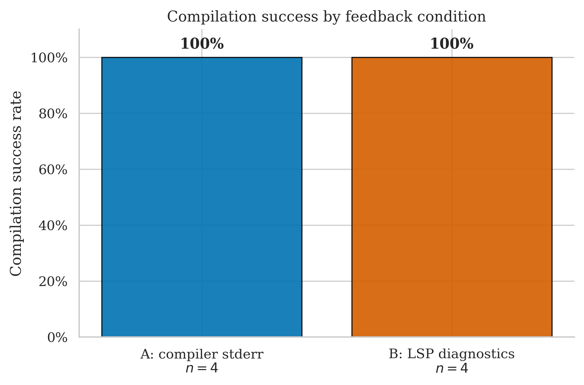
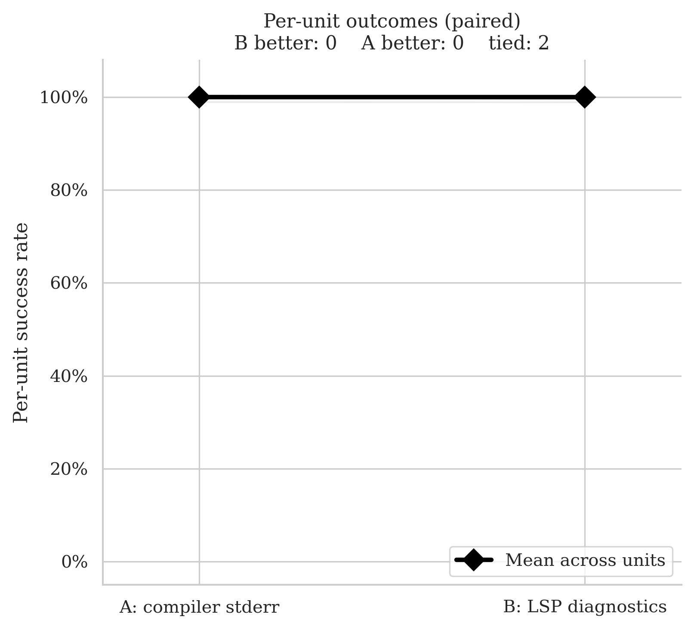
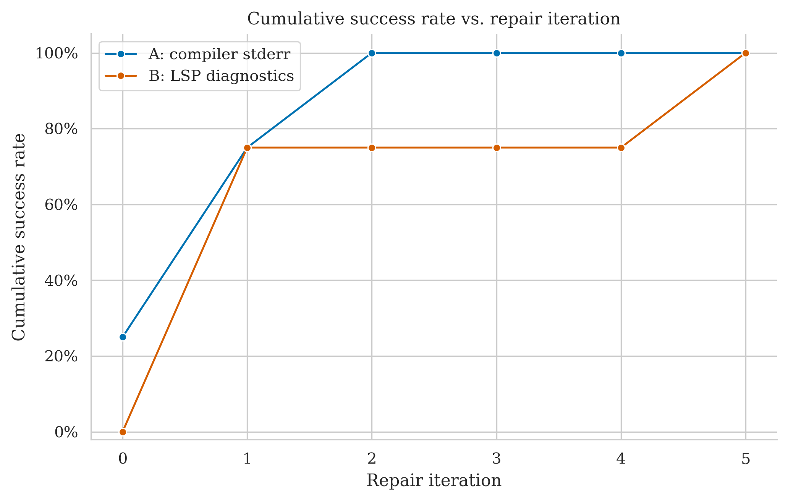
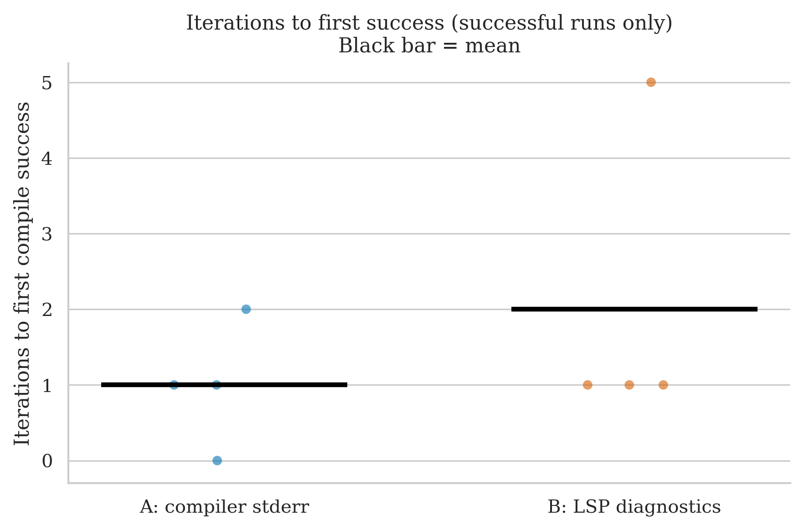
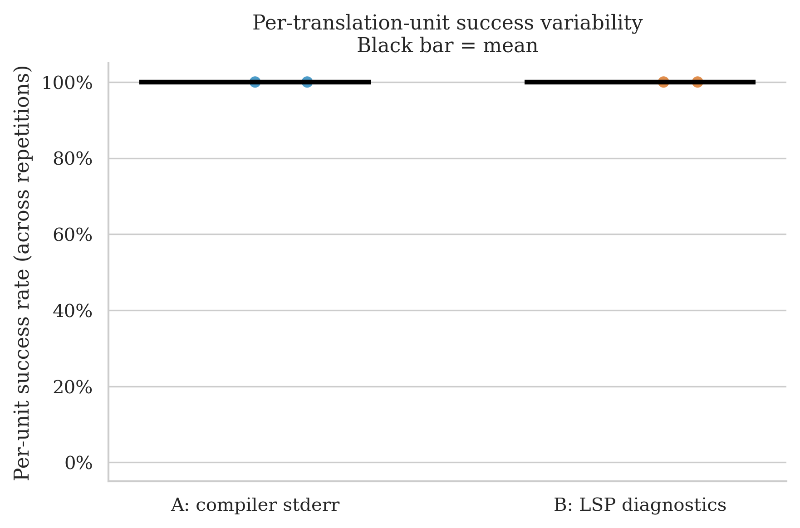

# poisson-disk-generator — Clean Run Analysis
**Run ID:** `2026-05-14_23-15-26`
**Date:** 2026-05-14
**Project:** poisson-disk-generator (header-only C++ Poisson-disk sampling library + demo by Sergey Kosarevsky)
**Model:** gpt-4o-2024-08-06 (translator + repair)
**Setup:** 2 files × 2 conditions × 2 repetitions × max 8 repair iterations

> Another ceiling-result project: both conditions compiled every run. The only meaningful difference is on `Poisson.cpp` rep 0, where B needed 5 iterations and 241s vs A's 0 iterations and 15s — a ~16× wall-time ratio for the same final outcome.

---

## The Two Conditions

| Label | What the repair agent receives after a failed compile |
|-------|------------------------------------------------------|
| **A: compiler stderr** | Raw `rustc` error output |
| **B: LSP diagnostics** | Structured output from rust-analyzer: error codes, line/col numbers, severity |

---

## Files Tested

| File | Lines of Code | Description |
|------|-------------|-------------|
| `Poisson.cpp` | 520 | Demo / driver — writes sampled point sets to image / text files |
| `PoissonGenerator.h` | 387 | The Poisson-disk sampling algorithm (header-only library) |

---

## Overall Success Rates

| Condition | Successes / Runs | Success Rate | 95% Wilson CI |
|-----------|-----------------|-------------|--------------|
| A: compiler stderr | 4 / 4 | **100%** | 51% – 100% |
| B: LSP diagnostics | 4 / 4 | **100%** | 51% – 100% |

Both at the ceiling. With n = 4 runs per condition the Wilson intervals are huge — this run says only that both signals are *sufficient* on this project, not that they are equivalent in general.

| Metric | A | B |
|--------|---|---|
| Mean iterations to success | 1.0 | 2.0 |
| Median iterations | 1 | 1 |
| Mean wall time | 52.4s | 98.2s |
| Median wall time | 39.9s | 54.8s |

B used twice as many iterations on average and ~88% more wall time. Both medians are similar (1 iteration, ~40–55s) — the means diverge because of one expensive B outlier.

---

## Per-File Breakdown

### Poisson.cpp (520 LOC) — the demo

| | Rep 0 | Rep 1 |
|-|-------|-------|
| **A** | ✅ PASS (0 iters, 14.6s) | ✅ PASS (2 iters, 115.2s) |
| **B** | ✅ PASS (5 iters, 241.0s) | ✅ PASS (1 iter, 56.6s) |

This is the entire story of the run. A compiled it **first try on rep 0** (no repair needed at all) and in 2 iterations on rep 1. B needed 5 iterations on rep 0 (taking 241s, more than 4 minutes) and 1 iteration on rep 1. Both ultimately succeeded but the variance on B's rep 0 is enormous.

### PoissonGenerator.h (387 LOC) — the algorithm

| | Rep 0 | Rep 1 |
|-|-------|-------|
| **A** | ✅ PASS (1 iter, 42.1s) | ✅ PASS (1 iter, 37.7s) |
| **B** | ✅ PASS (1 iter, 42.4s) | ✅ PASS (1 iter, 53.0s) |

Identical iteration counts and very similar wall times. The header itself is structurally clean enough that both signals get it on the first repair pass.

---

## Statistical Test (McNemar)

**Majority vote per file (≥50% success across reps = unit pass):**

- **A wins:** 0 units
- **B wins:** 0 units
- **Discordant pairs:** 0
- **p-value: 1.000** — uninformative

Both files are 100% / 100% ties. The slope chart shows two flat lines at the top of the y-axis.

---

## Cumulative Success Over Repair Iterations

A's curve reaches 100% by iteration 2 (three out of four runs needed ≤1 iteration); B's curve drags to 100% only by iteration 5 because of the Poisson.cpp rep 0 outlier.

---

## Iterations to Success (Successful Runs Only)

| Condition | Iterations used | Median |
|-----------|----------------|--------|
| A | 0, 2, 1, 1 | 1 |
| B | 5, 1, 1, 1 | 1 |

Same median (1). A's max is 2; B's max is 5. With only 4 points per condition the medians are nearly meaningless.

---

## Per-Unit Success Variability

All four points at 100%. No variability to inspect.

---

## Key Takeaways

1. **Another ceiling result.** Both conditions handled both files on every repetition. The library is small (two files, ~900 LOC combined) and the algorithm — grid-based candidate rejection — maps cleanly to Rust.

2. **The condition cost gap is concentrated in one run.** B rep 0 on `Poisson.cpp` took 5 iterations / 241 seconds; the other three B runs averaged 50 seconds at 1 iteration each. Removing the outlier brings B's mean wall time down to ~50s, very close to A's 52s. Stochastic variance in a single repair trajectory dominates the aggregate "B is 2× slower" headline here.

3. **`Poisson.cpp` rep 0 is the most extreme B-vs-A iteration gap seen yet** — 0 iters under A, 5 iters under B for the same file. Worth inspecting the repair transcripts: it's a candidate qualitative case for "what specifically did the LSP signal lead the model toward that the raw stderr signal avoided?"

4. **McNemar uninformative again.** With n = 2 units, both at 100%, there is no way for the per-file majority test to register anything.

5. **Updated cross-project picture (using only the analyses currently in `result_analysis/`):**

   | Project | A | B | Direction |
   |---------|---|---|-----------|
   | immediate2d | 100% (26/26) | 85% (22/26) | A > B |
   | argh | 90% (9/10) | 100% (10/10) | B > A |
   | debug_assert | 100% (6/6) | 100% (6/6) | tie |
   | poisson-disk-generator | 100% (4/4) | 100% (4/4) | tie |
   | **Pooled** | **97.8% (45/46)** | **91.3% (42/46)** | small A lead |

   Pooled signal is essentially unchanged from before this run (it was 97.6% / 90.5%). Adding 4 more A-passes and 4 more B-passes nudges both rates up by ~0.2 pp.

---

## What This Means for the Thesis

- This run reinforces the pattern: small/medium libraries with clean structure produce ceiling results for both conditions, contributing no statistical signal.
- The B-rep-0 outlier on Poisson.cpp is a useful qualitative artifact even though it doesn't move the success rate: 5 iterations and 4 minutes to reach the same end state A reached without any repair at all. Reading those 5 LSP-driven repair rounds may show what kind of "guidance" can mislead a repair loop rather than help it.
- The pooled cross-project rates (A ≈ 98%, B ≈ 91%) keep pointing slightly A-favourable, but the lead is still carried by immediate2d's three hard files. Of 23 units across these four projects, 19 are perfect ties.
- If the experiment is going to detect a real effect, the dataset needs more files like `raytracer.cpp`, `swarmz.h`, and `argh.h` and far fewer ones like these two — algorithmic complexity, not LOC, is what generates condition divergence.
