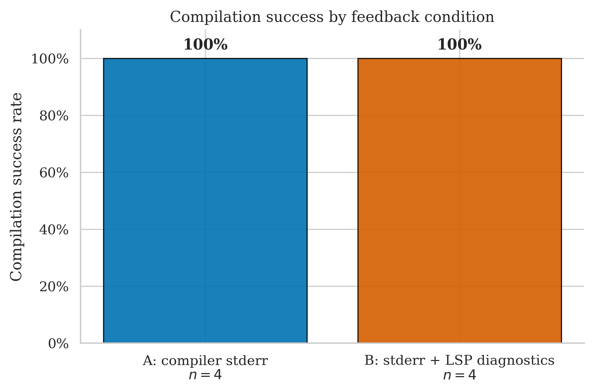
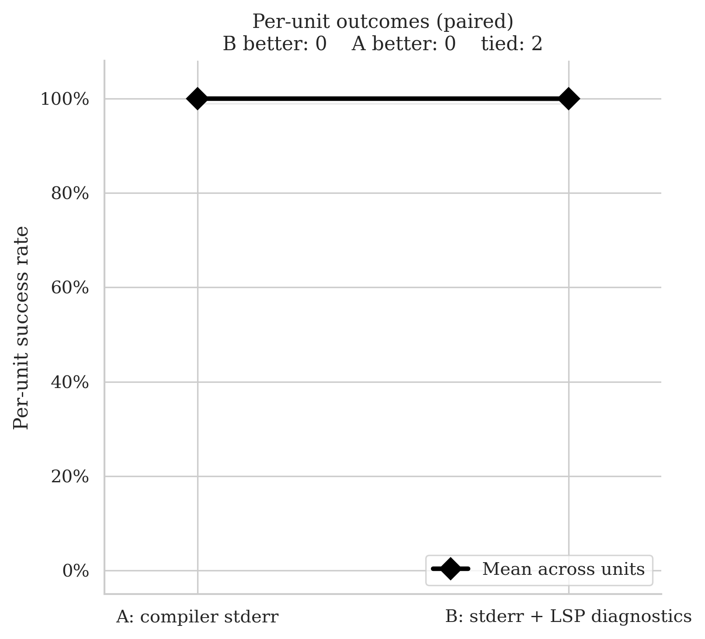
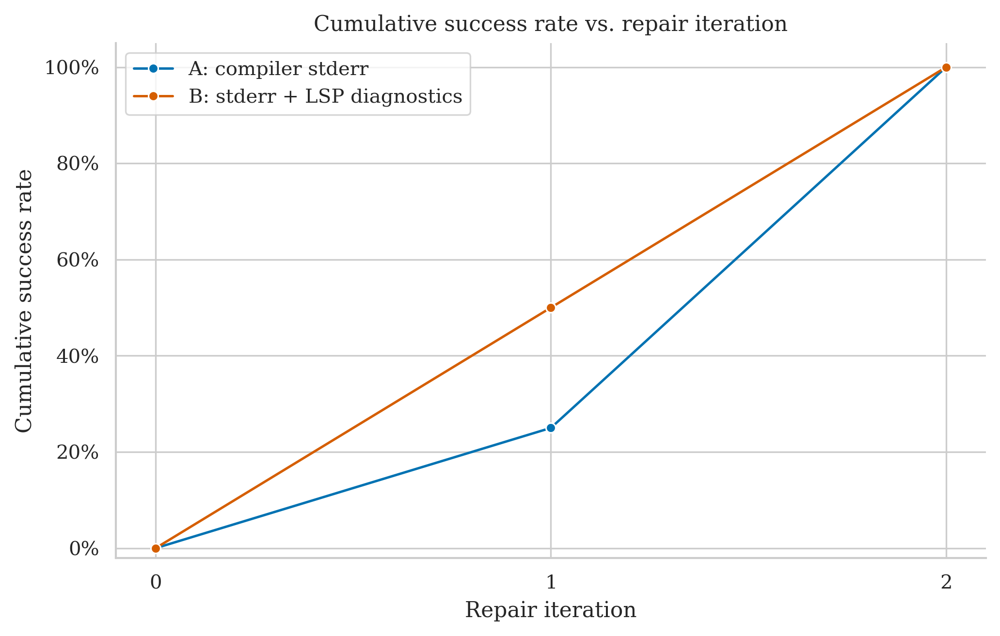
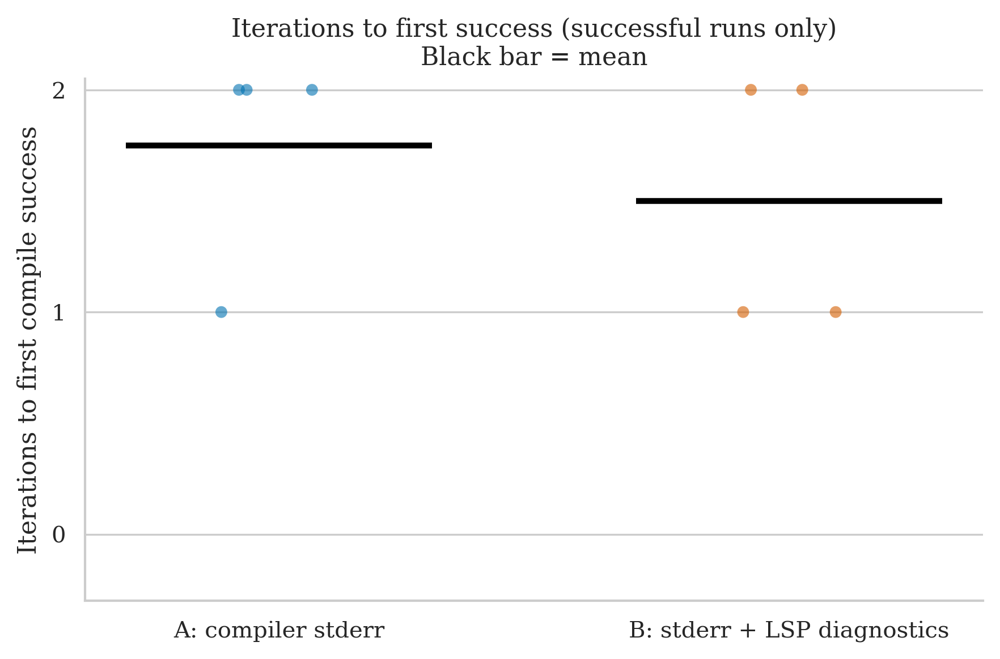
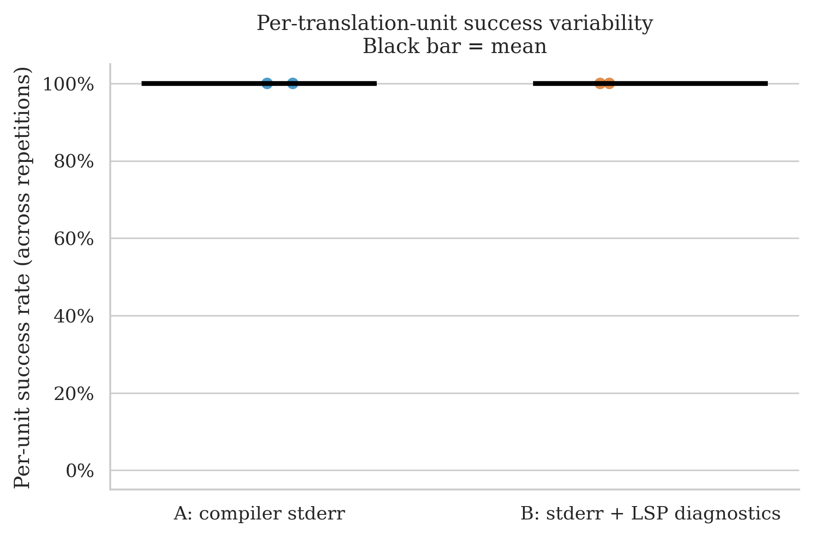

# poisson-disk-generator — Clean Run Analysis
**Run ID:** `2026-05-16_00-26-45`
**Date:** 2026-05-16
**Project:** poisson-disk-generator (Poisson-disk point sampling algorithm + demo)
**Model:** gpt-4o-2024-08-06 (translator + repair)
**Setup:** 2 files × 2 conditions × 2 repetitions × max 8 repair iterations
**Condition B (this run):** stderr + LSP diagnostics (combined)

> **Perfect tie — both conditions 100%.** Identical result to the previous run under LSP-only B. With only 2 translation units and 4 runs per condition this is the smallest dataset in the experiment; it contributes no condition signal regardless of the feedback type used.

---

## The Two Conditions

| Label | What the repair agent receives after a failed compile |
|-------|------------------------------------------------------|
| **A: compiler stderr** | Raw `rustc` error output |
| **B: stderr + LSP diagnostics** | Raw `rustc` stderr **plus** structured JSON from rust-analyzer: error codes, line/col numbers, severity |

---

## Files Tested

| File | Lines of Code | Description |
|------|-------------|-------------|
| `Poisson.cpp` | 520 | Demo program — generates and outputs Poisson-disk sample points |
| `PoissonGenerator.h` | 387 | Core algorithm — spatial sampling with minimum distance guarantee |

Both files implement a spatial point-sampling algorithm: primarily floating-point arithmetic, vector containers, and grid-based spatial hashing. There is no bitwise manipulation, union typing, or template metaprogramming — the C++ idioms are relatively clean to translate.

---

## Overall Success Rates

| Condition | Successes / Runs | Success Rate | 95% Wilson CI |
|-----------|-----------------|-------------|--------------|
| A: compiler stderr | 4 / 4 | **100%** | 51.0% – 100% |
| B: stderr + LSP diagnostics | 4 / 4 | **100%** | 51.0% – 100% |

Both conditions compiled every run. The Wilson confidence intervals are very wide (51%–100%) due to n=4 — even a perfect result here carries essentially no statistical information.

| Metric | A | B |
|--------|---|---|
| Mean iterations | 1.75 | 1.50 |
| Median iterations | 2.0 | 1.5 |
| Mean wall time | 93.4s | 82.3s |
| Median wall time | 78.3s | 65.4s |

B uses slightly fewer iterations on average (1.5 vs 1.75) and is faster in both mean and median wall time, despite the LSP query overhead. With n=4, this difference is noise — one run needing one fewer iteration accounts for the entire gap.

---

## Per-File Breakdown

### Poisson.cpp (520 LOC)

| | Rep 0 | Rep 1 |
|-|-------|-------|
| **A** | ✅ PASS (2 iters, 176.9s) | ✅ PASS (2 iters, 93.3s) |
| **B** | ✅ PASS (2 iters, 159.4s) | ✅ PASS (1 iter, 66.4s) |

Both conditions succeed both reps. A is consistent at 2 iterations; B uses 2 on rep 0 and 1 on rep 1. The wall-time variance on A (176.9s vs 93.3s for the same iteration count) reflects LLM response latency variation, not compilation or repair differences. Per-unit: **A = 100%, B = 100% — tie**.

### PoissonGenerator.h (387 LOC)

| | Rep 0 | Rep 1 |
|-|-------|-------|
| **A** | ✅ PASS (1 iter, 40.0s) | ✅ PASS (2 iters, 63.3s) |
| **B** | ✅ PASS (1 iter, 38.9s) | ✅ PASS (2 iters, 64.4s) |

A and B are nearly identical: same iteration counts on both reps, nearly identical wall times. This is one of the closest per-file matches in the entire dataset — the repair behaviour under both conditions is effectively indistinguishable. Per-unit: **A = 100%, B = 100% — tie**.

---

## Statistical Test (McNemar)

**Majority vote per file (≥50% success across reps = unit pass):**

- **A wins:** 0 units
- **B wins:** 0 units
- **Discordant pairs:** 0
- **p-value: 1.000** — uninformative

Both units at 100%/100%. The paired slope chart is a flat horizontal line. No information gained.

---

## Cumulative Success Over Repair Iterations

Neither condition compiles anything first-try (0% at iteration 0). B reaches 50% at iteration 1 (one run resolved in a single repair) vs A at 25% (no runs resolved that quickly on this file). Both reach 100% by iteration 2. The plot is linear and clean — all runs resolved within 2 repair rounds, no tail.

---

## Iterations to Success

| Condition | Iterations used | Mean |
|-----------|----------------|------|
| A (4 runs) | 2, 2, 1, 2 | 1.75 |
| B (4 runs) | 2, 1, 1, 2 | 1.50 |

All runs converge in 1–2 iterations. The mean bars in the plot are nearly identical. No outliers, no failures. The iteration plot is the flattest in the dataset.

---

## Per-Unit Success Variability

All four dots for both conditions sit at 100%. Both mean bars are flat at the top. Nothing to observe.

---

## Comparison with Previous poisson-disk-generator Run (LSP-Only B)

| Metric | Old B (LSP only) | New B (stderr + LSP) |
|--------|-----------------|----------------------|
| B success rate | 100% (4/4) | 100% (4/4) |
| A success rate | 100% (4/4) | 100% (4/4) |
| Result | Tie | Tie |

Identical outcome. The project produces a ceiling tie under any feedback condition tested.

---

## Key Takeaways

1. **Perfect tie, as in every previous run.** poisson-disk-generator has never produced a condition difference across any run. The files succeed under both conditions every time.

2. **The smallest dataset in the experiment.** With only 2 units and 4 runs per condition, this project cannot contribute any statistical signal regardless of outcome. Even a complete failure on one file would only produce 1 discordant pair.

3. **PoissonGenerator.h is the most condition-neutral file in the dataset.** Iteration counts and wall times under A and B are nearly identical (1 iter / 40s both times on rep 0, 2 iters / 63–64s on rep 1). The feedback signal appears entirely irrelevant for this type of code.

4. **Wall-time variance on Poisson.cpp is LLM latency, not feedback.** A took 176.9s on rep 0 and 93.3s on rep 1 at the same 2 iterations — a 90s difference on identical repair depth. This underscores that wall time is an imperfect proxy for repair efficiency when LLM response times vary.

---

## What This Means for the Thesis

- poisson-disk-generator contributes only to sample size, not to condition discrimination. It should be noted as a confirmed easy project that validates the system works correctly on clean algorithmic C++, but it should not be cited in any argument about which feedback condition is better.
- The near-identical per-file iteration behaviour on `PoissonGenerator.h` could be used as a baseline example showing what "no condition effect" looks like, for contrast with files like `TinyRISCV64.h` or `example4_paint.cpp` where conditions clearly diverge.
