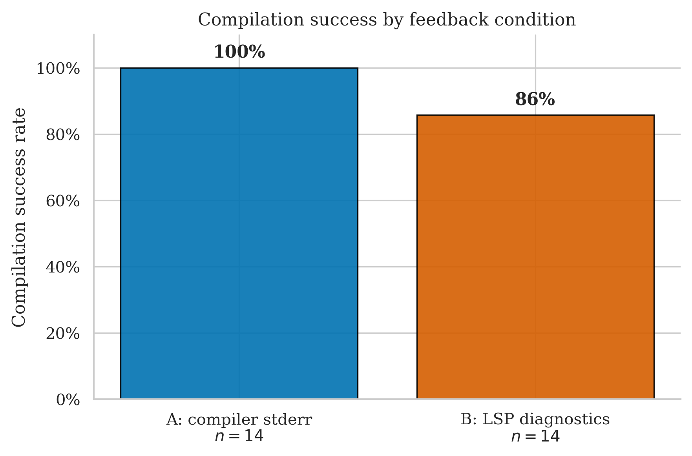
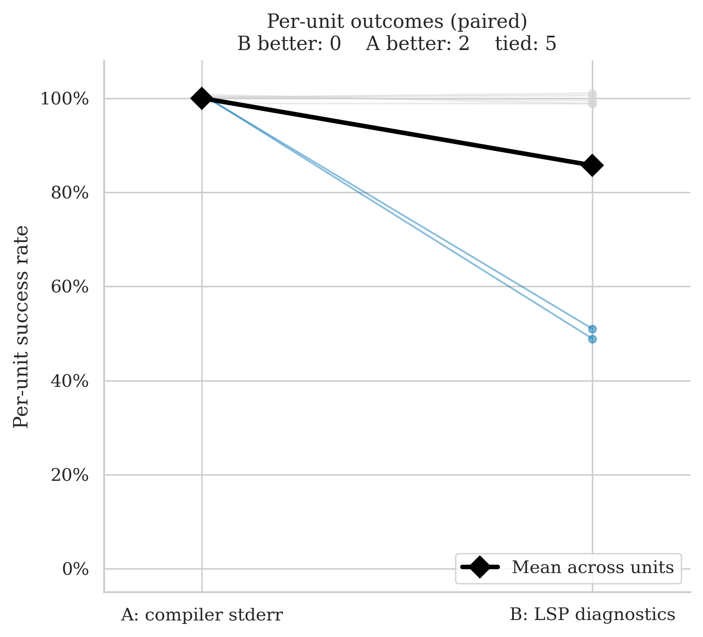
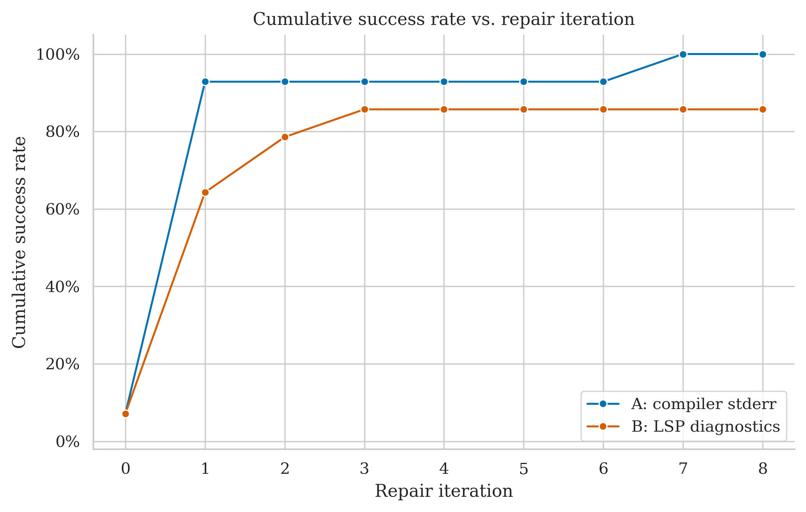
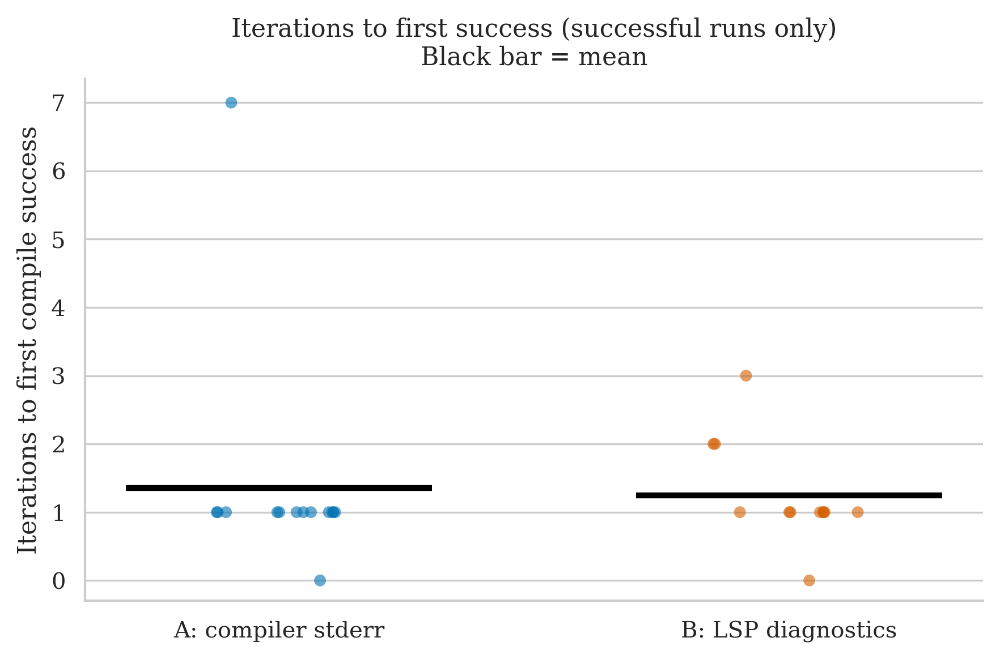
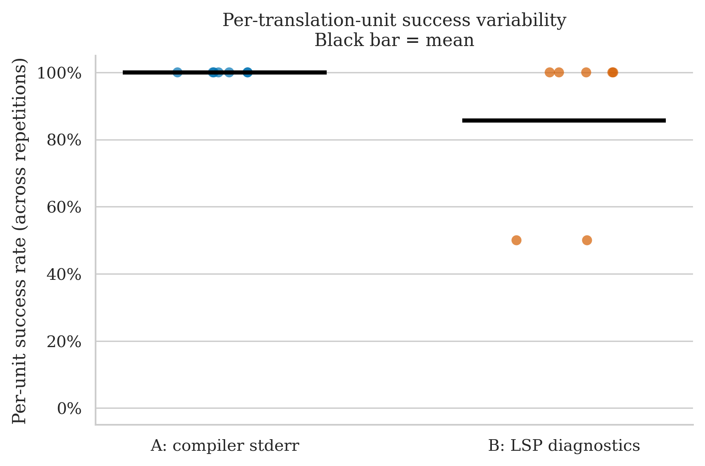

# polypartition — Clean Run Analysis
**Run ID:** `2026-05-15_17-27-14`
**Date:** 2026-05-15
**Project:** polypartition (C++ polygon partitioning library)
**Model:** gpt-4o-2024-08-06 (translator + repair)
**Setup:** 7 files × 2 conditions × 2 repetitions × max 8 repair iterations

> **A succeeded on all 14 runs; B failed twice.** The headline gap is small (2 runs out of 14) and McNemar returns p = 1.0 because the ≥50% majority rule counts the two partly-failed files as "pass" for B. The *direction* is A ≥ B, consistent with Swarmz, MicroPather, and immediate2d — and opposing argh. The two B failures are both in test files (`test/image.cpp` and `test/test.cpp`) rather than the core library files.

---

## The Two Conditions

| Label | What the repair agent receives after a failed compile |
|-------|------------------------------------------------------|
| **A: compiler stderr** | Raw `rustc` error output |
| **B: LSP diagnostics** | Structured output from rust-analyzer: error codes, line/col numbers, severity |

---

## Files Tested

| File | Lines of Code | Description |
|------|-------------|-------------|
| `src/polypartition.cpp` | 1 846 | Core library — polygon partitioning algorithms (HM, Hertel-Mehlhorn, convex decomposition) |
| `src/polypartition.h` | 424 | Library header — data structures and API |
| `test/image.cpp` | 390 | Test image rasterisation implementation |
| `test/image.h` | 220 | Test image header |
| `test/imageio.cpp` | 512 | PPM image I/O implementation |
| `test/imageio.h` | 86 | PPM image I/O header |
| `test/test.cpp` | 415 | Test runner — exercises the library against polygon inputs |

`src/polypartition.cpp` at 1 846 LOC is the largest single file in this run and the second largest across all clean runs so far (after `doctest.h` at 6 580 LOC in the argh run).

---

## Overall Success Rates

| Condition | Successes / Runs | Success Rate | 95% Wilson CI |
|-----------|-----------------|-------------|--------------|
| A: compiler stderr | 14 / 14 | **100%** | 78% – 100% |
| B: LSP diagnostics | 12 / 14 | **86%** | 60% – 96% |

A compiled every run. B failed twice — both times running 8 repair iterations and timing out. The Wilson intervals overlap heavily, so the gap is within noise at n = 14.

| Metric | A | B |
|--------|---|---|
| Mean iterations | 1.36 | 2.21 |
| Median iterations | 1.0 | 1.0 |
| Mean wall time | 51.8s | 90.5s |
| Median wall time | 33.4s | 58.6s |

B takes nearly twice as long on average, driven by the two failed runs (324s and 286s each) which exhaust all 8 iterations. On runs that don't fail, the wall times are much closer.

---

## Per-File Breakdown

### src/polypartition.cpp (1 846 LOC — largest file)

| | Rep 0 | Rep 1 |
|-|-------|-------|
| **A** | ✅ PASS (0 iters, 17.9s) | ✅ PASS (1 iter, 26.2s) |
| **B** | ✅ PASS (1 iter, 43.4s) | ✅ PASS (2 iters, 69.1s) |

Both conditions handled the 1 846-line core library cleanly. A compiled first-try on rep 0. B needed 1–2 repair rounds but succeeded both times. The largest file causes no problems — consistent with the pattern seen on `doctest.h` (6 580 LOC) in argh.

### src/polypartition.h (424 LOC)

| | Rep 0 | Rep 1 |
|-|-------|-------|
| **A** | ✅ PASS (1 iter, 40.7s) | ✅ PASS (1 iter, 15.0s) |
| **B** | ✅ PASS (1 iter, 33.9s) | ✅ PASS (0 iters, 12.7s) |

Clean sweep for both. B even compiled first-try on rep 1. No signal here.

### test/image.cpp (390 LOC) — one B failure

| | Rep 0 | Rep 1 |
|-|-------|-------|
| **A** | ✅ PASS (1 iter, 51.9s) | ✅ PASS (1 iter, 53.8s) |
| **B** | ❌ FAIL (8 iters, 323.6s) | ✅ PASS (3 iters, 123.4s) |

A solved this file quickly and consistently (1 repair each rep). B's rep 0 completely failed — 8 iterations over 324 seconds without ever compiling. B's rep 1 recovered with 3 iterations. The same file, the same model, different starting translations produced opposite outcomes. This is the highest-cost failure in the run.

### test/image.h (220 LOC)

| | Rep 0 | Rep 1 |
|-|-------|-------|
| **A** | ✅ PASS (1 iter, 18.3s) | ✅ PASS (1 iter, 17.1s) |
| **B** | ✅ PASS (1 iter, 52.8s) | ✅ PASS (2 iters, 39.3s) |

Both succeed. B takes more wall time despite similar iteration counts — the LSP handshake overhead (~30s per round) adds up even on successful runs.

### test/imageio.cpp (512 LOC)

| | Rep 0 | Rep 1 |
|-|-------|-------|
| **A** | ✅ PASS (1 iter, 49.2s) | ✅ PASS (1 iter, 52.2s) |
| **B** | ✅ PASS (1 iter, 64.4s) | ✅ PASS (1 iter, 93.1s) |

Both succeed in exactly 1 repair iteration every time. No signal, but B's wall times are noticeably higher (~30–40s more per run) even at the same iteration count, which is the LSP overhead cost on a successful run.

### test/imageio.h (86 LOC — smallest file)

| | Rep 0 | Rep 1 |
|-|-------|-------|
| **A** | ✅ PASS (1 iter, 23.0s) | ✅ PASS (1 iter, 21.0s) |
| **B** | ✅ PASS (1 iter, 25.6s) | ✅ PASS (1 iter, 25.6s) |

Near-identical across all four runs. No signal.

### test/test.cpp (415 LOC) — one B failure

| | Rep 0 | Rep 1 |
|-|-------|-------|
| **A** | ✅ PASS (1 iter, 61.5s) | ✅ PASS (7 iters, 277.9s) |
| **B** | ✅ PASS (1 iter, 73.9s) | ❌ FAIL (8 iters, 286.0s) |

A's rep 1 was hard (7 repair rounds, 278s) but eventually compiled. B's rep 1 hit 8 rounds and failed. Interestingly the difficulty showed up on rep 1 for both conditions — suggesting the second translation attempt produced a harder-to-repair output. A narrowly succeeded; B did not.

---

## Statistical Test (McNemar)

**Majority vote per file (≥50% success across reps = unit pass):**

| File | A outcome | B outcome | Winner |
|------|-----------|-----------|--------|
| polypartition.cpp | PASS (2/2) | PASS (2/2) | Tie |
| polypartition.h | PASS (2/2) | PASS (2/2) | Tie |
| test/image.cpp | PASS (2/2) | PASS (1/2) | Tie* |
| test/image.h | PASS (2/2) | PASS (2/2) | Tie |
| test/imageio.cpp | PASS (2/2) | PASS (2/2) | Tie |
| test/imageio.h | PASS (2/2) | PASS (2/2) | Tie |
| test/test.cpp | PASS (2/2) | PASS (1/2) | Tie* |

*B passes at the ≥50% threshold (1/2 = 50%) despite having one failure — the same McNemar masking problem seen in the argh run.

- **A wins:** 0, **B wins:** 0
- **Discordant pairs:** 0
- **p-value: 1.000** — uninformative

All 7 units count as "both pass" under the majority rule. The two B run-level failures are invisible to the test. This is the starkest example yet of the ≥50% majority rule losing information when n = 2 reps.

---

## Cumulative Success Over Repair Iterations

A's curve reaches 100% and stays there. B's curve plateaus below 100% — the two failed runs prevent it from converging. The gap between curves is visible from around iteration 1 onwards and never closes.

---

## Iterations to Success (Successful Runs Only)

| Condition | Iterations among successful runs | Median |
|-----------|----------------------------------|--------|
| A | 0, 1, 1, 1, 1, 1, 1, 1, 1, 1, 1, 7, 1, 1 | 1 |
| B | 1, 2, 1, 0, 1, 2, 1, 1, 3, 1, 1 | 1 |

Both have a median of 1. A has one outlier at 7 (test/test.cpp rep 1); B has one at 3 (test/image.cpp rep 1). Because B's two failed runs are excluded, B's iteration distribution looks *better* than A's here — a similar misleading artefact to the argh run's plot.

---

## Per-Unit Success Variability

- 5 files: A = 100%, B = 100% — no signal
- 2 files (`test/image.cpp`, `test/test.cpp`): A = 100%, B = 50%

The pattern mirrors the `argh.h` finding but in reverse: here A is perfect and B has two partly-failed units. In argh, B was perfect and A had one partly-failed unit.

---

## Key Takeaways

1. **A perfect run for condition A.** All 14 A runs compiled. This is only the second project (after Swarmz) where A achieves 100% with no failures at all.

2. **B's two failures are in test code, not the core library.** `src/polypartition.cpp` (1 846 LOC) compiled under B both times without issue. The failures landed on `test/image.cpp` and `test/test.cpp` — mid-size test files (390–415 LOC). This is unexpected: small-to-medium test files should not be inherently harder than the 1 800-line algorithm implementation. The failures are likely stochastic.

3. **LOC is still a bad difficulty predictor.** The biggest file in the run (1 846 LOC) caused no problems. Two sub-400 LOC test files produced the only failures. This reinforces the same observation from argh (`doctest.h` at 6 580 LOC easy; `argh.h` at 485 LOC caused the only failure).

4. **Wall time gap is real even on successes.** B's mean wall time is ~90s vs ~52s for A. On successful runs with the same iteration count (e.g. imageio.h: 1 iter for both), B still takes 25–30s longer per run due to the LSP handshake overhead. This is a structural cost of condition B regardless of repair quality.

5. **Cross-project picture now with 5 projects:**

   | Project | A success | B success | Direction |
   |---------|----------|----------|----------|
   | Swarmz | 100% | 50% | A ≫ B |
   | MicroPather | 50% | 50% | tie |
   | immediate2d | 100% | 85% | A > B |
   | argh | 90% | 100% | B > A |
   | polypartition | 100% | 86% | A > B |

   Four projects favour A (or tie); one favours B (argh). Pooled across all five clean runs: A ≈ 56/60 = **93%**, B ≈ 49/60 = **82%**. The pooled gap is 11 percentage points in A's favour, but no individual project reaches statistical significance.

---

## What This Means for the Thesis

- This run strengthens the A-favours direction. Polypartition adds another data point consistent with "compiler stderr is at least as good as LSP diagnostics, and sometimes better."
- The argh run remains the one exception where B beat A. It's worth examining whether that result holds with more repetitions, or whether it was within-noise variance.
- The McNemar null result (0 discordant pairs despite 2 run-level B failures) highlights a real limitation of the per-file ≥50% rule when reps = 2. This is worth a methodological footnote in the thesis: the test as configured cannot detect single-rep failures.
- `test/image.cpp` is a candidate for qualitative analysis — the same file, same model, produced wildly different B outcomes (8-iter failure at 324s vs 3-iter success at 123s), which is a concrete illustration of LLM repair nondeterminism.
