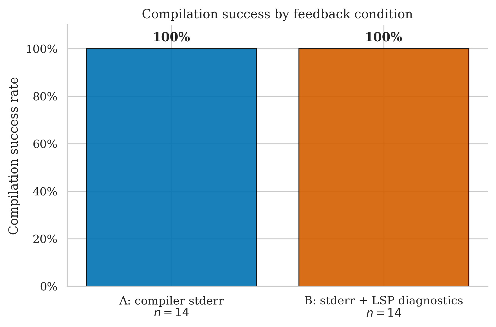
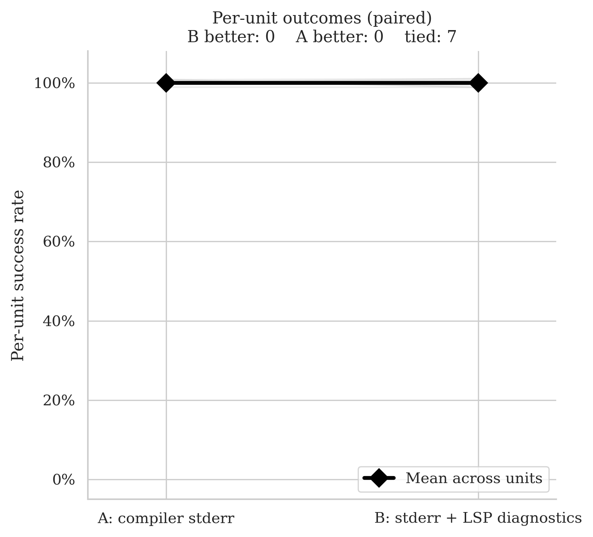
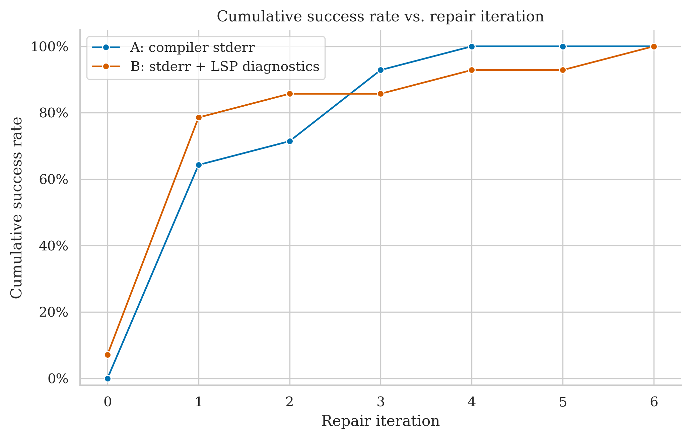
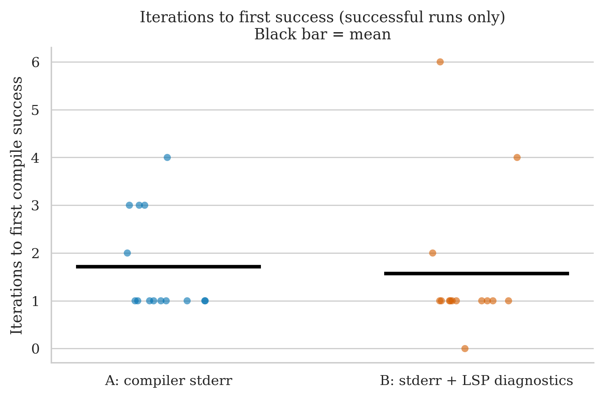
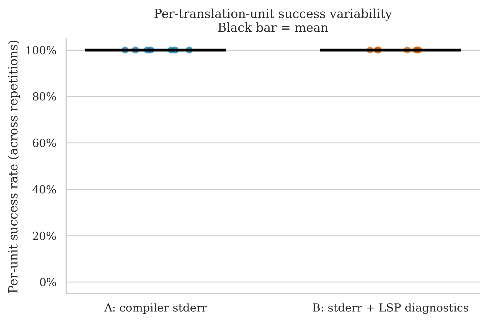

# polypartition — Clean Run Analysis
**Run ID:** `2026-05-16_00-41-01`
**Date:** 2026-05-16
**Project:** polypartition (polygon partitioning algorithm library)
**Model:** gpt-4o-2024-08-06 (translator + repair)
**Setup:** 7 files × 2 conditions × 2 repetitions × max 8 repair iterations
**Condition B (this run):** stderr + LSP diagnostics (combined)

> **Perfect tie — both conditions 100%.** A and B each compiled all 14 runs. This is a significant improvement over the previous polypartition run (LSP-only B), where B failed on two files (`test/image.cpp` and `test/test.cpp`) for an 85.7% B rate. The combined feedback eliminated both of those failures. The only notable observation is `test/test.cpp` rep 0 under B, which needed 6 iterations and 302 seconds — a slow convergence that still succeeded.

---

## The Two Conditions

| Label | What the repair agent receives after a failed compile |
|-------|------------------------------------------------------|
| **A: compiler stderr** | Raw `rustc` error output |
| **B: stderr + LSP diagnostics** | Raw `rustc` stderr **plus** structured JSON from rust-analyzer: error codes, line/col numbers, severity |

---

## Files Tested

| File | Lines of Code | Description |
|------|-------------|-------------|
| `src/polypartition.cpp` | 1 846 | Core algorithm — convex/Hertel-Mehlhorn/monotone partitioning |
| `src/polypartition.h` | 424 | Header — polygon data structures and algorithm declarations |
| `test/image.cpp` | 390 | Test harness image renderer (draws polygon output) |
| `test/image.h` | 220 | Image renderer header |
| `test/imageio.cpp` | 512 | PNG read/write for test images |
| `test/imageio.h` | 86 | PNG I/O header |
| `test/test.cpp` | 415 | Test runner — exercises all partitioning algorithms |

---

## Overall Success Rates

| Condition | Successes / Runs | Success Rate | 95% Wilson CI |
|-----------|-----------------|-------------|--------------|
| A: compiler stderr | 14 / 14 | **100%** | 78.5% – 100% |
| B: stderr + LSP diagnostics | 14 / 14 | **100%** | 78.5% – 100% |

Both conditions compiled every run. In the previous run (LSP-only B), B failed on 2 of 14 runs (85.7%). The combined feedback restores B to parity.

| Metric | A | B |
|--------|---|---|
| Mean iterations | 1.71 | 1.57 |
| Median iterations | 1.0 | 1.0 |
| Mean wall time | 63.8s | 69.8s |
| Median wall time | 65.6s | 43.7s |

B uses slightly fewer iterations on average (1.57 vs 1.71) but is slower in mean wall time (69.8s vs 63.8s) due to the LSP query overhead and one high-iteration outlier (`test/test.cpp` rep 0, 302s). The median wall time is actually faster for B (43.7s vs 65.6s), reflecting that most B runs converge quickly — the mean is skewed by that single long run.

---

## Per-File Breakdown

### test/test.cpp (415 LOC) — the outlier

| | Rep 0 | Rep 1 |
|-|-------|-------|
| **A** | ✅ PASS (2 iters, 87.8s) | ✅ PASS (3 iters, 73.6s) |
| **B** | ✅ PASS (6 iters, 302.5s) | ✅ PASS (1 iter, 70.4s) |

B's rep 0 is the most iteration-heavy successful run in this dataset: 6 repair rounds taking over 5 minutes. The same file under B rep 1 solved in 1 round. The enormous variance (6 vs 1) is stochastic — the initial translation quality on rep 0 was poor enough to require many rounds, but B never gave up and eventually converged. Under the old LSP-only run, this file failed on one rep entirely; here B exhausts more rounds but succeeds. Per-unit: **A = 100%, B = 100% — tie**.

### src/polypartition.cpp (1 846 LOC) — largest file, notable B efficiency on rep 0

| | Rep 0 | Rep 1 |
|-|-------|-------|
| **A** | ✅ PASS (3 iters, 144.4s) | ✅ PASS (4 iters, 126.2s) |
| **B** | ✅ PASS (1 iter, 26.9s) | ✅ PASS (4 iters, 123.0s) |

At 1,846 LOC this is the largest translation unit in this run. A is consistent at 3–4 iterations; B solves rep 0 in a single repair round (26.9s) but needs 4 on rep 1. B rep 0 is the most efficient translation of a large file in this run — the combined feedback appears to have pinpointed the errors precisely enough for a single-round fix. Per-unit: **A = 100%, B = 100% — tie**.

### src/polypartition.h (424 LOC) — B compiles first-try on rep 0

| | Rep 0 | Rep 1 |
|-|-------|-------|
| **A** | ✅ PASS (3 iters, 67.3s) | ✅ PASS (1 iter, 28.1s) |
| **B** | ✅ PASS (0 iters, 14.8s) | ✅ PASS (1 iter, 25.9s) |

B rep 0 compiled without any repair (0 iterations, 14.8s) — the initial translation was correct. A needed 3 iterations on the same rep. Per-unit: **A = 100%, B = 100% — tie**.

### test/image.cpp (390 LOC) — B recovered vs old run

| | Rep 0 | Rep 1 |
|-|-------|-------|
| **A** | ✅ PASS (1 iter, 63.8s) | ✅ PASS (1 iter, 54.9s) |
| **B** | ✅ PASS (2 iters, 95.5s) | ✅ PASS (1 iter, 60.6s) |

In the old run (LSP-only B), this file failed on one rep. Here B succeeds both times. A is fast and consistent at 1 iteration. Per-unit: **A = 100%, B = 100% — tie**.

### Remaining files (image.h, imageio.cpp, imageio.h)

| File | LOC | A | B | Notes |
|------|-----|---|---|-------|
| test/image.h | 220 | 100% | 100% | Both: 1 iter each rep, nearly identical |
| test/imageio.cpp | 512 | 100% | 100% | Both: 1 iter each rep, nearly identical wall times |
| test/imageio.h | 86 | 100% | 100% | Both: 1 iter each rep, ~23–27s |

Three infrastructure files (image data types, PNG I/O) where A and B are indistinguishable in both iteration count and wall time. No condition signal.

---

## Statistical Test (McNemar)

**Majority vote per file (≥50% success across reps = unit pass):**

- **A wins:** 0 units
- **B wins:** 0 units
- **Discordant pairs:** 0
- **p-value: 1.000** — uninformative

Seven units, all tied at 100%/100%. The paired slope chart is a flat horizontal line. McNemar has nothing to work with.

---

## Cumulative Success Over Repair Iterations

B starts slightly ahead at iteration 0 (~7% vs 0% — one run compiled first-try under B) and leads throughout iterations 1–3. A catches up and overtakes at iteration 3 (~93% vs 86%) because more of A's runs resolve in 1–3 rounds. A reaches 100% at iteration 4; B takes until iteration 6 due to the `test/test.cpp` rep 0 outlier. Both plateaus land at 100%. The crossing at iteration 3 is driven by A's consistent 1–3 iteration pattern vs B's bimodal distribution (mostly 0–2 but one run needing 6).

---

## Iterations to Success

| Condition | Iterations used | Mean |
|-----------|----------------|------|
| A (14 runs) | 3, 4, 3, 1, 1, 1, 1, 1, 1, 1, 1, 2, 3, 4 | 1.71 |
| B (14 runs) | 1, 4, 0, 1, 2, 1, 1, 1, 1, 1, 1, 1, 6, 1 | 1.57 |

A's distribution spans 1–4 with no outliers; most runs at 1–3. B's distribution is tighter (mostly 0–1) with one outlier at 6. The iteration plot shows B's mean bar very slightly below A's, with B's outlier dot at 6 visible above the cluster. Both conditions handle this project reliably.

---

## Per-Unit Success Variability

All fourteen dots for both conditions sit at 100%. Both mean bars flat at the top. No spread to observe.

---

## Comparison with Previous polypartition Run (LSP-Only B)

| File | Old A | Old B | New A | New B | Change |
|------|-------|-------|-------|-------|--------|
| `test/image.cpp` | 100% | **50%** | 100% | **100%** | B recovered |
| `test/test.cpp` | 100% | **50%** | 100% | **100%** | B recovered |
| All other files | 100% | 100% | 100% | 100% | Unchanged |
| **Overall** | **100%** | **85.7%** | **100%** | **100%** | **B fully recovered** |

Both files that caused B failures in the old run now succeed. The combined feedback signal resolved both cases that LSP alone could not.

---

## Key Takeaways

1. **The two old B failures are gone.** `test/image.cpp` and `test/test.cpp` both failed once under LSP-only B. Under the combined condition, both succeed on every rep. This directly confirms that adding stderr to the B feedback improved B's ability to repair those files.

2. **test/test.cpp is the sole warning signal.** It needed 6 repair rounds on one rep (302s) — the slowest successful run in this project. It succeeded, but barely converged within the 8-iteration budget. The per-unit success rate is 100%, but the depth of repair required suggests this file is harder than most.

3. **A's advantage over B from the previous run is fully eliminated.** Old B had 2 failures; new B has 0. The direction changed from A-wins to a complete tie.

4. **McNemar: 0 discordant pairs, p = 1.0.** All units at 100%/100%. The test is structurally uninformative for a ceiling-tie result.

5. **B shows signs of efficiency on large files.** `src/polypartition.cpp` (1,846 LOC) took B only 1 iteration on rep 0 vs A's 3. `src/polypartition.h` compiled first-try under B rep 0. These are isolated observations but consistent with B having better error localisation on larger translation units.

---

## What This Means for the Thesis

- **polypartition is now a confirmed ceiling-tie project under the combined B condition**, where it was previously an A-wins project under LSP-only B. This makes it a clean demonstration that the B condition change had a direct effect: adding stderr to the feedback removed the failures.
- **The improvement is not free.** B's mean wall time is slightly higher (69.8s vs 63.8s) and `test/test.cpp` nearly hit the iteration cap. The combined signal improved success rate at the cost of occasionally slower convergence.
- Like debug_assert and poisson-disk-generator, polypartition at ceiling contributes no discriminating power to the statistical comparison. The signal lives in harder projects (TinyRISCV64, immediate2d's raytracer).
