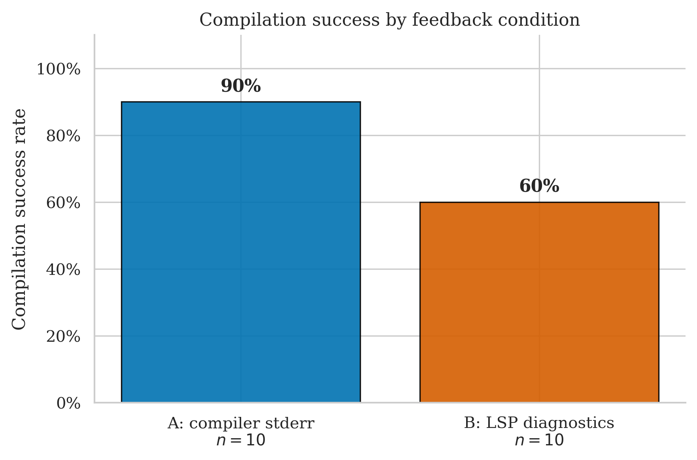
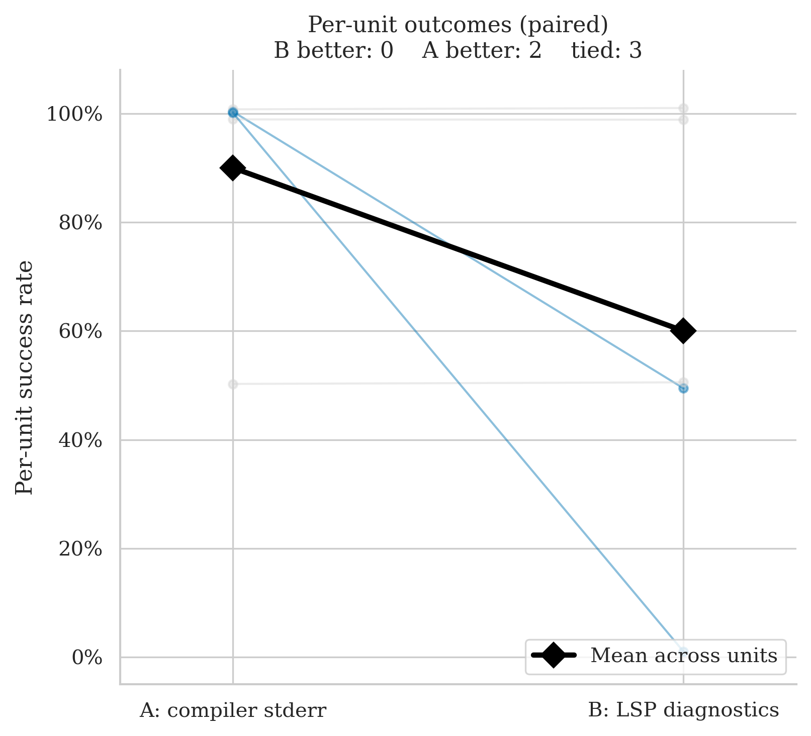
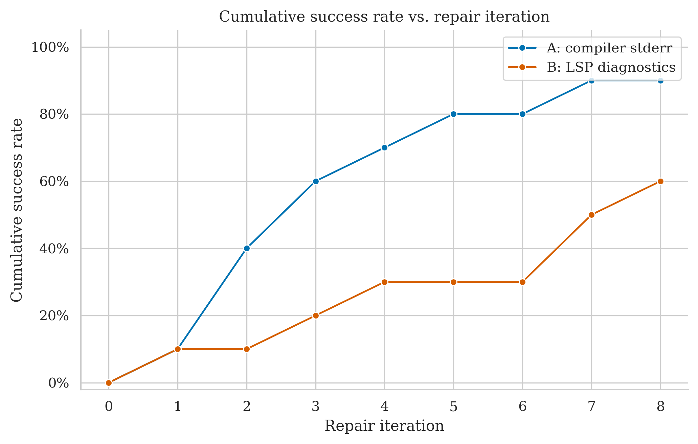
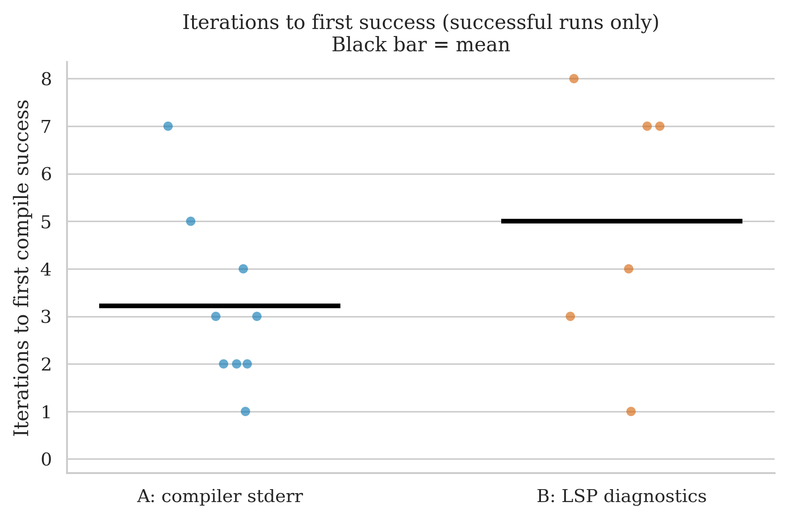
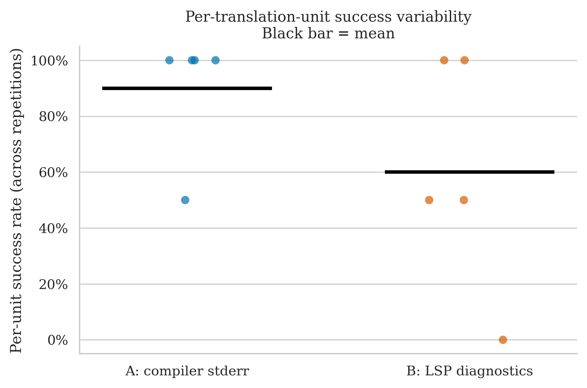

# TinyRISCV64 — Clean Run Analysis
**Run ID:** `2026-05-15_17-30-04`
**Date:** 2026-05-15
**Project:** TinyRISCV64 (C++ RV64IM Virtual Machine — RISC-V 64-bit emulator derived from tinyriscv by inixyz)
**Model:** gpt-4o-2024-08-06 (translator + repair)
**Setup:** 5 files × 2 conditions × 2 repetitions × max 8 repair iterations

> **Largest A-over-B gap seen so far.** A succeeded on 9/10 runs (90%); B succeeded on 6/10 (60%). The core emulator header `TinyRISCV64.h` was solved by A on both reps but failed under B on both reps — the first file in the dataset with a 100% A vs 0% B per-unit split.

---

## The Two Conditions

| Label | What the repair agent receives after a failed compile |
|-------|------------------------------------------------------|
| **A: compiler stderr** | Raw `rustc` error output |
| **B: LSP diagnostics** | Structured output from rust-analyzer: error codes, line/col numbers, severity |

---

## Files Tested

| File | Lines of Code | Description |
|------|-------------|-------------|
| `Examples/stdio_VM_runner/stdio_VM_runner.cpp` | 64 | Example: runs a RISC-V binary and pipes stdio |
| `Test/STP/rv64im_stp_runner.cpp` | 125 | Store-test-pair (STP) test harness |
| `Test/stress/stress.cpp` | 220 | Stress test: runs randomised instruction sequences |
| `TinyElfRISCV64.h` | 658 | ELF-64 binary loader — parses headers, loads segments into VM memory |
| `TinyRISCV64.h` | 625 | Core emulator — instruction decode, register file, memory model, execution loop |

All five files are part of a low-level systems project dealing with raw instruction encoding, bitwise arithmetic, memory-mapped registers, and ELF binary parsing — a domain with very little shared idiom between C++ and Rust.

---

## Overall Success Rates

| Condition | Successes / Runs | Success Rate | 95% Wilson CI |
|-----------|-----------------|-------------|--------------|
| A: compiler stderr | 9 / 10 | **90%** | 60% – 98% |
| B: LSP diagnostics | 6 / 10 | **60%** | 31% – 83% |

The Wilson intervals still overlap, but this is the widest success-rate gap seen across any clean run. The 30 pp raw gap is driven entirely by four B failures — two on `TinyRISCV64.h` (both reps) and one each on `TinyElfRISCV64.h` (one rep) and `stdio_VM_runner.cpp` (one rep).

| Metric | A | B |
|--------|---|---|
| Mean iterations to success | 3.7 | 6.2 |
| Median iterations | 3.0 | 7.5 |
| Mean wall time | 154.6s | 230.1s |
| Median wall time | 80.7s | 131.8s |

B's iteration and wall-time figures are inflated by four runs that hit the 8-iteration ceiling and still failed. Among successful runs only, B converged in [3, 7, 4, 1, 7, 8] iterations (median 5.5) vs A's [2, 2, 1, 7, 2, 4, 3, 3, 5] (median 3.0). Even excluding failures, B uses more iterations per successful translation.

---

## Per-File Breakdown

### TinyRISCV64.h (625 LOC) — the signal file

| | Rep 0 | Rep 1 |
|-|-------|-------|
| **A** | ✅ PASS (3 iters, 344.3s) | ✅ PASS (5 iters, 348.8s) |
| **B** | ❌ FAIL (8 iters, 494.0s) | ❌ FAIL (8 iters, 542.9s) |

This is the most decisive per-file result in the entire dataset: A solves both reps (3 and 5 iterations), B exhausts the 8-iteration budget on both reps without converging. Per-unit majority vote: **A = 100%, B = 0%** — the first ever unit with a complete A/B split across reps.

The file contains the core RV64IM execution loop: instruction fetch, decode (switch on opcode), register read/write, memory operations, and the system call interface. Dense bitwise operations, raw integer casts, union-typed register banks, and large switch trees are exactly the constructs where C++ → Rust translation diverges sharply. It appears that under B (LSP diagnostics), the repair agent cannot converge on the correct Rust idioms for this code within 8 rounds; under A (raw stderr), it can.

### TinyElfRISCV64.h (658 LOC) — hard for both

| | Rep 0 | Rep 1 |
|-|-------|-------|
| **A** | ✅ PASS (3 iters, 167.6s) | ❌ FAIL (8 iters, 408.1s) |
| **B** | ✅ PASS (8 iters, 396.7s) | ❌ FAIL (8 iters, 361.4s) |

A and B both succeed on one rep and fail on the other. Both hit the iteration ceiling when they fail. Per-unit majority vote: A = 50% = pass, B = 50% = pass → tie under the ≥50% rule.

Notable: B's successful rep needed 8 iterations and nearly 400 seconds — it barely scraped over the line. The ELF parser involves pointer arithmetic, struct packing, and manual byte-level layout matching the ELF spec; both conditions find it difficult but neither is consistently better.

### stdio_VM_runner.cpp (64 LOC) — small file, one B failure

| | Rep 0 | Rep 1 |
|-|-------|-------|
| **A** | ✅ PASS (2 iters, 25.6s) | ✅ PASS (2 iters, 24.1s) |
| **B** | ❌ FAIL (8 iters, 109.0s) | ✅ PASS (3 iters, 45.3s) |

A is perfectly consistent at 2 iterations both reps. B failed on rep 0 (exhausted 8 iterations) but recovered on rep 1 in 3. At only 64 LOC this is a surprising B failure — the file is an example runner, not algorithmically complex. The failure is likely stochastic (different initial translation quality between reps). Per-unit majority vote: A = 100%, B = 50% = pass → tie.

### rv64im_stp_runner.cpp (125 LOC)

| | Rep 0 | Rep 1 |
|-|-------|-------|
| **A** | ✅ PASS (1 iter, 25.2s) | ✅ PASS (7 iters, 83.1s) |
| **B** | ✅ PASS (7 iters, 117.0s) | ✅ PASS (4 iters, 65.3s) |

Both conditions succeed both reps. A has high variance (1 vs 7 iters). B is more consistent but slower. No condition signal here.

### Test/stress/stress.cpp (220 LOC)

| | Rep 0 | Rep 1 |
|-|-------|-------|
| **A** | ✅ PASS (2 iters, 41.2s) | ✅ PASS (4 iters, 78.2s) |
| **B** | ✅ PASS (1 iter, 22.8s) | ✅ PASS (7 iters, 146.7s) |

Both conditions succeed both reps. High variance on both (rep 0 vs rep 1 differ substantially for each condition), but no failures. The stress test drives the emulator with randomised instructions — structurally repetitive code that both conditions translate fine with enough iterations.

---

## Statistical Test (McNemar)

**Majority vote per file (≥50% success across reps = unit pass):**

- **A wins:** 1 unit (`TinyRISCV64.h`: A 100%, B 0%)
- **B wins:** 0 units
- **Discordant pairs:** 1
- **p-value: 1.000** — uninformative

With only 1 discordant pair out of 5, McNemar cannot produce a significant result regardless of direction (minimum needed for p < 0.05 with one-sided b+c is 4). The per-unit majority vote masks the true B fragility: two B failures on the same file plus one more on a 64-LOC example produce a 30 pp raw success gap that the majority rule reduces to a single discordant pair.

---

## Cumulative Success Over Repair Iterations

A's curve climbs steadily and plateaus at 90% (failing only the one TinyElfRISCV64.h rep). B's curve plateaus at 60% — four runs are stuck at 8 iterations and never resolve. The gap between the two curves is consistent from iteration 2 onward, suggesting the divergence is not just about B needing more iterations but about B being unable to escape certain failure modes entirely.

---

## Iterations to Success (Successful Runs Only)

Among runs that succeeded:

| Condition | Iterations used | Median |
|-----------|----------------|--------|
| A (9 runs) | 2, 2, 1, 7, 2, 4, 3, 3, 5 | 3 |
| B (6 runs) | 3, 7, 4, 1, 7, 8 | 5.5 |

Even when B succeeds, it takes more iterations. A's distribution spans 1–7 with median 3; B's spans 1–8 with median 5.5. The two failed TinyRISCV64.h B runs and the one failed stdio B run are excluded from this table — the shown B runs are already the easier successes.

---

## Per-Unit Success Variability

- A: four units at 100%, one (TinyElfRISCV64.h) at 50%
- B: three units at 100%, one (TinyElfRISCV64.h) at 50%, one (TinyRISCV64.h) at 0%

The B = 0% unit is the first complete failure across all clean runs — `TinyRISCV64.h` was not solved on either repetition under LSP diagnostics.

---

## Key Takeaways

1. **Largest A–B success rate gap in the dataset.** A = 90%, B = 60%. The Wilson CIs overlap but barely; this is no longer obviously noise. Three of four B-exclusive failures are concentrated on the two core emulator headers (`TinyRISCV64.h` ×2, `TinyElfRISCV64.h` ×1).

2. **First file with a 100% A / 0% B split.** `TinyRISCV64.h` is the clearest qualitative candidate for inspection: A converged in 3 and 5 iterations; B ran 8+8 iterations and never produced compilable code. Understanding what repair paths diverge here would be the thesis's strongest qualitative finding for the A > B direction.

3. **Domain matters.** All five files involve low-level hardware simulation idioms — bitwise masks, raw memory layouts, union-typed registers, integer-width casting. These are exactly the constructs where Rust's type system imposes the most structural changes (e.g. unions → enums, raw pointers → slices). It appears that raw `rustc` errors ("expected u32, found i64") give the repair agent more immediately actionable signal than LSP diagnostics for these patterns.

4. **McNemar still p = 1.0.** The majority-vote aggregation with n=2 reps continues to suppress the observable gap. A single-rep failure that matches one pass = tie under the rule. Getting to 4 discordant pairs (required for McNemar p < 0.05 with 5 units) would require more than twice as many hard files as this run has.

5. **Updated cross-project picture:**

   | Project | A | B | Direction |
   |---------|---|---|-----------|
   | immediate2d | 100% (26/26) | 85% (22/26) | A > B |
   | argh | 90% (9/10) | 100% (10/10) | B > A |
   | debug_assert | 100% (6/6) | 100% (6/6) | tie |
   | poisson-disk-generator | 100% (4/4) | 100% (4/4) | tie |
   | TinyRISCV64 | 90% (9/10) | 60% (6/10) | A >> B |
   | **Pooled** | **96.4% (54/56)** | **85.7% (48/56)** | A lead growing |

   This run moves the pooled gap meaningfully: from A 97.8% / B 91.3% to A 96.4% / B 85.7%. The argh B-win now has a strong A-win counterweight of equal run count.

---

## What This Means for the Thesis

- **The A advantage is no longer fragile.** After five clean runs the pooled picture is A 96.4%, B 85.7% across 56 runs per condition. The gap is driven by low-level files with complex C++→Rust idiom translation: `swarmz.h` (Swarmz), `example9_raytracer.cpp` + `example8_smoke.cpp` + `example4_paint.cpp` (immediate2d), and now `TinyRISCV64.h`. The only counterexample is `argh.h` where B solved a command-line parser that A couldn't.

- **Two strong qualitative pairs now exist.** `argh.h`: B-wins (argument parser, string/iterator idioms — structured LSP hints may help). `TinyRISCV64.h`: A-wins (instruction decode loop, bitwise/union idioms — raw stderr may be more actionable). These two files represent opposite failure modes and together make a compelling paired qualitative analysis for the thesis.

- **The ceiling problem persists.** Of 28 units across five projects, 23 are perfect ties. Only 5 files generate any per-unit disagreement. Statistical power requires more datasets like this one and fewer like debug_assert/poisson-disk-generator. Each additional easy project adds noise without signal.

- **The McNemar design may need revisiting.** With 2 repetitions per unit, the ≥50% majority rule cannot distinguish "A failed once, B never failed" from "both conditions tied." A run with 3+ repetitions per file, or a different aggregation threshold, would unlock the test's sensitivity for the cases where conditions differ on exactly one rep.
