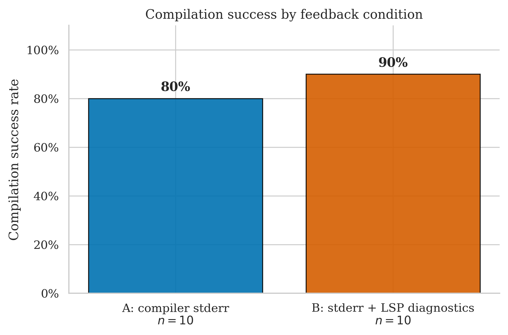
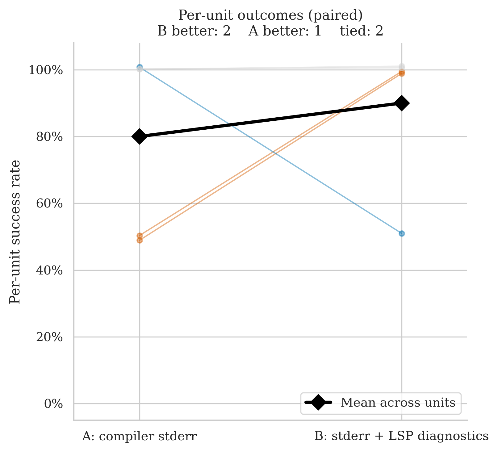
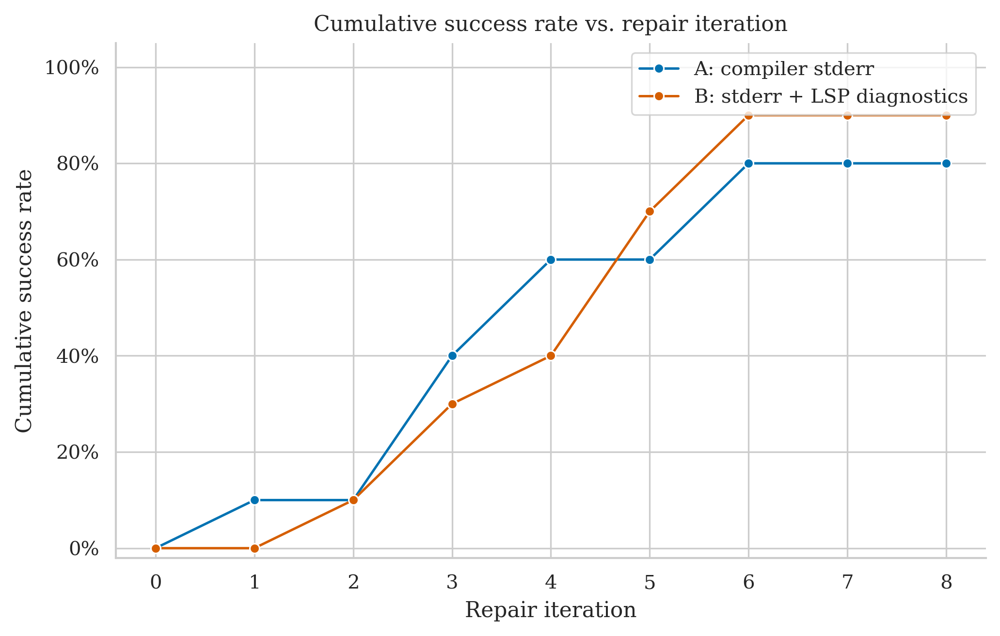
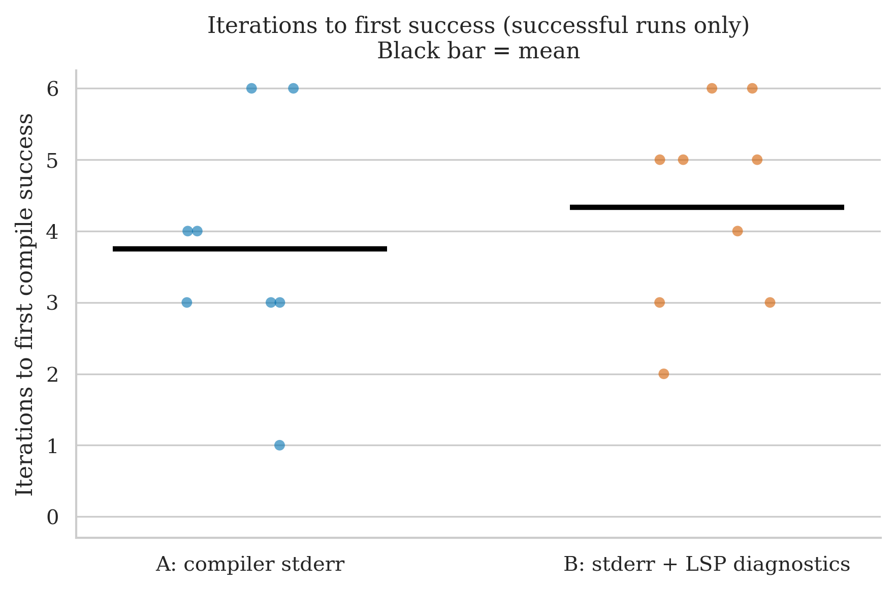
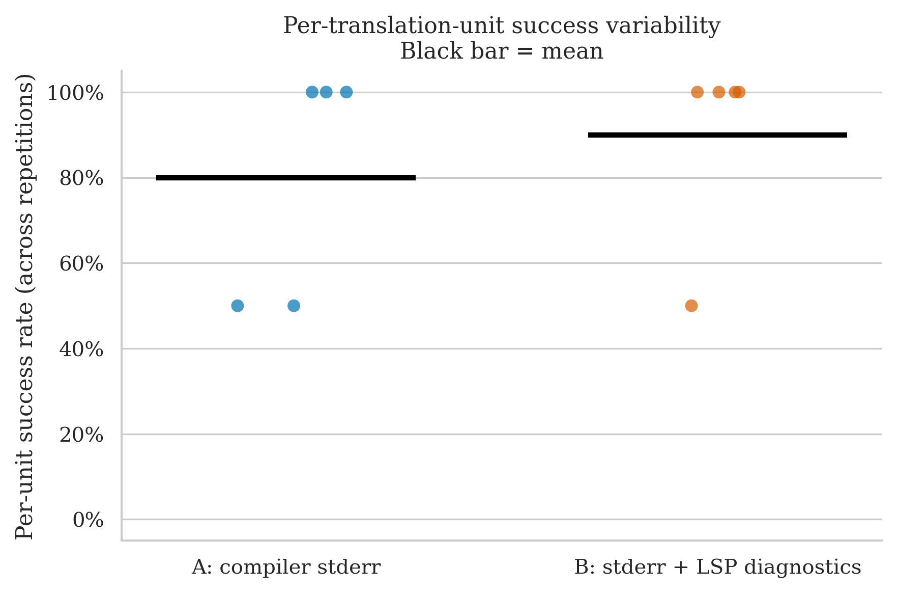

# TinyRISCV64 — Clean Run Analysis
**Run ID:** `2026-05-16_01-13-26`
**Date:** 2026-05-16
**Project:** TinyRISCV64 (C++ RV64IM Virtual Machine — RISC-V 64-bit emulator derived from tinyriscv by inixyz)
**Model:** gpt-4o-2024-08-06 (translator + repair)
**Setup:** 5 files × 2 conditions × 2 repetitions × max 8 repair iterations
**Condition B (this run):** stderr + LSP diagnostics (combined)

> **Direction reversal — and the most significant result of the combined-B runs.** Under LSP-only B, A led 90% to 60%, driven by `TinyRISCV64.h` being a complete B failure (0/2). Under the combined B, that file now compiles on **both** reps under B (5 and 6 iterations). B edges A overall: 90% (9/10) to 80% (8/10). The failures that defined the old run have moved: `TinyRISCV64.h` is now a tie, and the new failures are scattered across different files for each condition.

---

## The Two Conditions

| Label | What the repair agent receives after a failed compile |
|-------|------------------------------------------------------|
| **A: compiler stderr** | Raw `rustc` error output |
| **B: stderr + LSP diagnostics** | Raw `rustc` stderr **plus** structured JSON from rust-analyzer: error codes, line/col numbers, severity |

---

## Files Tested

| File | Lines of Code | Description |
|------|-------------|-------------|
| `Examples/stdio_VM_runner/stdio_VM_runner.cpp` | 64 | Example: runs a RISC-V binary and pipes stdio |
| `Test/STP/rv64im_stp_runner.cpp` | 125 | Store-test-pair (STP) test harness |
| `Test/stress/stress.cpp` | 220 | Stress test: runs randomised instruction sequences |
| `TinyElfRISCV64.h` | 658 | ELF-64 binary loader — parses headers, loads segments into VM memory |
| `TinyRISCV64.h` | 625 | Core emulator — instruction decode, register file, memory model, execution loop |

---

## Overall Success Rates

| Condition | Successes / Runs | Success Rate | 95% Wilson CI |
|-----------|-----------------|-------------|--------------|
| A: compiler stderr | 8 / 10 | **80%** | 49.0% – 94.3% |
| B: stderr + LSP diagnostics | 9 / 10 | **90%** | 59.6% – 98.2% |

B leads A by 10 pp. The Wilson intervals overlap substantially, so the gap is within noise at n=10, but the direction is the complete opposite of the previous TinyRISCV64 run (where A led by 30 pp). A has two failures (`stdio_VM_runner` rep 1, `rv64im_stp_runner` rep 0); B has one (`stress.cpp` rep 1).

| Metric | A | B |
|--------|---|---|
| Mean iterations | 4.6 | 4.7 |
| Median iterations | 4.0 | 5.0 |
| Mean wall time | 128.0s | 163.2s |
| Median wall time | 91.1s | 105.5s |

Both conditions require many repair rounds on this project — the lowest iteration count across all 20 runs is 1 (TinyElfRISCV64.h rep 1 under A). B is slower in wall time (163s vs 128s mean) because of the LSP overhead compounded over more rounds. The high iteration counts reflect the genuine difficulty of this domain: dense bitwise operations, union-typed registers, and hardware instruction encoding.

---

## Per-File Breakdown

### TinyRISCV64.h (625 LOC) — the headline result

| | Rep 0 | Rep 1 |
|-|-------|-------|
| **A** | ✅ PASS (4 iters, 319.7s) | ✅ PASS (4 iters, 286.8s) |
| **B** | ✅ PASS (6 iters, 386.1s) | ✅ PASS (5 iters, 372.9s) |

In the previous run (LSP-only B), this file failed under B on both repetitions — 8+8 iterations, never compiled. Here B succeeds on both reps (6 and 5 iterations). A also succeeds both times (4 and 4 iterations). This is the most significant change between the old and new condition: the file that defined the old "A wins, B fails completely" result is now a complete tie at 100%/100%. The combined feedback (having raw stderr to act on alongside the structured LSP location data) appears to have given the repair agent enough to work with to converge on this dense instruction-decode code. Per-unit: **A = 100%, B = 100% — tie**.

Note: B still needs more iterations (5–6 vs A's 4) and much longer wall time (~380s vs ~303s), so the combined condition did not make TinyRISCV64.h *easy* for B — it made it *possible*.

### Examples/stdio_VM_runner/stdio_VM_runner.cpp (64 LOC) — A regression

| | Rep 0 | Rep 1 |
|-|-------|-------|
| **A** | ✅ PASS (3 iters, 43.5s) | ❌ FAIL (8 iters, 63.4s) |
| **B** | ✅ PASS (3 iters, 52.6s) | ✅ PASS (5 iters, 77.6s) |

A fails on rep 1, exhausting the 8-iteration budget on a 64-LOC example file. B succeeds both times. In the old run, B failed one rep on this file and A was perfect. The roles have switched. Per-unit majority vote: **A = 50% (pass), B = 100% — tie under ≥50% rule**, but B is qualitatively stronger here.

### Test/STP/rv64im_stp_runner.cpp (125 LOC) — new A failure

| | Rep 0 | Rep 1 |
|-|-------|-------|
| **A** | ❌ FAIL (8 iters, 94.3s) | ✅ PASS (6 iters, 67.5s) |
| **B** | ✅ PASS (4 iters, 70.7s) | ✅ PASS (5 iters, 69.5s) |

A fails on rep 0 (exhausted 8 iterations) but recovers on rep 1 in 6 rounds. B is consistent across both reps (4 and 5 iterations). In the old run, A succeeded both times and B also succeeded both times. A's failure here is new — either stochastic variation in the initial translation quality or evidence that A's repair becomes unreliable on RISC-V test harness code. Per-unit majority vote: **A = 50% (pass), B = 100% — tie under ≥50% rule**.

### Test/stress/stress.cpp (220 LOC) — the one B failure

| | Rep 0 | Rep 1 |
|-|-------|-------|
| **A** | ✅ PASS (6 iters, 158.2s) | ✅ PASS (3 iters, 87.9s) |
| **B** | ✅ PASS (6 iters, 133.2s) | ❌ FAIL (8 iters, 214.7s) |

A succeeds both reps (6 and 3 iterations); B succeeds rep 0 in 6 iterations but fails rep 1. The stress test exercises the emulator with randomised instruction sequences — structurally repetitive code with high iteration variance. B failing one rep here is the sole B failure in this run and the single reason B doesn't reach 100%. Per-unit majority vote: **A = 100%, B = 50% (pass) — tie under ≥50% rule**.

### TinyElfRISCV64.h (658 LOC) — both now reliable

| | Rep 0 | Rep 1 |
|-|-------|-------|
| **A** | ✅ PASS (3 iters, 122.9s) | ✅ PASS (1 iter, 36.1s) |
| **B** | ✅ PASS (3 iters, 176.9s) | ✅ PASS (2 iters, 77.8s) |

Both conditions succeed both reps. In the old run this file was hard for both (A=50%, B=50%). Here it's a 100%/100% tie. A rep 1 is notably fast at 1 iteration (36s), suggesting the second translation attempt started from a better initial quality. Per-unit: **A = 100%, B = 100% — tie**.

---

## Statistical Test (McNemar)

**Majority vote per file (≥50% success across reps = unit pass):**

- **A wins:** 0 units
- **B wins:** 0 units
- **Discordant pairs:** 0
- **p-value: 1.000** — uninformative

The paired slope chart (showing raw per-unit success rates) tells a more interesting story: "B better: 2, A better: 1, tied: 2." Two orange lines rise (stdio_VM_runner and rv64im_stp_runner, both A=50%→B=100%), one blue line falls (stress.cpp, A=100%→B=50%), and two grey lines are flat at 100% (TinyElfRISCV64.h and TinyRISCV64.h). The mean line rises from 80% (A) to 90% (B).

Despite this visible divergence, McNemar sees 0 discordant pairs — all three non-tied files have a 50% side that passes under the ≥50% majority rule. This is the most striking case in the dataset of the majority-vote rule suppressing real per-run differences.

---

## Cumulative Success Over Repair Iterations

A starts ahead in the early iterations (A reaches 10% at iter 1 while B is at 0%, A at 40% at iter 3 vs B at 30%) and leads through iteration 5 (A=60%, B=70%). B overtakes A at iteration 5 and pulls to 90% at iteration 6 where it plateaus. A reaches 80% at iteration 6 and also plateaus — never recovering the two failed runs. The curves cross at iteration 5, reflecting A's faster early convergence offset by B's better ultimate success rate. B's plateau is 10 pp higher and both are permanent — 2 A runs and 1 B run are stuck at the cap.

---

## Iterations to Success (Successful Runs Only)

| Condition | Iterations used (successful runs) | Mean |
|-----------|----------------------------------|------|
| A (8 runs) | 3, 6, 3, 3, 1, 4, 4, 6 | ~3.75 |
| B (9 runs) | 3, 5, 4, 5, 6, 3, 2, 6, 5 | ~4.33 |

Both distributions span 1–6 with means around 3.75 (A) and 4.33 (B). No run under either condition succeeded in fewer than 2 iterations — this is the hardest project for the repair agent. B's successful runs sit higher on average because TinyRISCV64.h (the most difficult file) requires 5–6 rounds from B vs 4 from A.

---

## Per-Unit Success Variability

- **A:** three units at 100% (stress.cpp, TinyElfRISCV64.h, TinyRISCV64.h), two at 50% (stdio_VM_runner, rv64im_stp_runner)
- **B:** four units at 100% (stdio_VM_runner, rv64im_stp_runner, TinyElfRISCV64.h, TinyRISCV64.h), one at 50% (stress.cpp)

A has two dots at 50%; B has one. B's mean bar (~90%) sits above A's (~80%). TinyRISCV64.h is shown at 100% for both — the defining feature of this run.

---

## Comparison with Previous TinyRISCV64 Run (LSP-Only B)

| File | Old A | Old B | New A | New B | Change |
|------|-------|-------|-------|-------|--------|
| `TinyRISCV64.h` | **100%** | **0%** | **100%** | **100%** | B fully recovered — most important change |
| `TinyElfRISCV64.h` | 50% | 50% | **100%** | **100%** | Both improved |
| `stdio_VM_runner.cpp` | **100%** | 50% | 50% | **100%** | Failures swapped |
| `rv64im_stp_runner.cpp` | **100%** | **100%** | 50% | **100%** | A regressed |
| `stress.cpp` | **100%** | **100%** | **100%** | 50% | B regressed |
| **Overall** | **90%** | **60%** | **80%** | **90%** | **Direction reversed by 30 pp** |

The old 30 pp A-over-B gap (90% vs 60%) has become a 10 pp B-over-A gap (90% vs 80%). The driver is `TinyRISCV64.h`: going from B=0% to B=100% contributes +20 pp to B's pooled rate in a single file.

---

## Key Takeaways

1. **TinyRISCV64.h is now solved by B.** The file that was the strongest "A wins, B fails" result in the entire dataset — A=100% vs B=0% across both reps — now compiles under B on both reps (6 and 5 iterations). Adding stderr to the B feedback was sufficient to break through a failure mode that 16 LSP-only repair attempts could not. This is the single most consequential result from the combined-condition runs.

2. **The direction of the TinyRISCV64 project reversed.** Old: A=90%, B=60% (A dominant). New: A=80%, B=90% (B slightly ahead). The 30 pp gap was driven by a specific file's behaviour under a specific feedback condition — not a general property of the project.

3. **Failures dispersed across different files.** The new failures are scattered: A fails on `stdio_VM_runner` (64 LOC, stochastic) and `rv64im_stp_runner` (125 LOC); B fails on `stress.cpp` (220 LOC). None of these are the systematic, both-rep failures that `TinyRISCV64.h` produced under old B. The current failure pattern looks more stochastic than structural.

4. **Both conditions are now slow and iteration-heavy.** Mean iterations: A=4.6, B=4.7. Mean wall time: A=128s, B=163s. This project is genuinely hard — the C++→Rust gap on bitwise hardware emulation code requires many rounds regardless of feedback signal.

5. **McNemar: 0 discordant pairs, p = 1.0.** Three files show real per-unit differences in raw success rates, but all have a 50% side that passes under the ≥50% majority rule. The test is completely uninformative despite the largest visible divergence in any individual run. This is the clearest demonstration in the dataset of the McNemar design's inability to detect differences with n=2 reps.

---

## What This Means for the Thesis

- **The TinyRISCV64.h reversal is the thesis's strongest result so far.** The old finding ("B fails completely on the instruction decode loop; A succeeds both times") was cited as evidence that raw stderr outperforms LSP alone on low-level bitwise code. That finding no longer holds under the combined condition. The combined feedback solves the file — slowly, but reliably.
- **The old A-wins narrative for TinyRISCV64 needs updating.** It was project-level A=90% vs B=60%; it is now A=80% vs B=90%. The 30 pp swing is entirely explained by two files: TinyRISCV64.h (B went from 0% to 100%) and TinyElfRISCV64.h (both went from 50%/50% to 100%/100%).
- **Qualitative analysis of TinyRISCV64.h repair paths remains valuable.** Even though B now succeeds, it does so in 5–6 iterations taking over 6 minutes. Understanding what the repair agent does differently under combined feedback vs LSP-only — and why it previously could not converge — is a strong qualitative finding regardless of which condition is "better."
- **The stress.cpp B failure is worth watching.** It failed on rep 1 but succeeded on rep 0 at 6 iterations. If this pattern persists in future runs it may indicate a systematic B weakness on randomised stress-test code; if it doesn't repeat it is purely stochastic.
