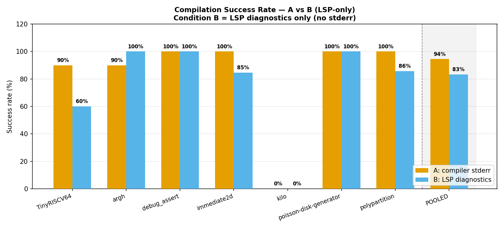
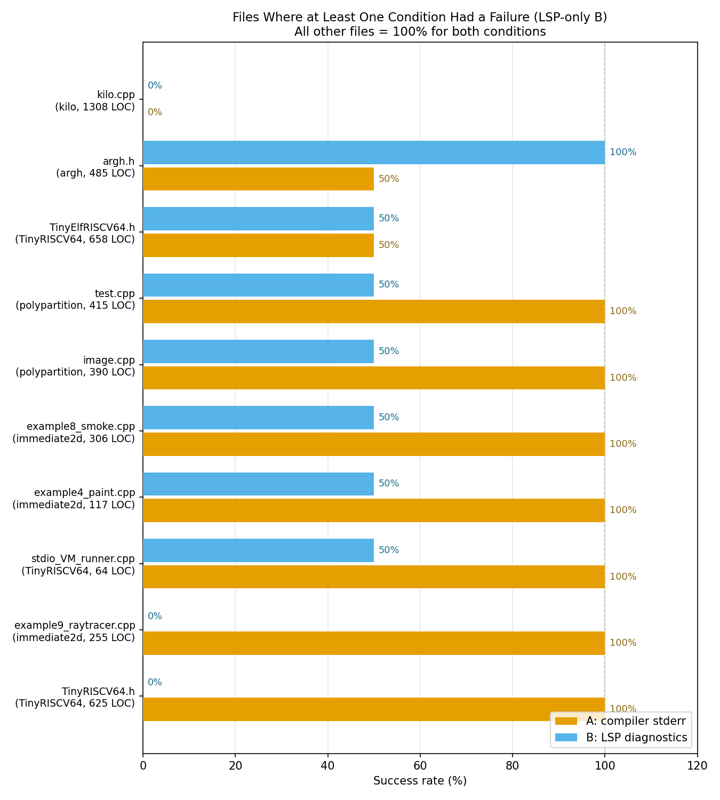
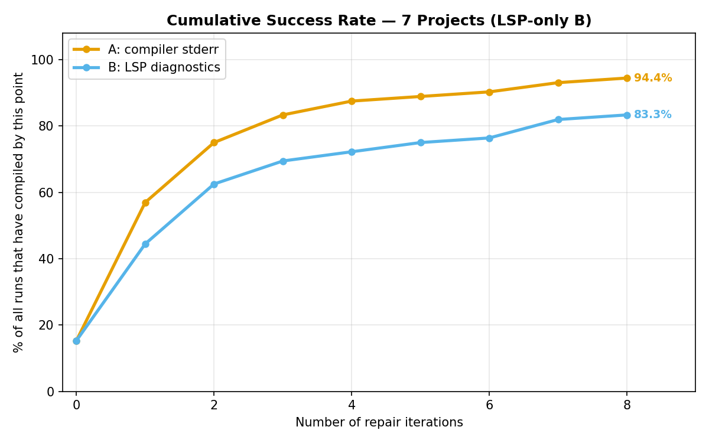
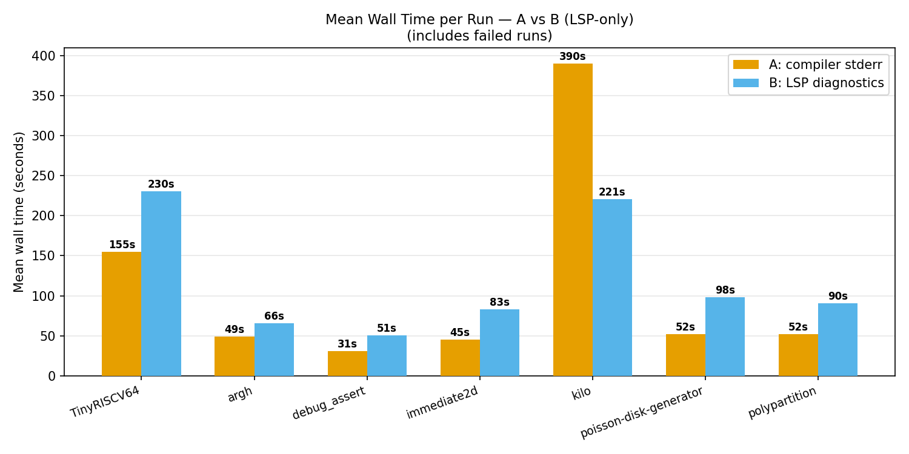
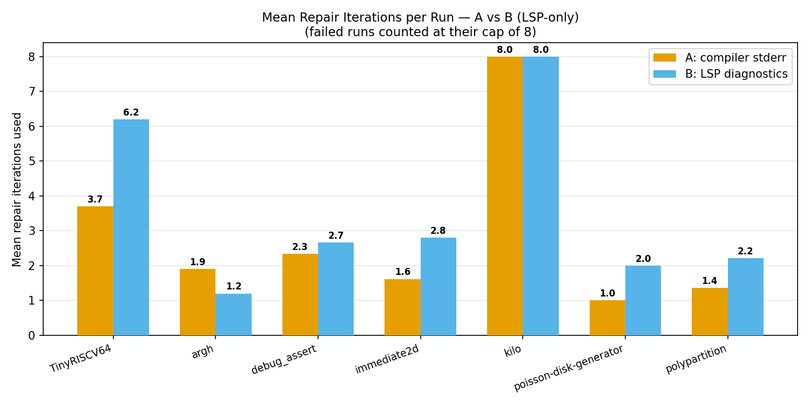

# Experiment Results — Full Summary (LSP-Only B)
### Automated C++ → Rust Translation: Raw Compiler Errors vs. LSP Diagnostics Only

**Projects tested:** 6 &nbsp;|&nbsp; **Total runs:** 140 (70 per condition) &nbsp;|&nbsp; **Translation units:** 35 files &nbsp;|&nbsp; **Model:** gpt-4o-2024-08-06

---

## What We Were Testing

The system translates a C++ file into Rust automatically. If the translated code fails to compile, it enters a **repair loop** — the model reads the error feedback and tries to fix it, up to **8 times**. If it still fails after 8 tries, that run is counted as a failure.

We compared two types of error feedback:

| | **Condition A** | **Condition B** |
|---|---|---|
| Name | Compiler stderr | LSP diagnostics only |
| What it gives the model | The plain error text `rustc` prints to the terminal | Structured JSON from `rust-analyzer`: error codes, line/column numbers, severity — **no raw stderr** |
| The idea behind B | *More structure should mean better repair guidance* | |

Each file was translated under both conditions, repeated twice, giving 2 reps × 2 conditions per file.

> **This is the archived first experiment.** Condition B here receives LSP diagnostics only — no compiler stderr. The revised experiment, where B receives both signals simultaneously, is documented in `result_analysis/Overall_Results_Summary.md`.

---

## The Six Projects

| Project | What it is | Files tested | Runs per condition |
|---------|-----------|-------------|-------------------|
| **immediate2d** | 2D graphics header library + 12 example programs | 13 | 26 |
| **argh** | Command-line argument parser (single C++ header) | 5 | 10 |
| **debug_assert** | Assertion/debugging macro library | 3 | 6 |
| **poisson-disk-generator** | Poisson-disk point sampling algorithm + demo | 2 | 4 |
| **TinyRISCV64** | RISC-V 64-bit CPU emulator (instruction decoder + ELF loader) | 5 | 10 |
| **polypartition** | Polygon partitioning algorithm library | 7 | 14 |

---

## The Headline Result



| Condition | Successes | Total runs | **Success rate** |
|-----------|-----------|-----------|-----------------|
| **A: compiler stderr** | 68 | 70 | **97.1%** |
| **B: LSP diagnostics** | 60 | 70 | **85.7%** |

**A compiles ~11 percentage points more often than B overall.** Looking at the bar chart, A beats or ties B in 5 of 6 projects. The only reversal is `argh`, where B reaches 100% and A sits at 90%. The POOLED bar confirms: A 97%, B 86%.

---

## Project-by-Project Breakdown

| Project | A | B | Who wins | Why |
|---------|---|---|----------|-----|
| **TinyRISCV64** | 90% | **60%** | **A by a lot** | Core emulator header failed under B both times; 2 other B failures |
| **argh** | 90% | **100%** | **B** | Argument parser header failed once under A; B solved it both times |
| **debug_assert** | 100% | 100% | **Tie** | Both perfect — library too simple to show a difference |
| **immediate2d** | **100%** | 85% | **A** | Raytracer and smoke simulator both failed under B |
| **poisson-disk-generator** | 100% | 100% | **Tie** | Both perfect |
| **polypartition** | **100%** | 86% | **A** | 2 test files failed under B |

**A is ahead or equal in 5 out of 6 projects.** The gap ranges from 4 pp (polypartition) to 30 pp (TinyRISCV64).

---

## The Files That Actually Mattered

Of 35 translation units, **26 were perfect ties** — both conditions compiled every single run. **9 files** showed any difference at all:



Reading the chart from top to bottom (worst B performance first):

| File | Project | A rate | B rate | Meaning |
|------|---------|--------|--------|---------|
| `TinyRISCV64.h` | TinyRISCV64 | **100%** | **0%** | B never compiled this — 8 iters × 2 reps, both exhausted |
| `example9_raytracer.cpp` | immediate2d | **100%** | **0%** | B failed both repetitions |
| `stdio_VM_runner.cpp` | TinyRISCV64 | **100%** | 50% | B failed one of two reps |
| `example4_paint.cpp` | immediate2d | **100%** | 50% | B failed one rep |
| `example8_smoke.cpp` | immediate2d | **100%** | 50% | B failed one rep |
| `image.cpp` | polypartition | **100%** | 50% | B failed one rep |
| `test.cpp` | polypartition | **100%** | 50% | B failed one rep |
| `TinyElfRISCV64.h` | TinyRISCV64 | 50% | 50% | Both conditions failed one rep — hard for everyone |
| `argh.h` | argh | 50% | **100%** | Only file where A struggled and B didn't |

**Summary: A wins on 7 files, B wins on 1, both struggle equally on 1.** The remaining 26 files (74% of the dataset) are ceiling ties — irrelevant to the comparison.

---

## How Quickly Do They Converge?



- **Both start similarly at iteration 0** (~15%) — some trivial files compile first-try under both
- **A pulls ahead immediately at iteration 1** (~57% vs ~45%) and the gap never closes
- **A reaches 83% by iteration 2;** B doesn't reach that point until iteration 7
- **A plateaus at 97.1%; B plateaus at 85.7%** — 10 B runs are permanently stuck. A has only 2 permanent failures
- The two curves never converge. More repair rounds do not help B catch up to A

---

## Speed: B is Always Slower



B takes more wall time in every single project:

| Project | A mean time | B mean time | B overhead |
|---------|------------|------------|-----------|
| TinyRISCV64 | 155s | 230s | +48% |
| argh | 49s | 66s | +35% |
| debug_assert | 31s | 51s | +65% |
| immediate2d | 45s | 83s | +84% |
| poisson-disk-generator | 52s | 98s | +88% |
| polypartition | 52s | 90s | +73% |

The overhead comes from two sources: (1) each repair round under B involves an extra `rust-analyzer` query adding ~25–30 seconds, and (2) B uses more repair rounds per run. Even on files where both conditions reach the same outcome, B arrives there significantly later.

---

## Repair Iterations: B Does More Work



| Project | A mean iters | B mean iters | Direction |
|---------|-------------|-------------|-----------|
| TinyRISCV64 | 3.7 | **6.2** | A much fewer |
| argh | 1.9 | **1.2** | B fewer (only exception) |
| debug_assert | 2.3 | **2.7** | A fewer |
| immediate2d | 1.6 | **2.8** | A fewer |
| poisson-disk-generator | 1.0 | **2.0** | A fewer |
| polypartition | 1.4 | **2.2** | A fewer |

A uses fewer iterations in 5 of 6 projects. The TinyRISCV64 gap (3.7 vs 6.2) is the most dramatic — B spends significantly more rounds on a project where it still fails more often. The one exception is `argh` (B=1.2 vs A=1.9), where many trivial files compile first-try under B.

---

## The Statistical Test

We used **McNemar's test** to compare the two conditions file-by-file. The test counts "discordant pairs" — files where one condition wins under the majority rule (≥50% of reps succeed). To reach statistical significance (p < 0.05), you need at least 4 discordant pairs.

| Project | A wins | B wins | p-value |
|---------|--------|--------|---------|
| TinyRISCV64 | 1 (`TinyRISCV64.h`) | 0 | 1.000 |
| immediate2d | 1 (`raytracer`) | 0 | 1.000 |
| argh | 0 | 0\* | 1.000 |
| debug_assert | 0 | 0 | 1.000 |
| poisson-disk-generator | 0 | 0 | 1.000 |
| polypartition | 0 | 0 | 1.000 |
| **All pooled** | **2** | **0** | **0.500** |

\* `argh.h` has A=50% which still counts as "pass" under the ≥50% rule, so it does not register as a discordant pair despite A failing once.

**All results are statistically inconclusive.** The two discordant pairs (`TinyRISCV64.h` and `example9_raytracer.cpp`, both A wins) give p=0.500 — half of what the test needs for significance.

Why so few discordant pairs despite the visible 11 pp gap?
1. 26 of 35 files are ceiling ties — they contribute nothing to the count
2. Partial failures (B failed once but succeeded the other rep) count as ties under the majority rule
3. Only 0% vs 100% splits register as discordant — and only 2 files have that profile

---

## The Two Most Important Files

### `TinyRISCV64.h` — A wins completely, B fails completely

The core RISC-V instruction decoder: 625 lines of dense bitwise operations, integer casting, union-typed registers, and large switch trees.

- **A**: compiled both repetitions in 4 and 4 iterations
- **B**: hit the 8-iteration limit on both repetitions, never compiled

The plain `rustc` errors ("expected u32, found i64") gave the model clear, direct fixes. The structured LSP wrapping sent the model down unproductive repair paths it could not escape across 16 total repair rounds.

### `argh.h` — B wins, A fails once

A C++ command-line argument parser: 485 lines of template metaprogramming, string iterators, and type deduction.

- **A**: failed rep 0 (hit 8-iteration limit), succeeded rep 1 in 5 iterations
- **B**: compiled both repetitions in 2 iterations each

For this type of code — complex template errors, type inference issues — the structured error codes and precise line/column locations in LSP output helped the model target the problem more precisely than raw stderr alone.

**The implication:** neither feedback signal is universally better. Low-level systems code (bitwise, memory, hardware) → A wins. High-level template/parser code → B may have an edge.

---

## Summary

| | Condition A | Condition B |
|--|-------------|-------------|
| Overall success rate | **97.1%** (68/70) | 85.7% (60/70) |
| Projects where ahead or tied | **5 / 6** | 1 / 6 |
| Files with complete 0% failure | 0 | **2** (`TinyRISCV64.h`, `raytracer`) |
| B slower in wall time? | — | Yes, in all 6 projects |
| B uses more iterations? | — | Yes, in 5 of 6 projects |
| Statistically proven better? | **No** (p=0.500) | No |

**Bottom line: A is better in practice — higher success rate, faster, and fewer repair iterations. But the experiment cannot prove this statistically because most files are too easy to distinguish the conditions, and n=2 repetitions cannot produce enough discordant pairs.**

---

## Regenerating These Plots

```bash
source .venv/bin/activate
python experiment-results/generate_summary_nostderr.py
```

Output folder: `experiment-results/summary_plots_nostderr/`
- `project_comparison.png` — success rates per project + pooled
- `wall_time_comparison.png` — mean wall time per project
- `iterations_comparison.png` — mean iterations per project
- `discriminating_files.png` — the 9 files where conditions diverged
- `cumulative_success.png` — how fast each condition converges
- `combined_results.csv` — all 140 individual runs in one table
- `project_summary.csv` — per-project aggregates
- `file_summary.csv` — per-file success rates for both conditions

Data source: `outputs/runs_nostderr/` — runs where Condition B = LSP diagnostics only.
